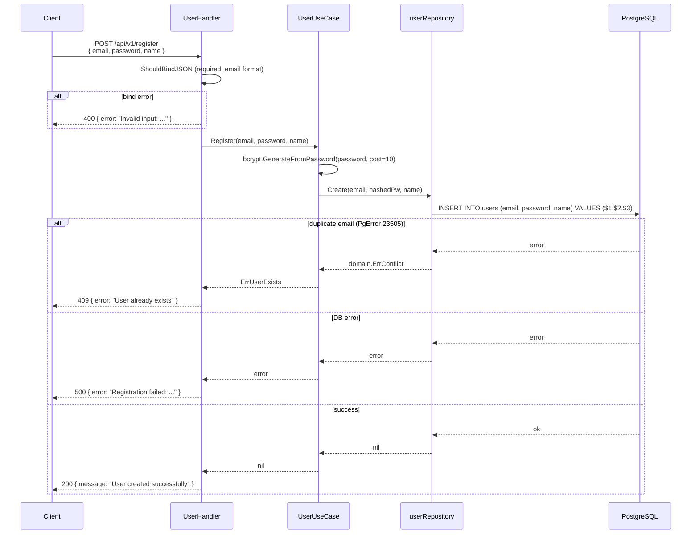
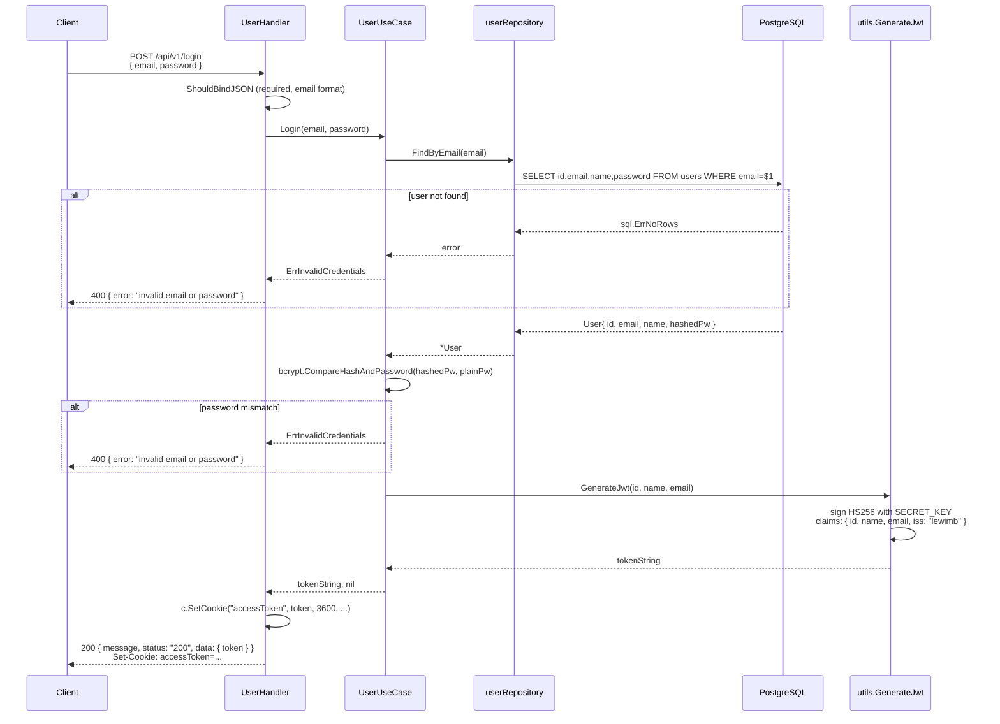
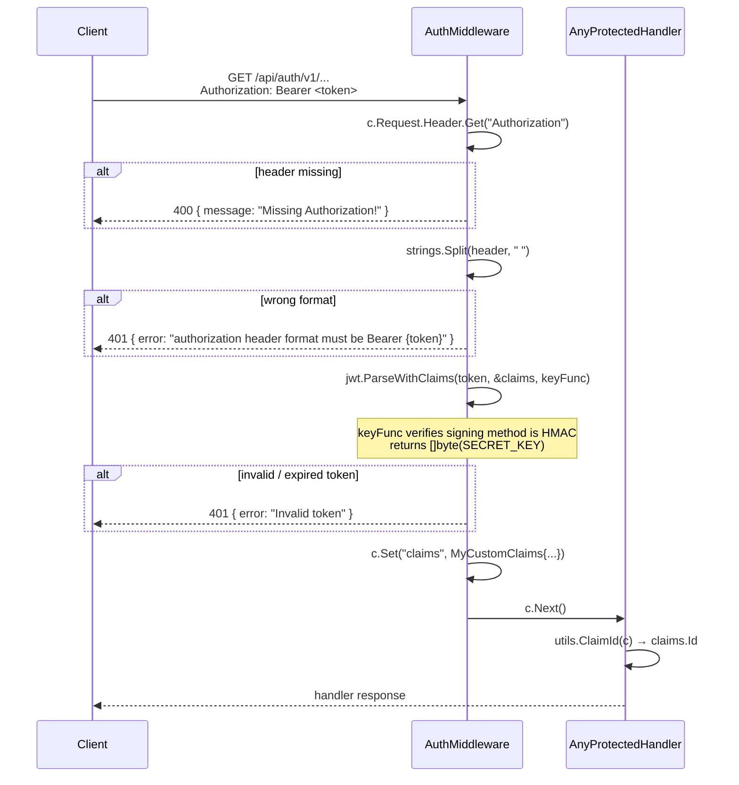
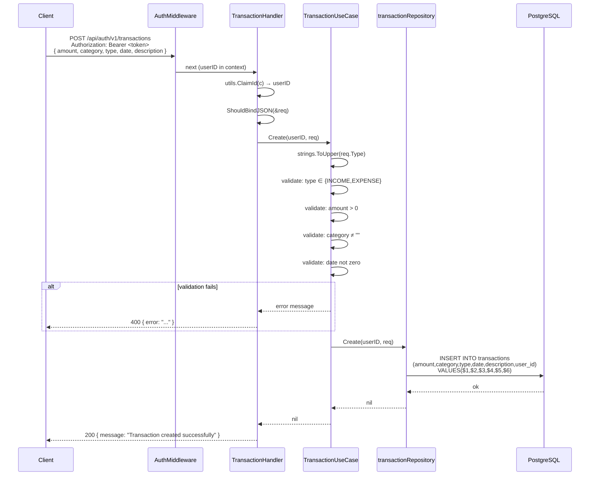
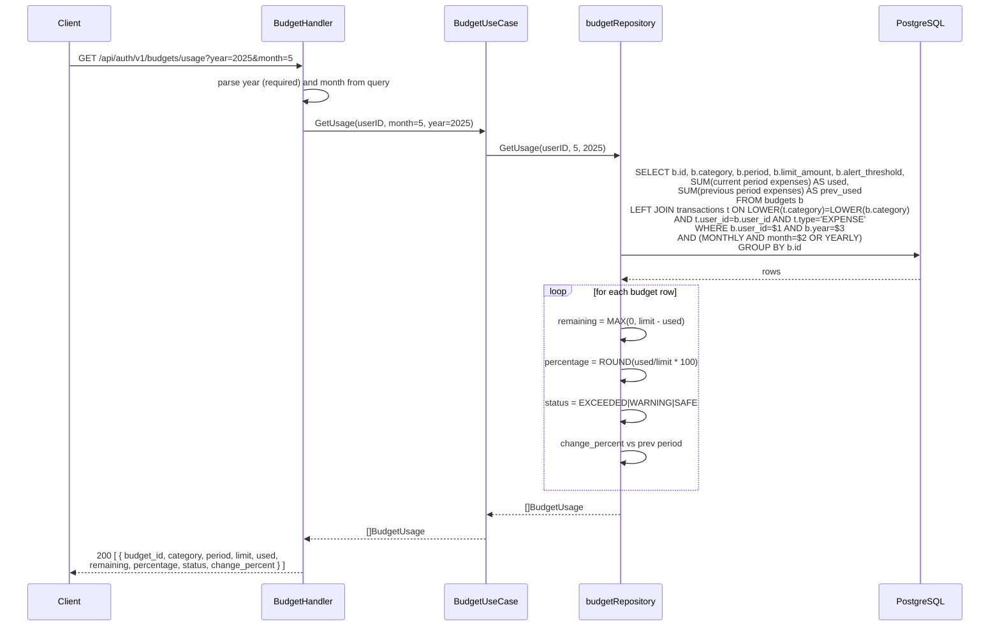
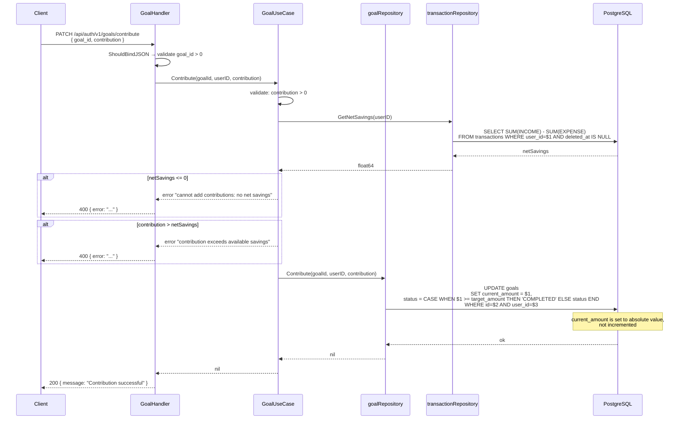
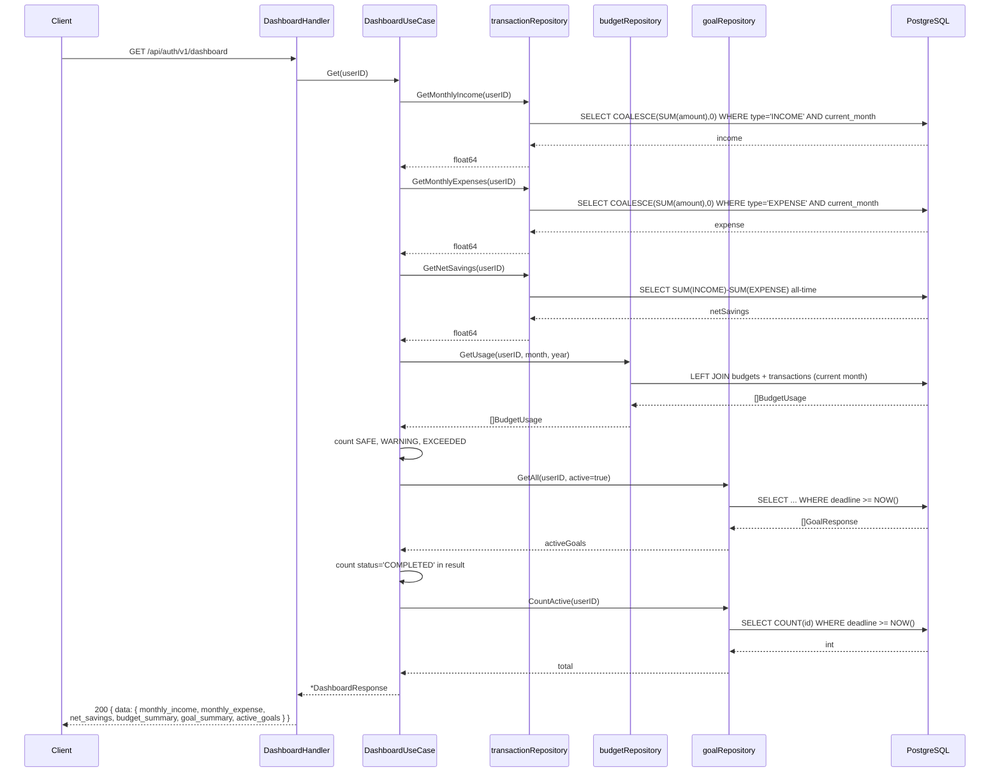
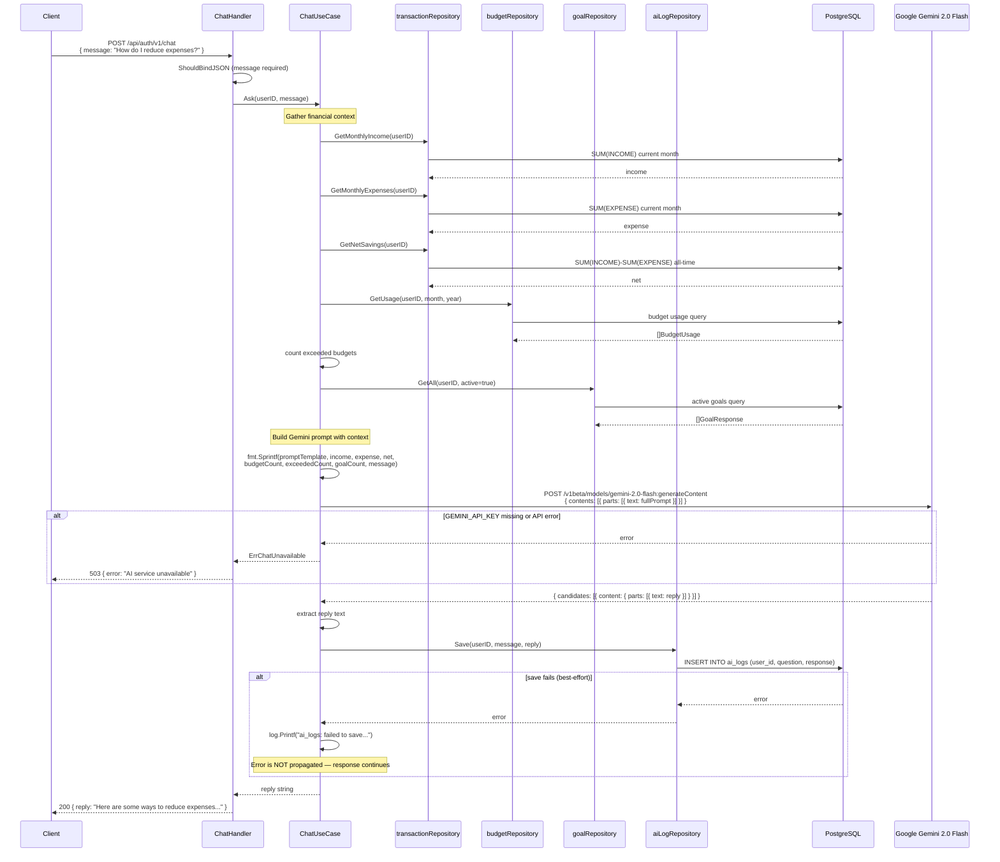
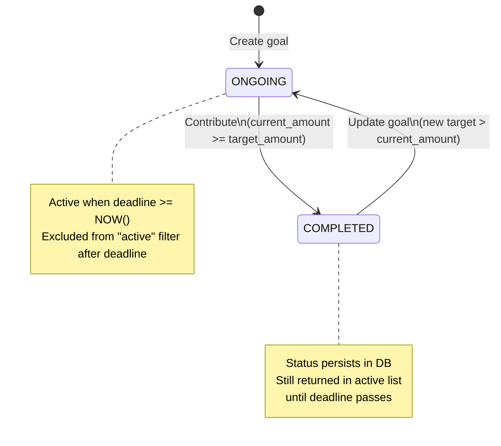

# Financial Planning Backend — Architecture & Technical Reference

> **Stack**: Go 1.25 · Gin v1.12 · PostgreSQL (pgx/v5) · JWT HS256 · Google Gemini 2.0 Flash  
> **Pattern**: Clean Architecture · Repository Pattern · Dependency Injection  
> **Server**: `:8080` (default `gin.Default()` port)  
> **CORS**: `http://localhost:5173` (hardcoded)

---

## Table of Contents

1. [System Overview](#1-system-overview)
2. [Database Analysis](#2-database-analysis)
3. [Use Case Analysis](#3-use-case-analysis)
4. [Class Diagram](#4-class-diagram)
5. [Sequence Diagrams](#5-sequence-diagrams)
6. [Architecture Explanation](#6-architecture-explanation)
7. [Design Decisions & Patterns](#7-design-decisions--patterns)

---

## 1. System Overview

### Purpose

A personal finance management REST API. Users can log income and expenses, track per-category budgets, pursue savings goals, view a dashboard snapshot of their financial health, and ask a context-aware AI assistant financial questions.

### Main Modules

| Module | Description |
|---|---|
| **Auth** | Registration, login, JWT issuance |
| **Transactions** | INCOME/EXPENSE ledger with pagination and filtering |
| **Budgets** | Category spending limits with real-time usage tracking |
| **Goals** | Savings targets with contributions and milestone tracking |
| **Dashboard** | Aggregated financial snapshot from all domains |
| **AI Chat** | Gemini-powered assistant with injected financial context |

### High-Level Architecture

```
┌─────────────────────────────────────────────────────────────────┐
│  Client (React/Vite @ localhost:5173)                           │
└────────────────────────────┬────────────────────────────────────┘
                             │ HTTP (JSON)
                             ▼
┌─────────────────────────────────────────────────────────────────┐
│  Delivery Layer  (internal/delivery/http/)                      │
│  ┌─────────────┐  ┌────────────────┐  ┌──────────────────────┐ │
│  │   Router    │  │   Middleware   │  │      Handlers        │ │
│  │  router.go  │  │  auth.go (JWT) │  │  user/tx/budget/...  │ │
│  └─────────────┘  └────────────────┘  └──────────────────────┘ │
└────────────────────────────┬────────────────────────────────────┘
                             │ Go structs / interfaces
                             ▼
┌─────────────────────────────────────────────────────────────────┐
│  Use Case Layer  (internal/usecase/)                            │
│  user · transaction · budget · goal · dashboard · chat          │
└────────────────────────────┬────────────────────────────────────┘
                             │ domain interfaces
                             ▼
┌─────────────────────────────────────────────────────────────────┐
│  Domain Layer  (internal/domain/)                               │
│  entities · repository interfaces · error sentinels             │
└────────────────────────────┬────────────────────────────────────┘
                             │ implements interfaces
                             ▼
┌─────────────────────────────────────────────────────────────────┐
│  Repository Layer  (internal/repository/postgres/)              │
│  user · transaction · budget · goal · ai_log                    │
└────────────────────────────┬────────────────────────────────────┘
                             │ SQL (database/sql + pgx/v5)
                             ▼
┌─────────────────────────────────────────────────────────────────┐
│  PostgreSQL                                                      │
│  users · transactions · budgets · goals · ai_logs               │
│  reports · settings  (schema only, no handlers)                 │
└─────────────────────────────────────────────────────────────────┘
```

### Main User Flows

```
1. Register → Login → [JWT token]
2. Token → Log transactions (income/expense)
3. Token → Set category budgets → View usage vs. spend
4. Token → Create goals → Contribute savings
5. Token → Dashboard (aggregated view)
6. Token → Ask AI assistant (auto-injects financial context)
```

---

## 2. Database Analysis

### 2.1 All Tables

#### `users`
Core identity table. All other domain tables FK to this.

| Column | Type | Constraints |
|---|---|---|
| `id` | SERIAL | PK |
| `email` | VARCHAR(255) | NOT NULL, UNIQUE |
| `name` | VARCHAR(255) | NOT NULL |
| `password` | VARCHAR(255) | NOT NULL (bcrypt hash) |
| `created_at` | TIMESTAMP | DEFAULT NOW() |
| `deleted_at` | TIMESTAMP | nullable (soft delete) |

---

#### `transactions`
Financial ledger. Every income or expense entry the user records.

| Column | Type | Constraints |
|---|---|---|
| `id` | SERIAL | PK |
| `user_id` | INTEGER | NOT NULL, FK → users(id) |
| `amount` | DECIMAL(10,2) | NOT NULL |
| `category` | VARCHAR(255) | NOT NULL |
| `type` | VARCHAR(10) | NOT NULL, CHECK IN ('INCOME','EXPENSE') |
| `date` | DATE | NOT NULL |
| `description` | TEXT | nullable |
| `created_at` | TIMESTAMP | DEFAULT NOW() |
| `deleted_at` | TIMESTAMP | nullable (soft delete) |

**Indices:**
```sql
idx_transactions_user_category_date (user_id, category, date)
idx_transactions_full               (user_id, category, type, date)
```

---

#### `budgets`
Per-category spending limit defined by the user for a specific period.

| Column | Type | Constraints |
|---|---|---|
| `id` | SERIAL | PK |
| `user_id` | INTEGER | NOT NULL, FK → users(id) |
| `category` | VARCHAR(255) | NOT NULL |
| `period` | VARCHAR(10) | NOT NULL, CHECK IN ('MONTHLY','YEARLY') |
| `month` | INTEGER | nullable (required only for MONTHLY) |
| `year` | INTEGER | NOT NULL |
| `limit_amount` | INTEGER | NOT NULL |
| `alert_threshold` | INTEGER | DEFAULT 80 |
| `created_at` | TIMESTAMP | DEFAULT NOW() |
| `deleted_at` | TIMESTAMP | nullable (soft delete) |

**Unique constraint:** `(user_id, category, period, month, year)` — prevents duplicate budgets for the same category/period combination.

**Index:** `idx_budgets_user (user_id)`

---

#### `goals`
A savings target with a deadline. Tracks progress via `current_amount`.

| Column | Type | Constraints |
|---|---|---|
| `id` | SERIAL | PK |
| `user_id` | INTEGER | NOT NULL, FK → users(id) |
| `name` | VARCHAR(255) | NOT NULL |
| `target_amount` | INTEGER | NOT NULL |
| `current_amount` | INTEGER | DEFAULT 0 |
| `deadline` | DATE | nullable |
| `status` | VARCHAR(20) | DEFAULT 'ONGOING' — values: ONGOING \| COMPLETED |
| `description` | TEXT | nullable (added in migration 009) |
| `created_at` | TIMESTAMP | DEFAULT NOW() |
| `deleted_at` | TIMESTAMP | nullable |

> **Note:** Goals use **hard delete** (`DELETE FROM goals`) — unlike transactions and budgets which soft-delete via `deleted_at`.

---

#### `ai_logs`
Persistent log of user ↔ AI conversations.

| Column | Type | Constraints |
|---|---|---|
| `id` | SERIAL | PK |
| `user_id` | INTEGER | NOT NULL, FK → users(id) |
| `question` | TEXT | nullable |
| `response` | TEXT | nullable |
| `created_at` | TIMESTAMP | DEFAULT NOW() |
| `deleted_at` | TIMESTAMP | nullable |

> **Status:** Repository fully implemented. No HTTP endpoint to retrieve history exists yet.

---

#### `reports` *(schema only)*
Intended for monthly/yearly financial report generation.

| Column | Type | Constraints |
|---|---|---|
| `id` | SERIAL | PK |
| `user_id` | INTEGER | NOT NULL, FK → users(id) |
| `type` | VARCHAR(50) | nullable — MONTHLY \| YEARLY |
| `generated_at` | TIMESTAMP | DEFAULT NOW() |

> **Status:** Schema exists. Zero handler, use-case, or repository code written.

---

#### `settings` *(schema only)*
Per-user application preferences with a guaranteed 1:1 relationship.

| Column | Type | Constraints |
|---|---|---|
| `id` | SERIAL | PK |
| `user_id` | INTEGER | NOT NULL, FK → users(id), **UNIQUE** |
| `currency` | VARCHAR(10) | DEFAULT 'IDR' |
| `language` | VARCHAR(10) | DEFAULT 'EN' |
| `notification_enabled` | BOOLEAN | DEFAULT TRUE |

> **Status:** Schema exists. Zero handler, use-case, or repository code written.

---

### 2.2 Entity Relationship Diagram

```
users (1) ────────────────────── (N) transactions
  │            user_id FK
  │
  ├── (1) ───────────────────── (N) budgets
  │            user_id FK
  │
  ├── (1) ───────────────────── (N) goals
  │            user_id FK
  │
  ├── (1) ───────────────────── (N) ai_logs
  │            user_id FK
  │
  ├── (1) ───────────────────── (N) reports
  │            user_id FK
  │
  └── (1) ───────────────────── (1) settings
               user_id FK + UNIQUE
```

**Cardinality summary:**

| Relationship | Cardinality | Enforced By |
|---|---|---|
| users → transactions | 1 : N | FK `transactions.user_id` |
| users → budgets | 1 : N | FK `budgets.user_id` |
| users → goals | 1 : N | FK `goals.user_id` |
| users → ai_logs | 1 : N | FK `ai_logs.user_id` |
| users → reports | 1 : N | FK `reports.user_id` |
| users → settings | 1 : 1 | FK + UNIQUE on `settings.user_id` |

No junction tables exist. No N:N relationships in the current schema.

### 2.3 Cross-Domain Logical Relationships

Though not enforced by FK, the following domain-level joins exist in SQL queries:

| Source | Join Target | Join Key | Used In |
|---|---|---|---|
| `budgets` | `transactions` | `LOWER(category)` + `user_id` + date period | `GetUsage` — spending vs. budget |
| `goals` | `transactions` | `user_id` aggregate | `Contribute` — net savings validation |

### 2.4 Migration Order

| # | Migration | Purpose |
|---|---|---|
| 001 | `create_users_table` | Core identity |
| 002 | `create_transactions_table` | Ledger |
| 003 | `create_budgets_table` | Spending limits |
| 004 | `create_goals_table` | Savings targets |
| 005 | `create_ai_logs_table` | Chat history |
| 006 | `create_reports_table` | (Planned) reports |
| 007 | `create_settings_table` | (Planned) user prefs |
| 008 | `add_performance_indices` | Query optimisation |
| 009 | `add_goals_description` | ALTER TABLE goals ADD COLUMN description |

---

## 3. Use Case Analysis

### 3.1 Authentication

**Flow:**

```
Register: email + password + name
  → bcrypt hash password (cost 10)
  → INSERT INTO users
  → detect 23505 (unique violation) → ErrConflict → 409

Login: email + password
  → SELECT user WHERE email = $1
  → bcrypt.CompareHashAndPassword
  → utils.GenerateJwt(id, name, email)   ← HS256, no expiry
  → return JWT in body + Set-Cookie (cookie ignored by middleware)
```

**Tables:** `users`  
**Use case:** `UserUseCase.Register`, `UserUseCase.Login`  
**Repository:** `userRepository.Create`, `userRepository.FindByEmail`

**Validation:**
- Email format validated by gin binding tag (`required,email`)
- Duplicate email: PostgreSQL error code `23505` mapped to `domain.ErrConflict`
- Wrong password: bcrypt mismatch returns `ErrInvalidCredentials` → 400

---

### 3.2 Transactions

**Create flow:**
```
POST body: { amount, category, type, date, description }
  → usecase validates: type ∈ {INCOME,EXPENSE}, amount > 0, category ≠ "", date ≠ zero
  → normalize: type = strings.ToUpper(type)
  → repo.Create(userID, req)
  → INSERT INTO transactions
```

**List flow:**
```
GET ?month=&year=&limit=&offset=
  → build dynamic WHERE clause with optional month/year filters
  → run COUNT(*) query for total records
  → run SELECT with LIMIT/OFFSET
  → return { data: [...], total: N }    ← N is total record count, not pages
```

**Update/Delete:**
- `WHERE id=$id AND user_id=$userID` — ownership enforced
- Delete sets `deleted_at = NOW()` (soft)
- `RowsAffected() == 0` → `ErrNotFound` → 404

**Monthly aggregates:**
```sql
-- GetMonthlyExpenses
SELECT COALESCE(SUM(amount),0) FROM transactions
WHERE user_id=$1
  AND EXTRACT(MONTH FROM date) = $2
  AND EXTRACT(YEAR FROM date) = $3
  AND type = 'EXPENSE'
  AND deleted_at IS NULL
```
Both `GetMonthlyExpenses` and `GetMonthlyIncome` use `time.Now()` server-side — no date param from client.

**Tables:** `transactions`

---

### 3.3 Budgets

**Create flow:**
```
POST body: { category, period, month?, year, limit_amount, alert_threshold? }
  → validate: period ∈ {MONTHLY,YEARLY}, year > 0, limit > 0
  → if MONTHLY: month required; if YEARLY: month = nil
  → alert_threshold default 80 if zero
  → check EXISTS (user_id, category, period, month, year) → ErrConflict → 409
  → INSERT INTO budgets
```

**Usage calculation flow:**
```
GET /budgets/usage?year=&month=
  → SQL LEFT JOIN budgets ← transactions
      matching: LOWER(category) + user_id + type='EXPENSE' + period filter
  → for each budget row:
      used      = SUM(current period expenses)
      prev_used = SUM(previous period expenses)
      remaining = MAX(0, limit - used)
      percentage = ROUND((used / limit) * 100)
      status:
          percentage >= 100              → EXCEEDED
          percentage >= alert_threshold  → WARNING
          else                           → SAFE
      change_percent = ROUND(((used - prev_used) / prev_used) * 100)
```

**Update (partial):**
```sql
UPDATE budgets
SET limit_amount    = COALESCE(NULLIF($1, 0), limit_amount),
    alert_threshold = COALESCE(NULLIF($2, 0), alert_threshold),
    category        = COALESCE(NULLIF($3, ''), category)
WHERE user_id=$4 AND id=$5
RETURNING ...
```
Sending `0` for any numeric field keeps the existing value.

**Tables:** `budgets` (joined to `transactions` for usage)

> **Security gap:** `GetByID` does not filter by `user_id` — any authenticated user can read any budget by ID.

---

### 3.4 Goals

**Create flow:**
```
POST body: { name, target_amount, deadline, description? }
  → validate: target > 0, deadline > NOW(), name ≠ ""
  → INSERT ... WHERE NOT EXISTS (same user + same name + deadline >= NOW())
      n == 0 → ErrConflict → 409
```

**Contribution flow (key business rule):**
```
PATCH /goals/contribute { goal_id, contribution }
  → validate: contribution > 0, goal_id > 0
  → txRepo.GetNetSavings(userID)
      = SUM(INCOME) - SUM(EXPENSE) all-time
  → if net <= 0   → error: "no net savings"
  → if amount > net → error: "exceeds available savings"
  → repo.Contribute(id, userID, amount)

-- SQL:
UPDATE goals
SET current_amount = $1,                                    ← ABSOLUTE value, not additive
    status = CASE WHEN $1 >= target_amount THEN 'COMPLETED' ELSE status END
WHERE id=$2 AND user_id=$3
```

> **Critical:** `Contribute` sets `current_amount` to the submitted value **directly**. The frontend must send the new cumulative total (e.g., current 500 + contributing 200 → send 700, not 200).

**Update flow:**
```sql
UPDATE goals SET
    name          = $1,
    target_amount = CASE WHEN $2 > current_amount THEN $2 ELSE target_amount END,
    description   = $3,
    deadline      = $4,
    status        = CASE WHEN $2 > current_amount THEN 'ONGOING' ELSE status END
WHERE id=$5 AND user_id=$6
```
Target can only be raised above current savings. Raising target resets status to ONGOING.

**Overview flow:**
```
GET /goals/overview
  → GetSavingsTotal(userID)    = SUM(current_amount) of all goals
  → GetUpcomingMilestones(userID)  = top 4, deadline > NOW, target ≠ current, ORDER BY deadline ASC
  → CountActive(userID)        = COUNT WHERE deadline >= NOW()
  → return { total_goals, savings, goals: [milestones] }
```

**Active filter:** `GET /goals?active=true` filters by `deadline >= NOW()`, not by `status`. A COMPLETED goal is still returned if its deadline hasn't passed.

**Tables:** `goals`, `transactions` (for net savings validation)

---

### 3.5 Dashboard

**Flow:**
```
GET /dashboard
  → 6 sequential DB queries:
      1. txRepo.GetMonthlyIncome(userID)     current month
      2. txRepo.GetMonthlyExpenses(userID)   current month
      3. txRepo.GetNetSavings(userID)        all-time
      4. budgetRepo.GetUsage(userID, month, year)
             → classify: SAFE / WARNING / EXCEEDED → count each
      5. goalRepo.GetAll(userID, active=true)
             → count COMPLETED in result
      6. goalRepo.CountActive(userID)
  → return DashboardResponse
```

**Response:**
```json
{
  "data": {
    "monthly_income":  1000000,
    "monthly_expense": 600000,
    "net_savings":     2400000,
    "budget_summary":  { "total": 3, "safe": 1, "warning": 1, "exceeded": 1 },
    "goal_summary":    { "total": 2, "active": 1, "completed": 1 },
    "active_goals":    [ ... ]
  }
}
```

**Tables:** `transactions`, `budgets`, `goals`

---

### 3.6 AI Chat

**Flow:**
```
POST /chat { message: "How can I save more?" }
  → fetch user's financial context:
      - GetMonthlyIncome(userID)
      - GetMonthlyExpenses(userID)
      - GetNetSavings(userID)
      - GetUsage(userID, month, year) → count exceeded budgets
      - GetAll(userID, active=true) → count active goals
  → build Gemini prompt:
      "You are a helpful financial assistant...
       [financial data summary]
       User question: <message>"
  → POST https://generativelanguage.googleapis.com/v1beta/models/gemini-2.0-flash:generateContent
  → parse response → extract candidates[0].content.parts[0].text
  → best-effort save to ai_logs (failure logged, not surfaced to client)
  → return { reply: "..." }
```

**Prompt language:** Model instructed to respond in the same language as the user (Indonesian or English).

**Error handling:**
- `GEMINI_API_KEY` missing → `ErrChatUnavailable` → 503
- Gemini non-200 → error with status code → 500
- `ai_logs` save failure → `log.Printf` only, response still returns 200

**Tables:** `transactions`, `budgets`, `goals`, `ai_logs` (write)  
**External API:** Google Gemini 2.0 Flash

---

## 4. Class Diagram

```mermaid
classDiagram
    direction TB

    %% ─── DOMAIN INTERFACES ────────────────────────────────────────────────────
    class UserRepository {
        <<interface>>
        +GetAll() []UserResponse, error
        +FindByEmail(email string) *User, error
        +Create(email, hashedPw, name string) error
    }

    class TransactionRepository {
        <<interface>>
        +GetByUserID(userID, limit, offset int, year, month string) []TransactionResponse, int, error
        +Create(userID int, req TransactionRequest) error
        +Update(userID, id int, req TransactionRequest) error
        +Delete(userID, id int) error
        +GetMonthlyExpenses(userID int) float64, error
        +GetMonthlyIncome(userID int) float64, error
        +GetNetSavings(userID int) float64, error
    }

    class BudgetRepository {
        <<interface>>
        +GetAll(userID int, category, month, year string) []Budget, error
        +GetByID(id int) *BudgetResponse, error
        +GetUsage(userID, month, year int) []BudgetUsage, error
        +Create(userID int, req CreateBudgetRequest) error
        +Update(userID, id, limit, threshold int, category string) *UpdateBudgetResponse, error
        +Delete(userID, id int) error
    }

    class GoalRepository {
        <<interface>>
        +GetAll(userID int, active bool) []GoalResponse, error
        +GetByID(id, userID int) *GoalResponse, error
        +GetSavingsTotal(userID int) float64, error
        +CountActive(userID int) int, error
        +GetUpcomingMilestones(userID int) []GoalResponse, error
        +Create(userID int, req CreateGoalRequest) error
        +Update(id, userID int, req CreateGoalRequest) error
        +Delete(id, userID int) error
        +Contribute(id, userID, amount int) error
    }

    class AiLogRepository {
        <<interface>>
        +Save(userID int, question, response string) error
        +GetByUserID(userID int) []AiLog, error
    }

    %% ─── DOMAIN ENTITIES ──────────────────────────────────────────────────────
    class User {
        +int ID
        +string Email
        +string Password
        +string Name
    }

    class TransactionRequest {
        +int Amount
        +string Category
        +string Type
        +Time Date
        +string Description
    }

    class TransactionResponse {
        +int ID
        +float64 Amount
        +string Category
        +string Type
        +Time Date
        +string Description
    }

    class Budget {
        +int ID
        +int UserID
        +string Category
        +string Period
        +int Month
        +int Year
        +int LimitAmount
        +int AlertThreshold
        +Time CreatedAt
    }

    class BudgetUsage {
        +int BudgetID
        +string Category
        +string Period
        +int64 Limit
        +int AlertThreshold
        +int64 Used
        +int64 Remaining
        +float64 Percentage
        +string Status
        +float64 ChangePercent
    }

    class GoalResponse {
        +int Id
        +string Name
        +int TargetAmount
        +int CurrentAmount
        +string Status
        +Time Deadline
        +string Description
        +Time CreatedAt
    }

    class CreateGoalRequest {
        +string Name
        +int TargetAmount
        +string Description
        +Time Deadline
    }

    class GoalOverviewResponse {
        +int TotalGoals
        +int Savings
        +GoalResponse Goals
    }

    class DashboardResponse {
        +float64 MonthlyIncome
        +float64 MonthlyExpense
        +float64 NetSavings
        +BudgetStatusSummary BudgetSummary
        +GoalProgressSummary GoalSummary
        +GoalResponse ActiveGoals
    }

    class AiLog {
        +int ID
        +int UserID
        +string Question
        +string Response
        +Time CreatedAt
    }

    class ChatRequest {
        +string Message
    }

    class ChatResponse {
        +string Reply
    }

    %% ─── USE CASES ────────────────────────────────────────────────────────────
    class UserUseCase {
        -repo UserRepository
        +GetAll() []UserResponse, error
        +Register(email, password, name string) error
        +Login(email, password string) string, error
    }

    class TransactionUseCase {
        -repo TransactionRepository
        +GetTransactions(...) []TransactionResponse, int, error
        +Create(userID int, req TransactionRequest) error
        +Update(userID, id int, req TransactionRequest) error
        +Delete(userID, id int) error
        +GetMonthlyExpenses(userID int) float64, error
        +GetMonthlyIncome(userID int) float64, error
    }

    class BudgetUseCase {
        -repo BudgetRepository
        +GetBudgets(...) []Budget, error
        +GetByID(id int) *BudgetResponse, error
        +GetUsage(userID, month, year int) []BudgetUsage, error
        +Create(userID int, req CreateBudgetRequest) error
        +Update(...) *UpdateBudgetResponse, error
        +Delete(userID, id int) error
    }

    class GoalUseCase {
        -repo GoalRepository
        -txRepo TransactionRepository
        +GetGoals(userID int, active bool) []GoalResponse, error
        +GetByID(id, userID int) *GoalResponse, error
        +GetOverview(userID int) *GoalOverviewResponse, error
        +Create(userID int, req CreateGoalRequest) error
        +Update(id, userID int, req CreateGoalRequest) error
        +Delete(id, userID int) error
        +Contribute(id, userID, amount int) error
    }

    class DashboardUseCase {
        -txRepo TransactionRepository
        -budgetRepo BudgetRepository
        -goalRepo GoalRepository
        +Get(userID int) *DashboardResponse, error
    }

    class ChatUseCase {
        -txRepo TransactionRepository
        -budgetRepo BudgetRepository
        -goalRepo GoalRepository
        -logRepo AiLogRepository
        +Ask(userID int, message string) string, error
    }

    %% ─── POSTGRES REPOSITORIES ────────────────────────────────────────────────
    class userRepository {
        -db sql.DB
        +GetAll() []UserResponse, error
        +FindByEmail(email string) *User, error
        +Create(email, pw, name string) error
    }

    class transactionRepository {
        -db sql.DB
        +GetByUserID(...) []TransactionResponse, int, error
        +Create(...) error
        +Update(...) error
        +Delete(...) error
        +GetMonthlyExpenses(...) float64, error
        +GetMonthlyIncome(...) float64, error
        +GetNetSavings(...) float64, error
    }

    class budgetRepository {
        -db sql.DB
        +GetAll(...) []Budget, error
        +GetByID(...) *BudgetResponse, error
        +GetUsage(...) []BudgetUsage, error
        +Create(...) error
        +Update(...) *UpdateBudgetResponse, error
        +Delete(...) error
    }

    class goalRepository {
        -db sql.DB
        +GetAll(...) []GoalResponse, error
        +GetByID(...) *GoalResponse, error
        +GetSavingsTotal(...) float64, error
        +CountActive(...) int, error
        +GetUpcomingMilestones(...) []GoalResponse, error
        +Create(...) error
        +Update(...) error
        +Delete(...) error
        +Contribute(...) error
    }

    class aiLogRepository {
        -db sql.DB
        +Save(...) error
        +GetByUserID(...) []AiLog, error
    }

    %% ─── HANDLERS ─────────────────────────────────────────────────────────────
    class UserHandler {
        -uc UserUseCase
        +Register(c Context)
        +Login(c Context)
        +GetAll(c Context)
    }

    class TransactionHandler {
        -uc TransactionUseCase
        +GetAll(c Context)
        +Create(c Context)
        +Update(c Context)
        +Delete(c Context)
        +GetMonthlyExpenses(c Context)
        +GetMonthlyIncome(c Context)
    }

    class BudgetHandler {
        -uc BudgetUseCase
        +GetAll(c Context)
        +GetByID(c Context)
        +Create(c Context)
        +GetUsage(c Context)
        +Update(c Context)
        +Delete(c Context)
    }

    class GoalHandler {
        -uc GoalUseCase
        +GetAll(c Context)
        +GetByID(c Context)
        +GetOverview(c Context)
        +GetMilestones(c Context)
        +Create(c Context)
        +Update(c Context)
        +Delete(c Context)
        +Contribute(c Context)
    }

    class DashboardHandler {
        -uc DashboardUseCase
        +Get(c Context)
    }

    class ChatHandler {
        -uc ChatUseCase
        +Ask(c Context)
    }

    class AuthMiddleware {
        +AuthRequired() HandlerFunc
        -parseBearer(header string) string
        -parseJWT(token string) Claims, error
    }

    %% ─── INTERFACE IMPLEMENTATIONS ────────────────────────────────────────────
    userRepository ..|> UserRepository : implements
    transactionRepository ..|> TransactionRepository : implements
    budgetRepository ..|> BudgetRepository : implements
    goalRepository ..|> GoalRepository : implements
    aiLogRepository ..|> AiLogRepository : implements

    %% ─── USE CASE DEPENDENCIES ────────────────────────────────────────────────
    UserUseCase --> UserRepository : depends on
    TransactionUseCase --> TransactionRepository : depends on
    BudgetUseCase --> BudgetRepository : depends on
    GoalUseCase --> GoalRepository : depends on
    GoalUseCase --> TransactionRepository : net savings check
    DashboardUseCase --> TransactionRepository : aggregates
    DashboardUseCase --> BudgetRepository : aggregates
    DashboardUseCase --> GoalRepository : aggregates
    ChatUseCase --> TransactionRepository : context fetch
    ChatUseCase --> BudgetRepository : context fetch
    ChatUseCase --> GoalRepository : context fetch
    ChatUseCase --> AiLogRepository : persists Q&A

    %% ─── HANDLER → USE CASE ───────────────────────────────────────────────────
    UserHandler --> UserUseCase : delegates to
    TransactionHandler --> TransactionUseCase : delegates to
    BudgetHandler --> BudgetUseCase : delegates to
    GoalHandler --> GoalUseCase : delegates to
    DashboardHandler --> DashboardUseCase : delegates to
    ChatHandler --> ChatUseCase : delegates to

    %% ─── DOMAIN ENTITY USAGE ──────────────────────────────────────────────────
    TransactionUseCase ..> TransactionRequest : input
    TransactionUseCase ..> TransactionResponse : output
    BudgetUseCase ..> BudgetUsage : output
    GoalUseCase ..> CreateGoalRequest : input
    GoalUseCase ..> GoalResponse : output
    GoalUseCase ..> GoalOverviewResponse : output
    DashboardUseCase ..> DashboardResponse : output
    ChatUseCase ..> ChatRequest : input
    ChatUseCase ..> ChatResponse : output
    ChatUseCase ..> AiLog : persists
```



---

## 5. Sequence Diagrams

### 5.1 User Registration



---

### 5.2 User Login



---

### 5.3 Auth Middleware (JWT Verification)



---

### 5.4 Create Transaction



---

### 5.5 Get Budget Usage



---

### 5.6 Goal Contribution



---

### 5.7 Dashboard Load



---

### 5.8 AI Chat



---

### 5.9 Goal Status Transitions



---

## 6. Architecture Explanation

### 6.1 Layering Approach

The project follows **Clean Architecture** with four concentric layers. Dependencies always point **inward**:

```
Delivery → UseCase → Domain ← Repository
```

| Layer | Package | Responsibility |
|---|---|---|
| **Domain** | `internal/domain/` | Entities, repository interfaces, error sentinels. Zero external dependencies. |
| **Use Case** | `internal/usecase/` | Business logic, validation, orchestration. Depends only on domain interfaces. |
| **Repository** | `internal/repository/postgres/` | SQL implementations of domain interfaces. Depends on `database/sql` and domain. |
| **Delivery** | `internal/delivery/http/` | HTTP routing, middleware, JSON binding/response. Depends on use cases and domain DTOs. |

### 6.2 Dependency Flow

```
main.go  (composition root)
  │
  ├─ postgres.NewUserRepository(db)      → domain.UserRepository
  ├─ postgres.NewTransactionRepository(db) → domain.TransactionRepository
  ├─ postgres.NewBudgetRepository(db)    → domain.BudgetRepository
  ├─ postgres.NewGoalRepository(db)      → domain.GoalRepository
  └─ postgres.NewAiLogRepository(db)     → domain.AiLogRepository
       │
       ├─ usecase.NewUserUseCase(userRepo)
       ├─ usecase.NewTransactionUseCase(txRepo)
       ├─ usecase.NewBudgetUseCase(budgetRepo)
       ├─ usecase.NewGoalUseCase(goalRepo, txRepo)   ← cross-domain
       ├─ usecase.NewDashboardUseCase(txRepo, budgetRepo, goalRepo)
       └─ usecase.NewChatUseCase(txRepo, budgetRepo, goalRepo, aiLogRepo)
            │
            └─ delivery.Setup(router, Deps{...})
                    └─ handler.NewXxxHandler(uc) for each domain
```

Cross-domain use cases receive multiple repo interfaces. `GoalUseCase` depends on `TransactionRepository` to validate net savings before a contribution. `DashboardUseCase` and `ChatUseCase` each aggregate from all three data repos.

### 6.3 Repository Pattern

Each domain entity has:
1. A **repository interface** in `domain/` — defines what operations the domain needs
2. A **postgres struct** in `repository/postgres/` — implements the interface with raw SQL

```go
// domain layer — defines contract
type TransactionRepository interface {
    GetByUserID(userID, limit, offset int, year, month string) ([]TransactionResponse, int, error)
    // ...
}

// repository layer — implements contract
type transactionRepository struct{ db *sql.DB }
func (r *transactionRepository) GetByUserID(...) ([]TransactionResponse, int, error) { /* SQL */ }

// use case layer — depends on interface, not concrete struct
type TransactionUseCase struct { repo TransactionRepository }
```

This lets the postgres implementation be swapped (e.g., for a mock in tests) without touching use cases.

### 6.4 Request Lifecycle

```
1. HTTP request arrives at Gin router
2. corsMiddleware runs (adds CORS headers, handles OPTIONS preflight)
3. [for /api/auth/v1/*] AuthRequired middleware:
      - Reads Authorization header
      - Parses and validates JWT
      - Stores MyCustomClaims in gin.Context ("claims" key)
4. Handler function runs:
      a. utils.ClaimId(c) extracts userID from claims
      b. c.ShouldBindJSON() binds and validates request body
      c. Calls use case method
5. Use case runs:
      a. Business validation (amounts, types, dates, ownership)
      b. Calls repository method(s)
6. Repository executes parameterized SQL
7. Result flows back up: repo → use case → handler → c.JSON(status, payload)
```

### 6.5 Validation Flow

Validation happens at two levels:

**Level 1 — HTTP binding (gin):**
```go
// in handler
var req struct {
    Email    string `json:"email" binding:"required,email"`
    Password string `json:"password" binding:"required"`
}
if err := c.ShouldBindJSON(&req); err != nil {
    c.JSON(400, gin.H{"error": "Invalid input: " + err.Error()})
    return
}
```
Catches: missing required fields, email format, type parsing.

**Level 2 — Business rules (use case):**
```go
// in usecase
if req.Type != "INCOME" && req.Type != "EXPENSE" {
    return errors.New("invalid transaction type: must be INCOME or EXPENSE")
}
if req.Amount <= 0 {
    return errors.New("amount must be greater than 0")
}
```
Catches: domain invariants, business rule violations, cross-entity checks (e.g., net savings for contributions).

**Level 3 — Database constraints:**
- UNIQUE violations → `pgconn.PgError` code `23505` → `domain.ErrConflict`
- FK violations → propagated as repo errors
- `RowsAffected() == 0` → `domain.ErrNotFound`

### 6.6 Error Handling Flow

```
domain.ErrConflict    → 409 Conflict
domain.ErrNotFound    → 404 Not Found
domain.ErrUnauthorized → 401 Unauthorized
usecase.ErrUserExists  → 409
usecase.ErrInvalidCredentials → 400
usecase.ErrChatUnavailable → 503

any other error → 400 or 500 depending on handler judgment
```

Domain error sentinels (`errors.New(...)`) propagate up through repo → use case → handler. Handlers use `errors.Is()` to match and return the correct HTTP status.

```go
// handler pattern
if err := h.uc.Delete(id, userID); err != nil {
    if errors.Is(err, domain.ErrNotFound) {
        c.JSON(404, gin.H{"error": err.Error()})
        return
    }
    c.JSON(500, gin.H{"error": err.Error()})
    return
}
```

### 6.7 Authentication Details

| Property | Value |
|---|---|
| Algorithm | HS256 |
| Secret | `SECRET_KEY` env variable |
| Claims | `id int`, `name string`, `email string`, `iss: "lewimb"` |
| Expiry | **None** — tokens do not expire |
| Transport | Response body JSON + `Set-Cookie: accessToken` |
| Middleware reads | `Authorization: Bearer <token>` header **only** |
| Cookie use | Cookie is set but ignored by middleware |

### 6.8 Soft Delete Strategy

| Table | Delete type | Mechanism |
|---|---|---|
| `users` | Soft | `deleted_at` column (not yet exposed in API) |
| `transactions` | Soft | `SET deleted_at = NOW()` |
| `budgets` | Soft | `SET deleted_at = NOW()` |
| `goals` | **Hard** | `DELETE FROM goals WHERE id=$1 AND user_id=$2` |
| `ai_logs` | Soft | `deleted_at` column (queried with IS NULL) |

All read queries filter `WHERE deleted_at IS NULL` on soft-deleted tables. Goal deletion is intentionally permanent.

---

## 7. Design Decisions & Patterns

### Discovered Patterns

| Pattern | Where Used | Why |
|---|---|---|
| **Clean Architecture** | Entire codebase | Separate business logic from HTTP/DB concerns |
| **Repository Interface** | All domain entities | Invert dependency; enable test mocking |
| **Dependency Injection** | `main.go` (composition root) | Single wiring point; no globals |
| **Error Sentinel** | `domain/errors.go` | Type-safe error identification across layers |
| **Soft Delete** | transactions, budgets | Preserve history for future audit/undo |
| **Parameterized SQL** | All repositories | SQL injection prevention |
| **Dynamic query building** | `GetAll` (tx, budgets) | Optional filter params without ORM |
| **COALESCE(NULLIF())** | Budget update | Partial update without null-overwrite |
| **Best-effort logging** | `ai_logs` save in ChatUseCase | Non-critical path should not fail primary response |
| **Cross-repo use case** | GoalUseCase, DashboardUseCase, ChatUseCase | Aggregate data across domains without coupling repos to each other |

### Notable Trade-offs

| Decision | Benefit | Limitation |
|---|---|---|
| Raw SQL (no ORM) | Full control, readable queries | More boilerplate, manual scan |
| No JWT expiry | Simpler flow | Security risk — no token invalidation |
| Absolute contribution | Idempotent if re-sent | UI must track cumulative total |
| All-time net savings for contribution check | Simple | Doesn't account for already-contributed amounts |
| No caching on dashboard | Always accurate | 6+ queries per page load |
| CORS hardcoded | Simple | Must be changed for production |
| `GET /api/v1/users` unauthenticated | Debug convenience | Exposes user list and password hashes |
| `GetBudgetByID` no ownership check | Simpler query | Any user can read any budget by ID |

---

*Generated from full codebase analysis — `financial-planning-golang` · 2026-05-17*
