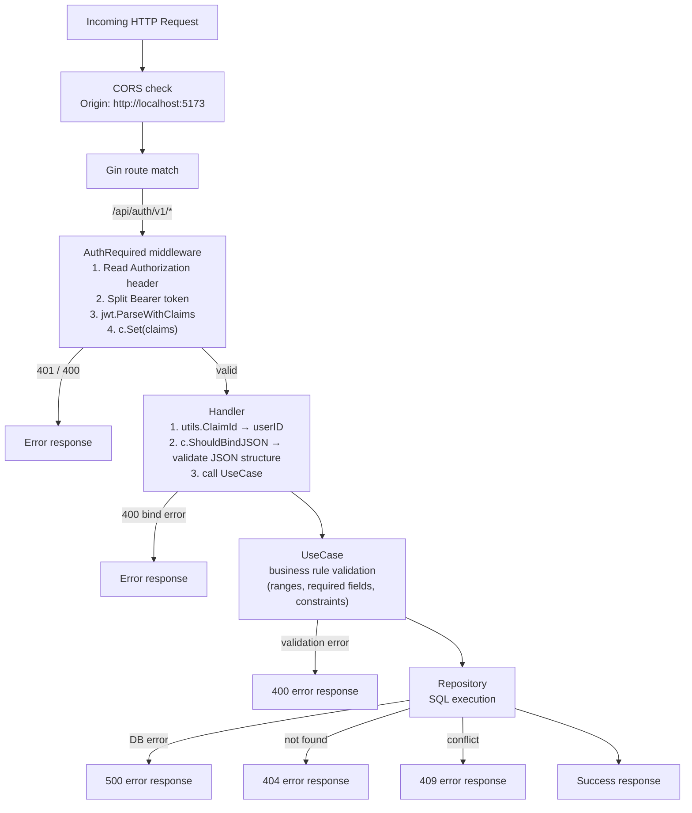
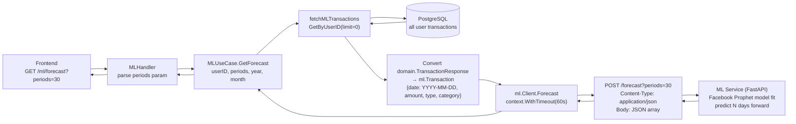

# API Flow Documentation

Detailed documentation of every endpoint: validation rules, service interactions, DB queries, and response shapes. All information is derived directly from the source code.

---

## Base URL

```
http://localhost:8080
```

---

## Authentication

All `/api/auth/v1/*` routes require:
```
Authorization: Bearer <JWT>
```

The JWT is issued on login. It contains `{id, name, email}` claims signed with HS256 using `SECRET_KEY`. There is **no expiry** in the claims — only the `accessToken` cookie has a 1-hour client-side expiry. The middleware reads the `Authorization` header only; the cookie is not used for validation.

---

## Request Validation Flow



---

## Endpoints

### Authentication — no JWT required

---

#### `POST /api/v1/register`

**Flow:** Handler → UserUseCase → UserRepository → DB

```
Request body:
{ "email": "string", "password": "string", "name": "string" }

Validation (UseCase):
  - email must be unique (DB constraint)
  - password: no length constraint enforced in app (only bcrypt limits apply)

DB:
  INSERT INTO users (email, name, password) VALUES ($1, $2, $3)
  Unique constraint on email → ErrConflict → ErrUserExists → 409

Password handling:
  bcrypt.GenerateFromPassword(password, cost=10)

Responses:
  200 → { "message": "User registered successfully" }
  409 → { "error": "already exists" }
  500 → { "error": "..." }
```

---

#### `POST /api/v1/login`

**Flow:** Handler → UserUseCase → UserRepository → DB → JWT generation

```
Request body:
{ "email": "string", "password": "string" }

DB:
  SELECT id, email, name, password FROM users
  WHERE email = $1 AND deleted_at IS NULL

Password verification:
  bcrypt.CompareHashAndPassword(storedHash, inputPassword)

JWT generation:
  HS256 signed with SECRET_KEY
  Claims: { id, name, email, iss: "lewimb" }
  No ExpiresAt claim

Side effect:
  c.SetCookie("accessToken", token, 3600, "/", "localhost", false, false)

Responses:
  200 → { "message": "Login Successfully", "status": "200",
           "data": { "token": "eyJ..." } }
  400 → { "error": "invalid email or password" }
```

---

#### `GET /api/v1/users`

```
DB:
  SELECT id, email, name, created_at, deleted_at FROM users

Responses:
  200 → { "data": [...UserResponse], "status": "success", "message": "success" }
  500 → { "error": "..." }
```

---

### Transactions — JWT required

---

#### `GET /api/auth/v1/transactions`

**Flow:** Handler → TransactionUseCase → TransactionRepository → DB

```
Query params:
  month   string  optional  "1"–"12"
  year    string  optional  "2026"
  limit   int     optional  default 10  (0 = no limit)
  offset  int     optional  default 0

DB (two queries):
  1. COUNT(*) FROM transactions WHERE user_id=$1 AND deleted_at IS NULL
     [+ EXTRACT(MONTH) AND EXTRACT(YEAR) if month+year provided]

  2. SELECT id, amount, category, type, date::date, description
     FROM transactions WHERE user_id=$1 AND deleted_at IS NULL
     [+ month/year filter]
     ORDER BY date DESC
     [LIMIT $N] [OFFSET $N]

Responses:
  200 → { "data": [...TransactionResponse], "total": N }
  500 → { "error": "..." }
```

---

#### `POST /api/auth/v1/transactions`

```
Request body:
{ "amount": int, "category": "string", "type": "INCOME|EXPENSE",
  "date": "2026-05-01T00:00:00Z", "description": "string" }

Validation (UseCase):
  - amount > 0
  - type normalised to strings.ToUpper(type); must be INCOME or EXPENSE
  - category non-empty
  - date not zero value

DB:
  INSERT INTO transactions (amount, category, type, date, description, user_id)
  VALUES ($1, $2, $3, $4, $5, $6)

Responses:
  200 → { "message": "Transaction created successfully" }
  400 → { "error": "validation message" }
```

---

#### `PUT /api/auth/v1/transactions/:id`

```
Path param: id (integer)
Request body: same as POST

Validation: same as POST

DB:
  UPDATE transactions
  SET amount=$1, category=$2, type=$3, date=$4, description=$5, updated_at=NOW()
  WHERE id=$6 AND user_id=$7 AND deleted_at IS NULL

  RowsAffected = 0 → ErrNotFound → 404

Responses:
  200 → { "message": "Transaction updated successfully" }
  400 → { "error": "..." }
  404 → { "error": "not found" }
```

---

#### `DELETE /api/auth/v1/transactions/:id`

```
DB:
  UPDATE transactions SET deleted_at=NOW()
  WHERE id=$1 AND user_id=$2 AND deleted_at IS NULL

  RowsAffected = 0 → ErrNotFound → 404

Responses:
  200 → { "message": "Transaction deleted successfully" }
  400 → invalid ID
  404 → not found
```

---

#### `GET /api/auth/v1/transactions/monthly`

```
DB:
  SELECT COALESCE(SUM(amount), 0) FROM transactions
  WHERE user_id=$1 AND type='EXPENSE'
  AND EXTRACT(MONTH FROM date) = currentMonth
  AND EXTRACT(YEAR FROM date) = currentYear
  AND deleted_at IS NULL

Responses:
  200 → { "total": 3200000.0, "message": "success" }
```

---

#### `GET /api/auth/v1/transactions/monthly-income`

Same as above but `type='INCOME'`.

---

### Budgets — JWT required

---

#### `GET /api/auth/v1/budgets`

```
Query params:
  category  string  optional
  month     string  optional
  year      string  optional

DB:
  SELECT id, user_id, category, period, month, year, limit_amount,
         alert_threshold, created_at
  FROM budgets WHERE user_id=$1 AND deleted_at IS NULL
  [AND category=$N] [AND year=$N] [AND month=$N]
  ORDER BY created_at DESC

Responses:
  200 → { "data": [...Budget] }  ← snake_case fields
```

---

#### `POST /api/auth/v1/budgets`

```
Request body:
{ "category": "string", "period": "MONTHLY|YEARLY",
  "month": 5, "year": 2026,
  "limit_amount": 2000000, "alert_threshold": 80 }

Validation (UseCase):
  - period must be MONTHLY or YEARLY
  - limit_amount > 0
  - category non-empty

DB:
  1. SELECT EXISTS (... WHERE user_id=$1 AND category=$2 AND period=$3
                   AND year=$4 AND (month=$5 OR ($5 IS NULL AND month IS NULL)))
     → ErrConflict → 409

  2. INSERT INTO budgets (user_id, category, period, month, year,
                          limit_amount, alert_threshold)

Responses:
  201 → { "message": "Budget created successfully" }
  400 → validation error
  409 → duplicate budget
```

---

#### `GET /api/auth/v1/budgets/usage`

```
Query params:
  year   int  required
  month  int  optional (defaults to current month)

DB (single complex query):
  SELECT b.id, b.category, b.period, b.limit_amount, b.alert_threshold,
    SUM(current_period_expense) AS used,
    SUM(previous_period_expense) AS prev_used
  FROM budgets b
  LEFT JOIN transactions t ON t.user_id = b.user_id
    AND LOWER(t.category) = LOWER(b.category)
    AND t.type = 'EXPENSE' AND t.deleted_at IS NULL
  WHERE b.user_id=$1 AND b.year=$3
    AND ((b.period='MONTHLY' AND b.month=$2) OR (b.period='YEARLY'))
    AND b.deleted_at IS NULL
  GROUP BY b.id, b.category, b.period, b.limit_amount, b.alert_threshold

Computed in repository (Go):
  remaining     = limit - used (min 0)
  percentage    = round((used / limit) * 100)
  status        = EXCEEDED if ≥100%, WARNING if ≥alert_threshold%, else SAFE
  change_percent = round(((used - prev_used) / prev_used) * 100)

Responses:
  200 → [ ...BudgetUsage ]  ← direct array, no wrapper
  400 → invalid year
```

---

#### `GET /api/auth/v1/budgets/:id`

```
DB:
  SELECT id, user_id, category, period, month, year, limit_amount,
         alert_threshold, created_at
  FROM budgets WHERE id=$1

NOTE: Response uses camelCase (BudgetResponse struct):
  userId, limitAmount, alertThreshold, createdAt

Responses:
  200 → { "data": BudgetResponse }  ← camelCase
  404 → not found
```

---

#### `PUT /api/auth/v1/budgets/:id`

```
Request body (camelCase):
{ "limitAmount": 2500000, "alertThreshold": 75, "category": "string" }

Zero values mean "keep existing" (NULLIF in SQL).

DB:
  UPDATE budgets SET
    limit_amount    = COALESCE(NULLIF($1, 0), limit_amount),
    alert_threshold = COALESCE(NULLIF($2, 0), alert_threshold),
    category        = COALESCE(NULLIF($3, ''), category),
    updated_at      = NOW()
  WHERE user_id=$4 AND id=$5
  RETURNING id, user_id, category, period, month, year, limit_amount, alert_threshold

Responses:
  200 → { "data": UpdateBudgetResponse }  ← snake_case
  404 → not found
```

---

#### `DELETE /api/auth/v1/budgets/:id`

```
DB:
  UPDATE budgets SET deleted_at=NOW()
  WHERE user_id=$1 AND id=$2 AND deleted_at IS NULL

Responses:
  200 → { "message": "Budget deleted successfully" }
  404 → not found
```

---

### Goals — JWT required

---

#### `GET /api/auth/v1/goals`

```
Query params:
  active  bool  optional default false
           "true" → WHERE deadline >= NOW()

DB:
  SELECT id, name, target_amount, current_amount, status, deadline,
         description, created_at
  FROM goals WHERE user_id=$1
  [AND deadline >= NOW() if active=true]

Responses:
  200 → { "data": [...GoalResponse] }
```

---

#### `POST /api/auth/v1/goals`

```
Request body:
{ "name": "string", "target_amount": int,
  "description": "string", "deadline": "2026-12-31T00:00:00Z" }

Validation (UseCase):
  - target_amount > 0
  - deadline must be in the future (time.Now())
  - name non-empty

DB:
  INSERT INTO goals (user_id, name, target_amount, description, deadline)
  SELECT $1, $2, $3, $4, $5
  WHERE NOT EXISTS (
    SELECT 1 FROM goals
    WHERE user_id=$6 AND name=$7 AND deadline >= NOW()
  )
  RowsAffected = 0 → ErrConflict → 409

Responses:
  201 → { "message": "Goal created successfully" }
  400 → validation error
  409 → active goal with same name exists
```

---

#### `GET /api/auth/v1/goals/overview`

```
DB (3 queries):
  1. SUM(current_amount) FROM goals WHERE user_id=$1  → savings
  2. SELECT * FROM goals WHERE user_id=$1 AND deadline > NOW()
     AND target_amount <> current_amount ORDER BY deadline LIMIT 4  → milestones
  3. COUNT(*) FROM goals WHERE user_id=$1 AND deadline >= NOW()  → total

Responses:
  200 → { "message": "success",
           "data": { total_goals, savings, goals: [...milestones] } }
```

---

#### `GET /api/auth/v1/goals/milestones`

Same internal call as overview; returns only the `goals` array (next 4 by deadline).

---

#### `GET /api/auth/v1/goals/:id`

```
DB:
  SELECT id, name, target_amount, current_amount, description,
         deadline, status, created_at
  FROM goals WHERE id=$1 AND user_id=$2

Responses:
  200 → { "data": GoalResponse }
  404 → not found
```

---

#### `PUT /api/auth/v1/goals/:id`

```
Request body: same as POST

Validation: same as POST

DB:
  UPDATE goals SET
    name          = $1,
    target_amount = CASE WHEN $2 > current_amount THEN $2 ELSE target_amount END,
    description   = $3,
    deadline      = $4,
    status        = CASE WHEN $2 > current_amount THEN 'ONGOING' ELSE status END,
    updated_at    = NOW()
  WHERE id=$5 AND user_id=$6

Note: target_amount is NOT lowered below current_amount.

Responses:
  200 → { "message": "Goal updated successfully" }
  400 → validation error
  404 → not found
```

---

#### `DELETE /api/auth/v1/goals/:id`

```
DB:
  DELETE FROM goals WHERE id=$1 AND user_id=$2
  (hard delete — no soft delete)

Responses:
  200 → { "message": "Goal deleted successfully" }
  404 → not found
```

---

#### `PATCH /api/auth/v1/goals/contribute`

```
Request body:
{ "goal_id": int, "contribution": int }

Validation (UseCase):
  1. contribution > 0
  2. GetNetSavings(userID) > 0  → else "cannot add contributions: no net savings"
  3. contribution <= netSavings  → else "contribution exceeds available savings"

DB (2 queries):
  1. SELECT SUM(INCOME) - SUM(EXPENSE) FROM transactions
     WHERE user_id=$1 AND deleted_at IS NULL  → netSavings

  2. UPDATE goals SET
       current_amount = $1,
       status = CASE WHEN $1 >= target_amount THEN 'COMPLETED' ELSE status END,
       updated_at = NOW()
     WHERE id=$2 AND user_id=$3

Note: contribution SETS current_amount directly — does not add to it.

Responses:
  200 → { "message": "Contribution successful" }
  400 → validation error
  404 → goal not found
```

---

### Dashboard — JWT required

---

#### `GET /api/auth/v1/dashboard`

```
No query params. Server uses time.Now() for month/year.

DB (5 sequential queries):
  1. SUM(INCOME amount) WHERE month=now AND year=now
  2. SUM(EXPENSE amount) WHERE month=now AND year=now
  3. SUM(INCOME) - SUM(EXPENSE) all-time → net savings
  4. Budget usage JOIN query for current month
  5. Active goals (deadline >= NOW())
  6. COUNT active goals

Aggregations (in Go):
  - BudgetStatusSummary: count SAFE/WARNING/EXCEEDED from usage
  - GoalProgressSummary: total, active, completed

Responses:
  200 → { "data": {
    monthly_income, monthly_expense, net_savings,
    budget_summary: { total, safe, warning, exceeded },
    goal_summary:   { total, active, completed },
    active_goals:   [ ...GoalResponse ]
  } }
```

---

### AI Chat — JWT required

---

#### `POST /api/auth/v1/chat`

```
Request body:
{ "message": "string" }

Validation:
  - message required (binding:"required")

Context building (ChatUseCase.Ask):
  Fetches: monthly income, monthly expense, net savings,
           budget usage, active goals, financial profile

Prompt format:
  "[User Financial Profile if exists]
   Transaction Data (current month: May 2026):
   - Monthly income: N
   - Monthly expense: N
   - Net savings (all-time): N
   - Budgets: N total, N exceeded budget limit
   - Active financial goals: N
   User question: [message]"

Gemini call:
  Model: gemini-3-flash-preview
  Up to 3 retries on rate-limit errors (429) with exponential backoff
  Rate limit: 1s → 2s → abort

Side effect (non-blocking):
  INSERT INTO ai_logs (user_id, question, response)
  (error silently logged, not propagated)

Responses:
  200 → { "reply": "AI response text" }
  400 → { "error": "message is required" }
  503 → { "error": "AI service unavailable" }
  500 → { "error": "internal server error" }
```

---

### ML Insights — JWT required

All three ML endpoints follow the same pipeline:

```
Handler → MLUseCase.fetchMLTransactions → TransactionRepository.GetByUserID(limit=0)
       → convert to []ml.Transaction → ml.Client.{Analysis|Anomaly|Forecast}
       → HTTP POST to ML service → decode response → return
```

---

#### `GET /api/auth/v1/ml/analysis`

```
Query params:
  year   string  optional
  month  string  optional

ML service call:
  POST http://ML_SERVICE_URL/analysis
  Body: [ { "date": "YYYY-MM-DD", "amount": N, "type": "EXPENSE|INCOME", "category": "..." }, ... ]
  Timeout: 5 seconds

ML service response:
  { "total_expense": N, "avg_daily": N, "top_category": "string"|null,
    "spending_distribution": { "category": amount, ... } }

Responses:
  200 → MLAnalysisResponse (passed through directly)
  503 → { "error": "ML service unavailable" }
  500 → { "error": "internal server error" }
```

---

#### `GET /api/auth/v1/ml/anomaly`

```
Query params: year, month (optional)

ML service call:
  POST http://ML_SERVICE_URL/anomaly
  Timeout: 10 seconds
  Requires ≥ 5 unique expense days in data

ML service response:
  { "anomalies": [ { "date": "YYYY-MM-DD", "amount": N } ],
    "summary": "You spent unusually high on N day(s)" }

Responses:
  200 → MLAnomalyResponse
  503 → ML service unavailable
```

---

#### `GET /api/auth/v1/ml/forecast`

```
Query params:
  periods  int     optional  default 30, clamped [1, 365]
  year     string  optional
  month    string  optional

Clamping (in ml.Client.Forecast, not handler):
  if periods <= 0 → 30
  if periods > 365 → 365

ML service call:
  POST http://ML_SERVICE_URL/forecast?periods=N
  Timeout: 60 seconds
  Note: uses raw POST, not the shared post() helper (inline HTTP build)

ML service response:
  { "predicted_monthly_spending": N,
    "daily_forecast": [ { "date": "YYYY-MM-DD", "predicted_amount": N }, ... ] }

Responses:
  200 → MLForecastResponse
  503 → ML service unavailable
```

---

### Financial Profile — JWT required

---

#### `POST /api/auth/v1/financial-profile`

```
Request body:
{ "monthly_income": N, "fixed_expenses": N, "current_savings": N,
  "debt": N, "employment_status": "string",
  "financial_goals": ["emergency_fund", "house"],
  "spending_habit": "string|null", "risk_level": "string|null" }

Validation (UseCase):
  - monthly_income >= 0
  - fixed_expenses >= 0
  - current_savings >= 0
  - debt >= 0
  - employment_status non-empty (after TrimSpace)
  - financial_goals: len > 0, no blank entries

DB (inside single transaction):
  1. INSERT INTO user_financial_profiles (...) ON CONFLICT (user_id) DO UPDATE SET ...
  2. DELETE FROM user_financial_goals WHERE user_id=$1
  3. INSERT INTO user_financial_goals (user_id, goal_type) ... for each goal

Post-save: GetByUserID → compute NetAvailable

Computed field (not stored):
  net_available = monthly_income - fixed_expenses - debt

Responses:
  200 → { "message": "profile saved",
           "data": { ...FinancialProfileResponse, net_available } }
  400 → validation error
```

---

#### `GET /api/auth/v1/financial-profile`

```
DB (2 queries):
  1. SELECT monthly_income, fixed_expenses, current_savings, debt,
            employment_status, spending_habit, risk_level,
            created_at, updated_at
     FROM user_financial_profiles WHERE user_id=$1

  2. SELECT goal_type FROM user_financial_goals
     WHERE user_id=$1 ORDER BY id

Computed:
  net_available = monthly_income - fixed_expenses - debt

Responses:
  200 → { "data": FinancialProfileResponse }
  404 → { "error": "profile not found" }  (profile not yet created)
  500 → internal error
```

---

## Error Response Reference

All error responses share the same envelope:

```json
{ "error": "human-readable message" }
```

| HTTP Status | Meaning | Common Sources |
|---|---|---|
| 400 | Bad request / validation failure | Missing fields, invalid types, business rule violation |
| 401 | Unauthorised | Missing/invalid/expired JWT |
| 404 | Not found | Record doesn't exist or belongs to another user |
| 409 | Conflict | Duplicate budget, duplicate user email, duplicate active goal name |
| 500 | Internal server error | Unhandled DB errors, unexpected panics |
| 503 | Service unavailable | Gemini API key missing, ML service unreachable, rate limit exceeded |

---

## Forecast Pipeline — End to End


