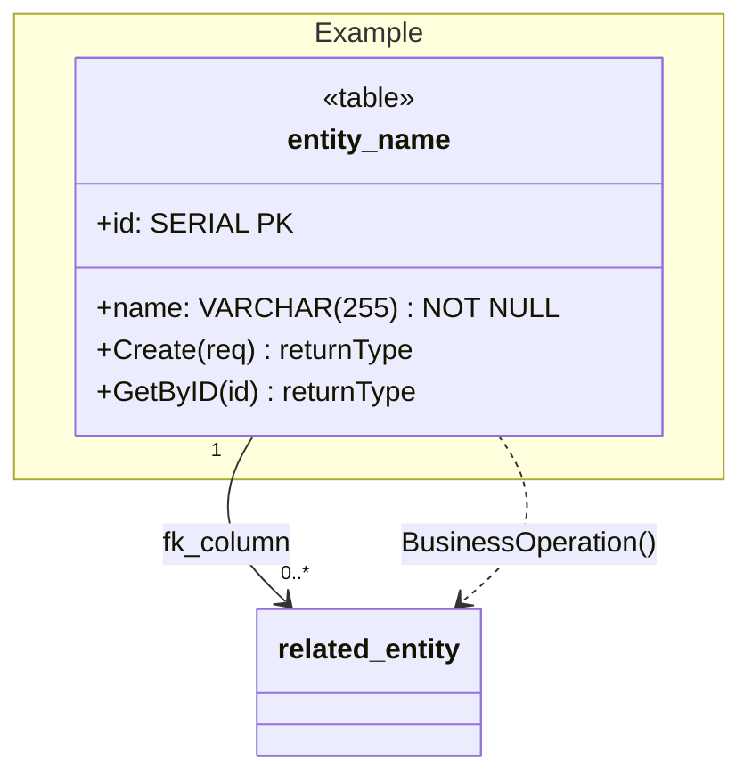

# Class Diagram Generation Prompt

You are an AI specialized in generating UML class diagrams. Given the system description below, produce a complete UML class diagram covering:

1. **All entity classes** with their attributes (with types) and methods/operations (with parameters and return types)
2. **Relationships** between classes (FK associations with cardinalities, dependencies)
3. **Cross-entity business operations** (logical flows between entities)
4. **Namespaces/packages** grouping related entities

Use proper UML notation: `+` for public, `-` for private, `#` for protected.

---

## System Overview

**AI Financial Planning Platform** — A Go backend that helps users manage personal finances with AI-powered insights. Built with Clean Architecture (Domain → Use Case → Delivery/Repository). PostgreSQL database, Gin HTTP framework, JWT authentication.

---

## Technology Context

- **Language:** Go (no ORM, raw SQL via pgx/v5)
- **Auth:** JWT HS256 (no expiry claim, cookie-based 1h session)
- **External:** Google Gemini API (AI chatbot), ML Python service (analysis/anomaly/forecast)
- **Soft deletes:** `deleted_at` on users, transactions, budgets, ai_logs. Hard delete on goals.
- **Amounts:** Stored as `BIGINT` (integer, no decimals — represents IDR cents)

---

## Entity Definitions

### 1. users — Core (Namespace: Core)

**Attributes:**
- `+id: SERIAL PK`
- `+email: VARCHAR(255) UNIQUE NOT NULL`
- `+name: VARCHAR(255) NOT NULL`
- `+password: VARCHAR(255) NOT NULL` (bcrypt-hashed)
- `+created_at: TIMESTAMP`
- `+deleted_at: TIMESTAMP` (soft delete)

**Operations (UserUseCase):**
- `+Register(email, password, name) error`
- `+Login(email, password) string` (returns JWT)
- `+GetAll() []UserResponse`
- `+GetMe(userID) UserResponse`

**Relationships:** Parent to ALL other entities. One user has many transactions/budgets/goals/ai_logs/reports/user_financial_goals/notifications/activity_logs. One user has at most one settings/user_financial_profiles/notification_preferences.

---

### 2. transactions — Financial Transactions (Namespace: Financial Transactions)

**Attributes:**
- `+id: SERIAL PK`
- `+user_id: INTEGER FK → users.id`
- `+amount: BIGINT NOT NULL`
- `+category: VARCHAR(255) NOT NULL`
- `+type: VARCHAR(10) NOT NULL` — CHECK(INCOME, EXPENSE)
- `+date: DATE NOT NULL`
- `+description: TEXT`
- `+is_recurring: BOOLEAN`
- `+recurrence_interval: VARCHAR(20)`
- `+created_at: TIMESTAMP`
- `+updated_at: TIMESTAMP`
- `+deleted_at: TIMESTAMP` (soft delete)

**Operations (TransactionUseCase):**
- `+Create(userID, req) error`
- `+Update(userID, id, req) error`
- `+Delete(userID, id) error`
- `+GetAll(userID, limit, offset, year, month) []TransactionResponse`
- `+GetMonthlyExpenses(userID) float64`
- `+GetMonthlyIncome(userID) float64`
- `+GetMonthlySummary(userID, months) []MonthlySummaryItem`
- `+Export(userID) string`
- `+BulkImport(userID, items) ImportResult`

**Cross-entity operations:**
- Provides `GetNetSavings()` to `goals` (for contribution validation)
- Joins with `budgets` in `GetUsage()` (in-memory by category, user_id, month, year)
- Feeds transaction data to `DashboardUseCase` (aggregation)
- Feeds transaction data to `ChatUseCase` (prompt context)
- Feeds transaction data to `MLUseCase` (analysis/anomaly/forecast)
- CRUD operations logged to `activity_logs`

---

### 3. budgets — Budget Management (Namespace: Financial Transactions)

**Attributes:**
- `+id: SERIAL PK`
- `+user_id: INTEGER FK → users.id`
- `+category: VARCHAR(255) NOT NULL`
- `+period: VARCHAR(10) NOT NULL` — CHECK(MONTHLY, YEARLY)
- `+month: INTEGER` — nullable, required if MONTHLY
- `+year: INTEGER NOT NULL`
- `+limit_amount: INTEGER NOT NULL`
- `+alert_threshold: INTEGER` — defaults to 80
- `+created_at: TIMESTAMP`
- `+updated_at: TIMESTAMP`
- `+deleted_at: TIMESTAMP` (soft delete)

Constraints: UNIQUE(user_id, category, period, month, year)

**Operations (BudgetUseCase):**
- `+Create(userID, req) error`
- `+Update(userID, id, limit, threshold, category) UpdateBudgetResponse`
- `+Delete(userID, id) error`
- `+GetAll(userID, category, month, year) []Budget`
- `+GetByID(id) BudgetResponse`
- `+GetUsage(userID, month, year) []BudgetUsage`

**Cross-entity operations:**
- `GetUsage()` joins with `transactions` in-memory (category match)
- `CheckBudgetAlerts()` generates `notifications` (BUDGET_WARNING, BUDGET_EXCEEDED)
- CRUD operations logged to `activity_logs`

**Budget Status Logic:**
```
percentage = used / limit × 100
≥ 100 → EXCEEDED
≥ alert_threshold → WARNING
else → SAFE
```

---

### 4. goals — Savings Goals (Namespace: Goals & Planning)

**Attributes:**
- `+id: SERIAL PK`
- `+user_id: INTEGER FK → users.id`
- `+name: VARCHAR(255) NOT NULL`
- `+target_amount: INTEGER NOT NULL`
- `+current_amount: INTEGER` — defaults to 0
- `+deadline: DATE`
- `+status: VARCHAR(20)` — CHECK(ONGOING, COMPLETED)
- `+description: TEXT`
- `+created_at: TIMESTAMP`
- `+updated_at: TIMESTAMP` (hard delete — no `deleted_at` column)

**Operations (GoalUseCase):**
- `+Create(userID, req) error`
- `+Update(id, userID, req) error`
- `+Delete(id, userID) error`
- `+GetAll(userID, active) []GoalResponse`
- `+GetByID(id, userID) GoalResponse`
- `+GetOverview(userID) GoalOverviewResponse`
- `+GetMilestones(userID) []GoalResponse`
- `+Contribute(id, userID, amount) error`

**Cross-entity operations:**
- `Contribute()` validates `contribution ≤ net_savings` by calling `transactions.GetNetSavings()`
- CRUD operations logged to `activity_logs`

---

### 5. user_financial_profiles — Financial Profile (Namespace: Goals & Planning)

**Attributes:**
- `+id: SERIAL PK`
- `+user_id: INTEGER FK UNIQUE → users.id` (1:1)
- `+monthly_income: NUMERIC(15,2)`
- `+fixed_expenses: NUMERIC(15,2)`
- `+current_savings: NUMERIC(15,2)`
- `+debt: NUMERIC(15,2)`
- `+employment_status: VARCHAR(100)`
- `+spending_habit: VARCHAR(100)`
- `+risk_level: VARCHAR(50)`
- `+created_at: TIMESTAMPTZ`
- `+updated_at: TIMESTAMPTZ`

**Operations (FinancialProfileUseCase):**
- `+Upsert(userID, req) FinancialProfileResponse`
- `+Get(userID) FinancialProfileResponse`

**Cross-entity operations:**
- Provides financial context to `ChatUseCase` (prompt building)
- Computes `NetAvailable = monthly_income − fixed_expenses − debt`

---

### 6. user_financial_goals — Profile Goal Tags (Namespace: Goals & Planning)

**Attributes:**
- `+id: SERIAL PK`
- `+user_id: INTEGER FK → users.id`
- `+goal_type: VARCHAR(100) NOT NULL`

Constraints: UNIQUE(user_id, goal_type)

**Operations:**
- `+Create(userID, goal_type) error`
- `+GetAll(userID) []UserFinancialGoal`

---

### 7. ai_logs — Chat History (Namespace: AI & Reports)

**Attributes:**
- `+id: SERIAL PK`
- `+user_id: INTEGER FK → users.id`
- `+question: TEXT`
- `+response: TEXT`
- `+created_at: TIMESTAMP`
- `+deleted_at: TIMESTAMP` (soft delete)

**Operations (via ChatUseCase):**
- `+Save(userID, question, response) error`
- `+GetHistory(userID) []AiLog`
- `+ClearHistory(userID) error`

---

### 8. reports — Generated Reports (Namespace: AI & Reports)

**Attributes:**
- `+id: SERIAL PK`
- `+user_id: INTEGER FK → users.id`
- `+type: VARCHAR(50)` — MONTHLY or YEARLY
- `+month: INTEGER`
- `+year: INTEGER`
- `+content: TEXT`
- `+status: VARCHAR(20)`
- `+generated_at: TIMESTAMP`

**Operations (ReportsUseCase):**
- `+GetMonthlySummary(userID, months) []MonthlySummaryItem`
- `+GetCategoryBreakdown(userID, year, month) map[string]float64`
- `+GetSavingsRate(userID, months) []SavingsRatePoint`
- `+GetNetWorth(userID, months) []NetWorthPoint`
- `+GetMonthComparison(userID) MonthComparisonResponse`

---

### 9. settings — User Settings (Namespace: Settings)

**Attributes:**
- `+id: SERIAL PK`
- `+user_id: INTEGER FK UNIQUE → users.id` (1:1)
- `+currency: VARCHAR(10)` — defaults to IDR
- `+language: VARCHAR(10)` — defaults to EN
- `+notification_enabled: BOOLEAN` — defaults to TRUE

**Operations:**
- `+Upsert(userID, currency, lang, notifEnabled) error`
- `+Get(userID) Settings`

---

### 10. notifications — Notifications (Namespace: Notifications & Activity)

**Attributes:**
- `+id: SERIAL PK`
- `+user_id: INTEGER FK → users.id`
- `+type: VARCHAR(50) NOT NULL` — e.g. BUDGET_WARNING, BUDGET_EXCEEDED
- `+title: VARCHAR(255) NOT NULL`
- `+message: TEXT NOT NULL`
- `+entity_type: VARCHAR(50)` — related entity type
- `+entity_id: INTEGER` — related entity ID
- `+is_read: BOOLEAN` — defaults to FALSE
- `+created_at: TIMESTAMPTZ`

**Operations (NotificationUseCase):**
- `+GetAll(userID, unreadOnly) []Notification`
- `+MarkRead(id, userID) error`
- `+MarkAllRead(userID) error`
- `+Delete(id, userID) error`
- `+GetPreferences(userID) NotificationPreferences`
- `+UpdatePreferences(userID, prefs) error`
- `+GetUnreadCount(userID) int`

**Cross-entity operations:**
- `CheckBudgetAlerts()` reads `budgets` usage and generates notifications when budgets exceed thresholds

---

### 11. notification_preferences — Notification Preferences (Namespace: Notifications & Activity)

**Attributes:**
- `+id: SERIAL PK`
- `+user_id: INTEGER FK UNIQUE → users.id` (1:1)
- `+budget_alerts: BOOLEAN` — defaults to TRUE
- `+goal_reminders: BOOLEAN` — defaults to TRUE
- `+anomaly_alerts: BOOLEAN` — defaults to TRUE
- `+updated_at: TIMESTAMPTZ`

---

### 12. activity_logs — Activity Log (Namespace: Notifications & Activity)

**Attributes:**
- `+id: SERIAL PK`
- `+user_id: INTEGER FK → users.id`
- `+action: VARCHAR(50) NOT NULL` — e.g. CREATE, UPDATE, DELETE
- `+entity_type: VARCHAR(50) NOT NULL` — e.g. transaction, budget, goal
- `+entity_id: INTEGER` — affected entity ID
- `+description: TEXT NOT NULL`
- `+created_at: TIMESTAMPTZ`

**Operations (ActivityLogUseCase):**
- `+Log(userID, action, entityType, entityID, description) error`
- `+GetActivity(userID, limit, offset) []ActivityLog`

---

## Relationship Summary

### FK Associations

| From | To | Cardinality | FK Column | Notes |
|------|-----|-------------|-----------|-------|
| users | transactions | 1 ──< N | `user_id` | Owner relationship |
| users | budgets | 1 ──< N | `user_id` | Owner relationship |
| users | goals | 1 ──< N | `user_id` | Owner relationship |
| users | ai_logs | 1 ──< N | `user_id` | Owner relationship |
| users | reports | 1 ──< N | `user_id` | Owner relationship |
| users | user_financial_goals | 1 ──< N | `user_id` | CASCADE on delete |
| users | notifications | 1 ──< N | `user_id` | CASCADE on delete |
| users | activity_logs | 1 ──< N | `user_id` | CASCADE on delete |
| users | settings | 1 ── 1 | `user_id` UNIQUE | Optional; no routes |
| users | user_financial_profiles | 1 ── 1 | `user_id` UNIQUE | CASCADE on delete |
| users | notification_preferences | 1 ── 1 | `user_id` UNIQUE | CASCADE on delete |

### Logical (Non-FK) Business Operations

| Source | Target | Operation | Description |
|--------|--------|-----------|-------------|
| transactions | budgets | GetUsage() | In-memory join by category, user_id, month, year to compute budget usage percentage and status (SAFE/WARNING/EXCEEDED) |
| transactions | goals | Contribute() | Validates contribution ≤ net_savings before allowing goal contribution |
| budgets | notifications | CheckBudgetAlerts() | Checks budget usage thresholds; generates BUDGET_WARNING or BUDGET_EXCEEDED notifications |
| transactions | activity_logs | CRUD logging | CRUD operations on transactions are logged as activity entries |
| budgets | activity_logs | CRUD logging | CRUD operations on budgets are logged as activity entries |
| goals | activity_logs | CRUD logging | CRUD operations on goals are logged as activity entries |
| user_financial_profiles | transactions | GetNetSavings() | Computes net savings (income − expense) for financial profile context |

### Aggregation & Service Dependencies

| Service | Reads From | Purpose |
|---------|-----------|---------|
| DashboardUseCase | transactions, budgets, goals | Aggregates monthly income, expense, net savings, budget usage statuses, active goal count, financial health score |
| ChatUseCase | transactions, budgets, goals, user_financial_profiles, ai_logs | Builds financial context prompt for Gemini AI, persists Q&A history, supports clear history |
| MLUseCase | transactions | Fetches all user transactions, converts to ml.Transaction format, sends to Python ML service for analysis/anomaly/forecast |
| ReportsUseCase | transactions, budgets, goals | Computes monthly summaries, category breakdowns, savings rate trends, net worth history, month-over-month comparisons |

---

## Output Format

Generate the diagram using Mermaid `classDiagram` syntax. Each class should have:

1. **Class name** (lowercase, snake_case matching DB table names)
2. **Stereotype** `<<table>>`
3. **Attributes** section — all column definitions with visibility, name, and type
4. **Operations** section — all methods with visibility, parameters, and return types
5. **Relationships** — FK associations (solid arrows `-->`) and business operations (dotted arrows `..>`)
6. **Namespaces** — group related entities (Core, Financial Transactions, Goals & Planning, AI & Reports, Settings, Notifications & Activity)

Example:

