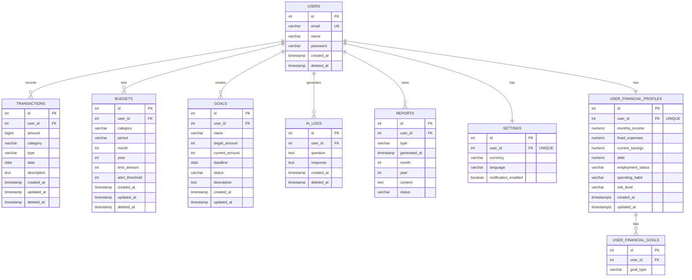

# Entity Relationship Diagram

Source of truth: `db/migrations/` (SQL DDL) and `internal/domain/` (Go types).

---

## Diagram

---

## Table Definitions

### `users`
Central entity. All other tables reference `users(id)`.

| Column | Type | Constraints | Notes |
|---|---|---|---|
| `id` | SERIAL | PK | |
| `email` | VARCHAR(255) | NOT NULL, UNIQUE | Login identifier |
| `name` | VARCHAR(255) | NOT NULL | Display name |
| `password` | VARCHAR(255) | NOT NULL | bcrypt hash, cost=10 |
| `created_at` | TIMESTAMP | DEFAULT NOW() | |
| `deleted_at` | TIMESTAMP | nullable | Soft delete (not enforced in app routes) |

---

### `transactions`
Core financial data. Supports both INCOME and EXPENSE records.

| Column | Type | Constraints | Notes |
|---|---|---|---|
| `id` | SERIAL | PK | |
| `user_id` | INTEGER | FK → users(id), NOT NULL | |
| `amount` | BIGINT | NOT NULL | Migrated from DECIMAL(10,2) in migration 010. IDR has no decimal subunits. |
| `category` | VARCHAR(255) | NOT NULL | Free text; case-insensitive match in budget JOIN |
| `type` | VARCHAR(10) | CHECK (INCOME, EXPENSE) | Normalised to uppercase in use case |
| `date` | DATE | NOT NULL | |
| `description` | TEXT | nullable | |
| `created_at` | TIMESTAMP | DEFAULT NOW() | |
| `updated_at` | TIMESTAMP | nullable | Added in migration 014 |
| `deleted_at` | TIMESTAMP | nullable | Soft delete |

**Indices:** `(user_id, category, date)`, `(user_id, category, type, date)`

---

### `budgets`
Per-user spending limits per category + period.

| Column | Type | Constraints | Notes |
|---|---|---|---|
| `id` | SERIAL | PK | |
| `user_id` | INTEGER | FK → users(id), NOT NULL | |
| `category` | VARCHAR(255) | NOT NULL | Must match transaction category (case-insensitive) |
| `period` | VARCHAR(10) | CHECK (MONTHLY, YEARLY) | |
| `month` | INTEGER | nullable | 1–12; NULL for YEARLY budgets |
| `year` | INTEGER | NOT NULL | |
| `limit_amount` | INTEGER | NOT NULL | |
| `alert_threshold` | INTEGER | DEFAULT 80 | % of limit that triggers WARNING |
| `created_at` | TIMESTAMP | DEFAULT NOW() | |
| `updated_at` | TIMESTAMP | nullable | Added in migration 014 |
| `deleted_at` | TIMESTAMP | nullable | Soft delete |

**Unique constraint:** `(user_id, category, period, month, year)`  
**Indices:** `(user_id)`, `(user_id, year, period)`

---

### `goals`
User savings targets with deadline tracking.

| Column | Type | Constraints | Notes |
|---|---|---|---|
| `id` | SERIAL | PK | |
| `user_id` | INTEGER | FK → users(id), NOT NULL | |
| `name` | VARCHAR(255) | NOT NULL | Unique per user per active deadline |
| `target_amount` | INTEGER | NOT NULL | |
| `current_amount` | INTEGER | DEFAULT 0 | Set directly (not incremented) |
| `deadline` | DATE | nullable | Used to determine "active" |
| `status` | VARCHAR(20) | DEFAULT 'ONGOING' | ONGOING or COMPLETED |
| `description` | TEXT | nullable | Added in migration 009 |
| `created_at` | TIMESTAMP | DEFAULT NOW() | |
| `updated_at` | TIMESTAMP | nullable | Added in migration 014 |

> **Note:** `deleted_at` column was dropped in migration 012. Goals use **hard delete** (`DELETE FROM goals`), not soft delete.

**Indices:** `(user_id)`, `(user_id, deadline)`

---

### `ai_logs`
Persistent chat history between users and the Gemini AI.

| Column | Type | Constraints | Notes |
|---|---|---|---|
| `id` | SERIAL | PK | |
| `user_id` | INTEGER | FK → users(id), NOT NULL | |
| `question` | TEXT | nullable | User's message |
| `response` | TEXT | nullable | Gemini's reply |
| `created_at` | TIMESTAMP | DEFAULT NOW() | |
| `deleted_at` | TIMESTAMP | nullable | Present in DDL; not queried by app |

**Index:** `(user_id)`

---

### `reports`
Placeholder for report generation. **Not yet wired to any API route.**

| Column | Type | Constraints | Notes |
|---|---|---|---|
| `id` | SERIAL | PK | |
| `user_id` | INTEGER | FK → users(id), NOT NULL | |
| `type` | VARCHAR(50) | nullable | MONTHLY or YEARLY |
| `generated_at` | TIMESTAMP | DEFAULT NOW() | |
| `month` | INTEGER | nullable | Added in migration 011 |
| `year` | INTEGER | nullable | Added in migration 011 |
| `content` | TEXT | nullable | Added in migration 011 |
| `status` | VARCHAR(20) | DEFAULT 'GENERATED' | Added in migration 011 |

**Index:** `(user_id)`

---

### `settings`
Per-user app preferences. **Not yet wired to any API route.**

| Column | Type | Constraints | Notes |
|---|---|---|---|
| `id` | SERIAL | PK | |
| `user_id` | INTEGER | FK → users(id), NOT NULL, UNIQUE | One settings row per user |
| `currency` | VARCHAR(10) | DEFAULT 'IDR' | |
| `language` | VARCHAR(10) | DEFAULT 'EN' | |
| `notification_enabled` | BOOLEAN | DEFAULT TRUE | |

---

### `user_financial_profiles`
Onboarding financial snapshot used for AI personalisation.

| Column | Type | Constraints | Notes |
|---|---|---|---|
| `id` | SERIAL | PK | |
| `user_id` | INTEGER | FK → users(id), NOT NULL, UNIQUE | One profile per user |
| `monthly_income` | NUMERIC(15,2) | NOT NULL, DEFAULT 0 | |
| `fixed_expenses` | NUMERIC(15,2) | NOT NULL, DEFAULT 0 | |
| `current_savings` | NUMERIC(15,2) | NOT NULL, DEFAULT 0 | |
| `debt` | NUMERIC(15,2) | NOT NULL, DEFAULT 0 | |
| `employment_status` | VARCHAR(100) | NOT NULL | |
| `spending_habit` | VARCHAR(100) | nullable | Optional |
| `risk_level` | VARCHAR(50) | nullable | Optional |
| `created_at` | TIMESTAMPTZ | NOT NULL, DEFAULT NOW() | |
| `updated_at` | TIMESTAMPTZ | NOT NULL, DEFAULT NOW() | |

**Index:** `(user_id)`

---

### `user_financial_goals`
Goal types associated with a user's financial profile (distinct from savings `goals`).

| Column | Type | Constraints | Notes |
|---|---|---|---|
| `id` | SERIAL | PK | |
| `user_id` | INTEGER | FK → users(id), NOT NULL | |
| `goal_type` | VARCHAR(100) | NOT NULL | e.g. emergency_fund, house, investment |

**Unique constraint:** `(user_id, goal_type)`  
**Index:** `(user_id)`

---

## Relationship Summary

| Relationship | Cardinality | Enforcement |
|---|---|---|
| users → transactions | 1:N | FK + soft delete |
| users → budgets | 1:N | FK + unique(category,period,month,year) + soft delete |
| users → goals | 1:N | FK + hard delete |
| users → ai_logs | 1:N | FK |
| users → reports | 1:N | FK (no app routes yet) |
| users → settings | 1:1 | FK + UNIQUE(user_id) (no app routes yet) |
| users → user_financial_profiles | 1:1 | FK + UNIQUE(user_id) |
| user_financial_profiles → user_financial_goals | 1:N | FK + UNIQUE(user_id, goal_type) |

---

## Notable Design Notes

1. **Soft delete inconsistency:** `transactions`, `budgets`, `ai_logs` use `deleted_at`. `goals` had `deleted_at` but it was dropped in migration 012 — goals use hard delete. `reports` and `settings` have `deleted_at` in the DDL but no corresponding app logic.

2. **Budget↔Transaction join is logical, not FK-enforced:** The budget usage query joins on `LOWER(t.category) = LOWER(b.category)`. There is no FK from `transactions.category` to `budgets.category`. A typo in category naming will silently break budget tracking.

3. **`reports` and `settings` are scaffolded but unused:** Both tables exist in the DB with proper FKs and indices, but zero Go code reads or writes to them. They represent planned features.

4. **`user_financial_goals` vs `goals`:** Two separate tables serve different purposes. `goals` tracks savings targets with amounts and deadlines. `user_financial_goals` stores goal-type strings (e.g., "emergency_fund") as part of the onboarding profile — no amounts or deadlines.

5. **Amount type migration:** `transactions.amount` was `DECIMAL(10,2)` initially, changed to `BIGINT` in migration 010 to align with Go's `int` type and IDR's integer-only currency.
