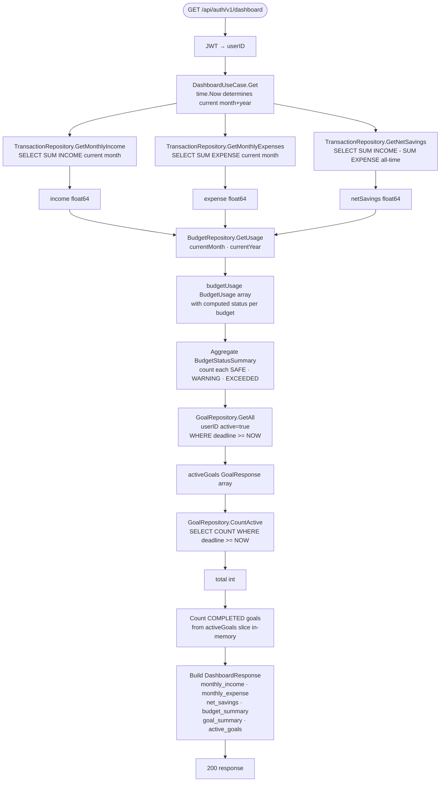
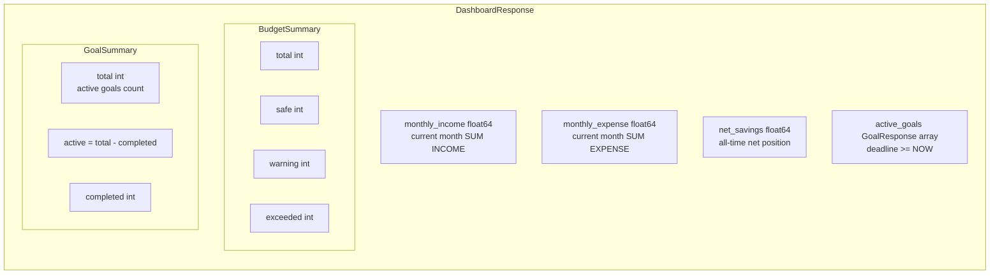
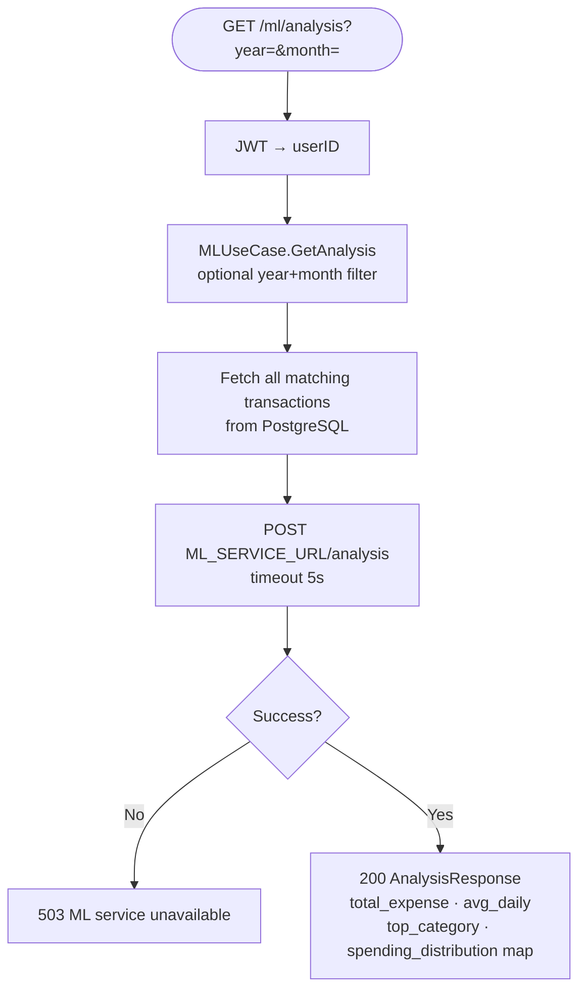
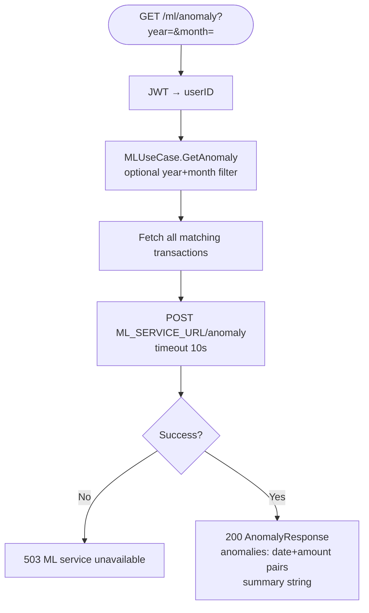
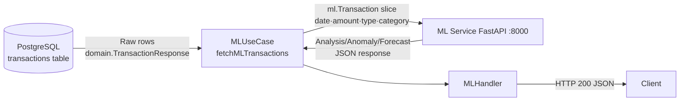

# Analytics Flow

Covers Dashboard aggregation and ML analytics. Derived from `internal/usecase/dashboard.go`, `internal/usecase/ml.go`, and `internal/repository/postgres/`.

---

## 1. Dashboard Aggregation



> **Sequential queries:** All 6 DB calls in Dashboard run sequentially — no goroutine parallelism. A future improvement could use `errgroup` to run them concurrently.

---

## 2. Dashboard Response Structure



---

## 3. ML Analysis — Spending Breakdown



**`spending_distribution`** is a map of category → total spend, e.g.:
```json
{ "Makanan & Minuman": 1500000, "Transportasi": 450000, ... }
```

---

## 4. ML Anomaly Detection



> **ML service note:** The `/anomaly` endpoint requires at least 5 unique expense days to perform statistical detection. Below that threshold the ML service returns an empty anomaly list (see `ML_SERVICE_INTEGRATION.md`).

---

## 5. Data Flow: PostgreSQL → ML Service → Client


