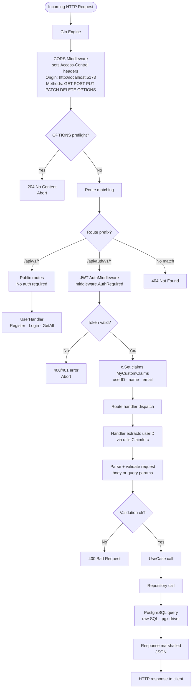
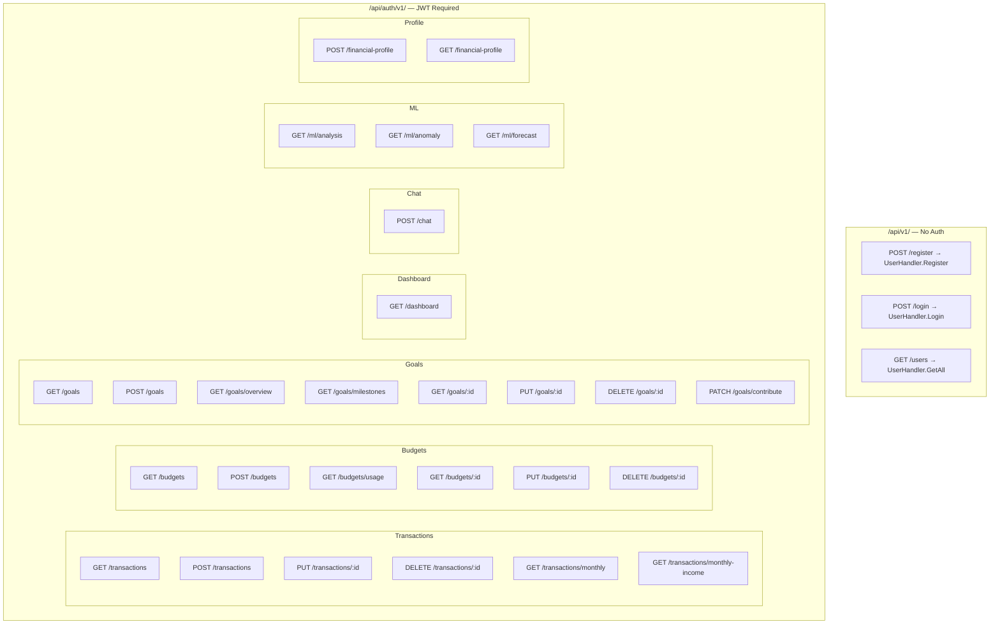
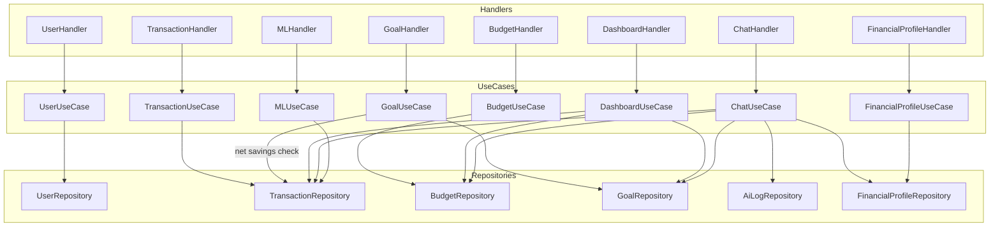
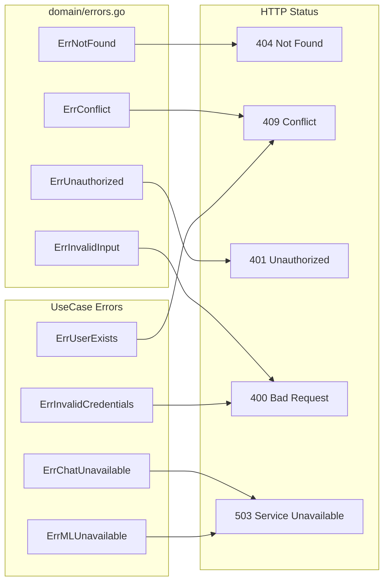

# API Request Flow

Generic lifecycle of every HTTP request through the system. Derived from `main.go`, `internal/delivery/http/router.go`, and `internal/delivery/http/middleware/`.

---

## 1. Generic Request Lifecycle

---

## 2. Route Map

---

## 3. Handler → UseCase → Repository Dependency Map

---

## 4. Error → HTTP Status Mapping

