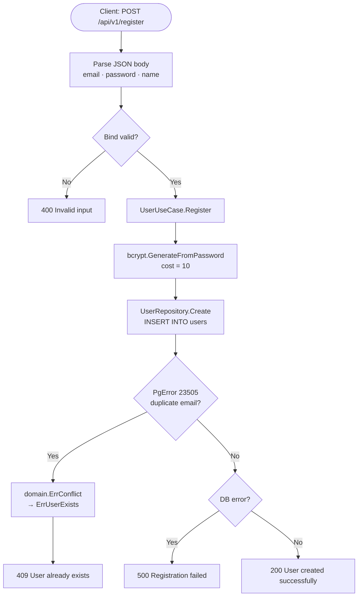
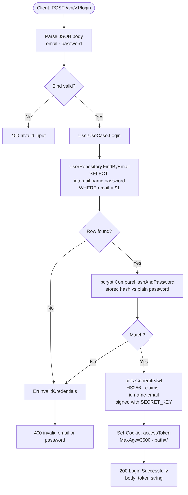
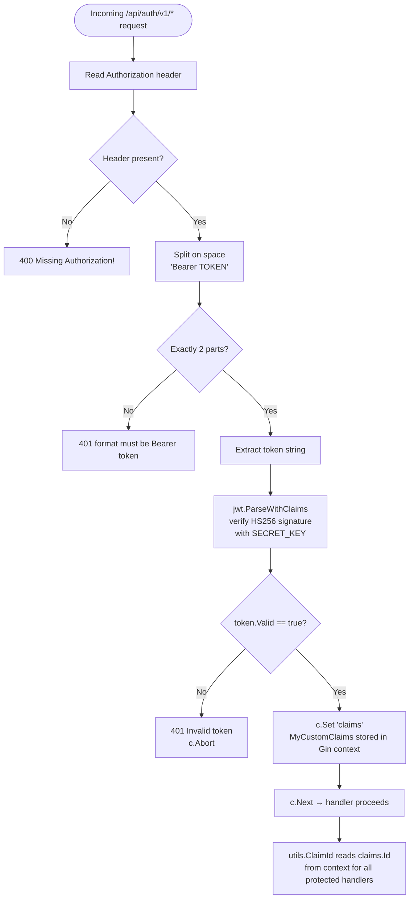
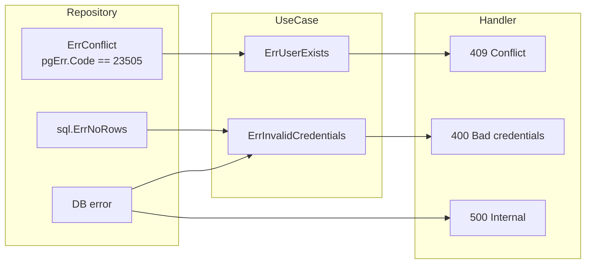

# Authentication Flow

All flows derived from `internal/usecase/user.go`, `internal/delivery/http/middleware/auth.go`, and `utils/`.

---

## 1. User Registration

---

## 2. User Login and JWT Issuance

> **JWT structure:** Header `{alg:HS256}` + Claims `{id, name, email, iss:lewimb}` + HMAC-SHA256 signature.  
> No `exp` claim is embedded — session length is enforced solely by the 1-hour cookie TTL.

---

## 3. JWT Middleware — Protected Route Guard

---

## 4. Error Propagation Map

