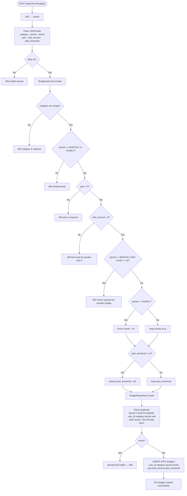
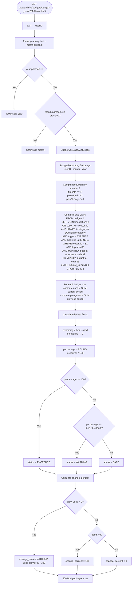
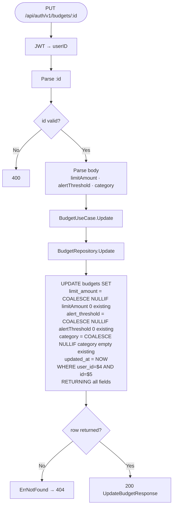
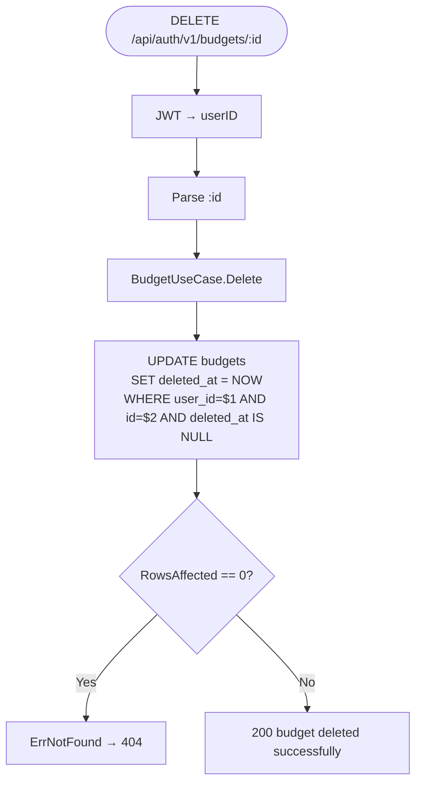
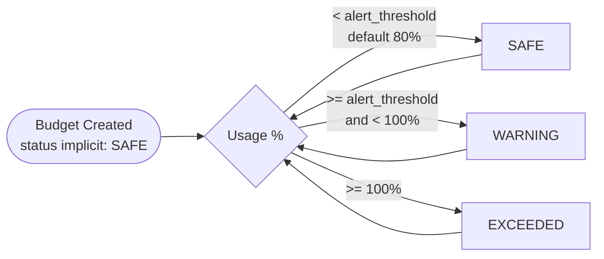

# Budgeting Flow

Derived from `internal/usecase/budget.go`, `internal/repository/postgres/budget.go`, `internal/delivery/http/handler/budget.go`.

---

## 1. Create Budget

---

## 2. Budget Usage Calculation

---

## 3. Update Budget

> **NULLIF pattern:** Zero values in `limitAmount`/`alertThreshold` or empty string in `category` are treated as "no change" — the existing value is preserved. This allows partial updates.

---

## 4. Soft-Delete Budget

---

## 5. Budget Status State Machine

