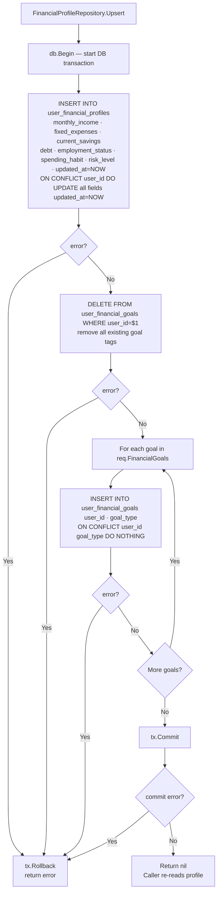
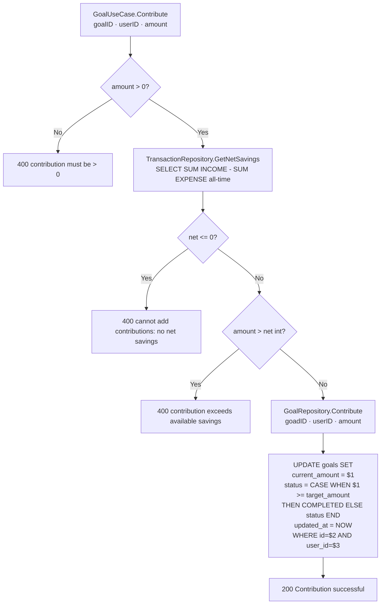
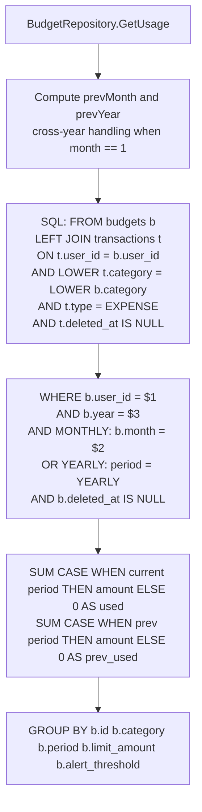
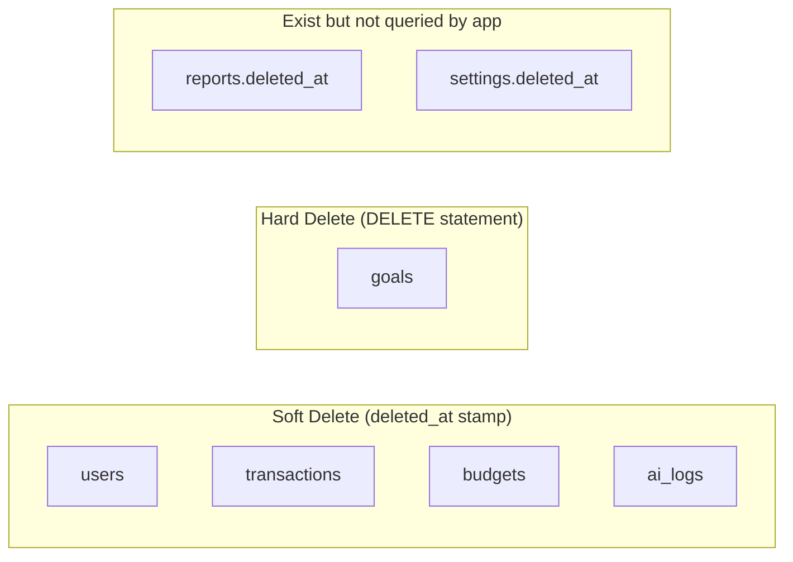
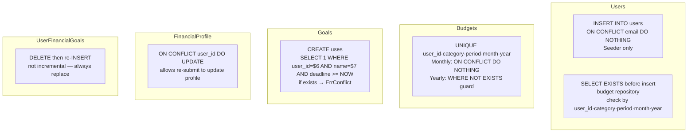

# Database Sync Flow

Covers atomic DB operations, cross-table consistency patterns, and the financial profile upsert transaction. Derived from `internal/repository/postgres/`.

---

## 1. Financial Profile Upsert (Atomic DB Transaction)



> **Atomicity guarantee:** The profile fields and goal tags are always consistent — they are either both updated or both rolled back. No partial state is possible.

---

## 2. Goal Contribution — Cross-Domain Net Savings Check



> **Cross-domain dependency:** `GoalUseCase` directly injects `TransactionRepository` to validate contribution against net savings. This is an intentional design trade-off to avoid a cross-domain service call.

---

## 3. Budget Usage — Logical JOIN Pattern



> **No FK between categories:** The JOIN uses `LOWER(t.category) = LOWER(b.category)` — a purely logical match. A misspelling in either table silently breaks the budget tracking for that category.

---

## 4. Soft Delete vs Hard Delete



> **Goals:** `deleted_at` was dropped in migration 012. The `goalRepository.Delete()` executes `DELETE FROM goals WHERE id=$1 AND user_id=$2`. All other entities that support deletion use soft delete.

---

## 5. Duplicate Prevention Patterns



---

## 6. Index Coverage Map

```mermaid
flowchart LR
    subgraph transactions_indices
        I1[idx_transactions_user_category_date\nuser_id · category · date]
        I2[idx_transactions_full\nuser_id · category · type · date]
    end
    subgraph budgets_indices
        I3[idx_budgets_user\nuser_id]
        I4[idx_budgets_user_year_period\nuser_id · year · period]
    end
    subgraph goals_indices
        I5[idx_goals_user\nuser_id]
        I6[idx_goals_user_deadline\nuser_id · deadline]
    end
    subgraph ai_logs_indices
        I7[idx_ailogs_user\nuser_id]
    end
    subgraph profile_indices
        I8[idx_user_financial_profiles_user_id]
        I9[idx_user_financial_goals_user_id]
    end
