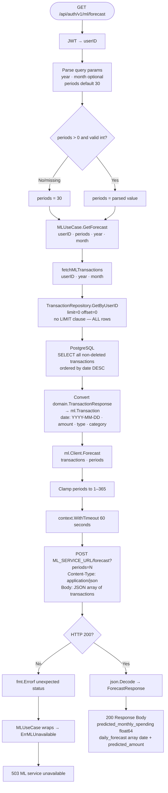
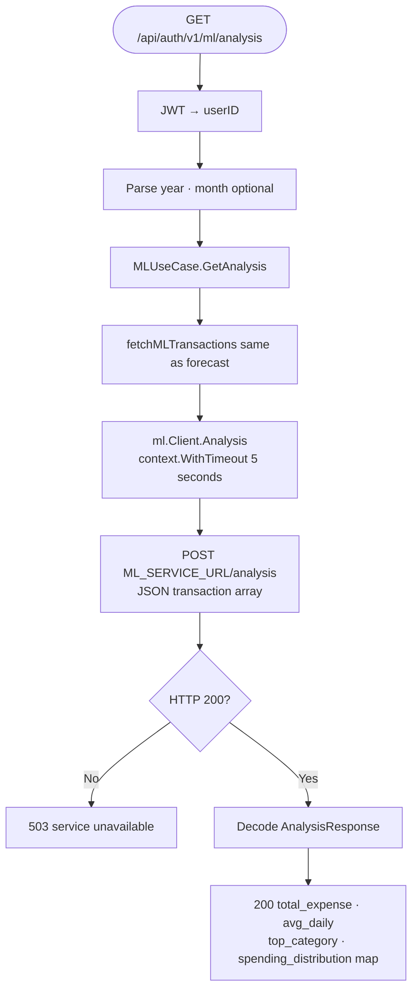
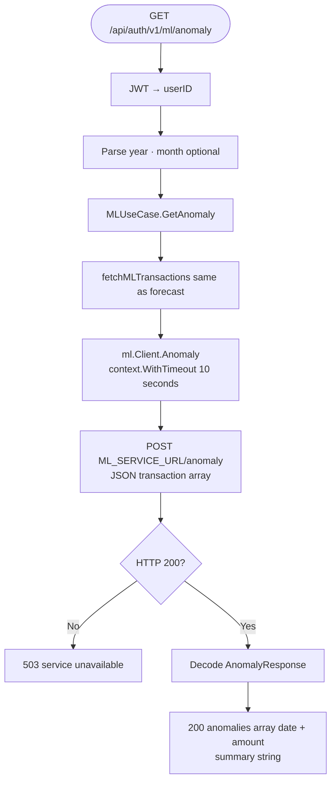
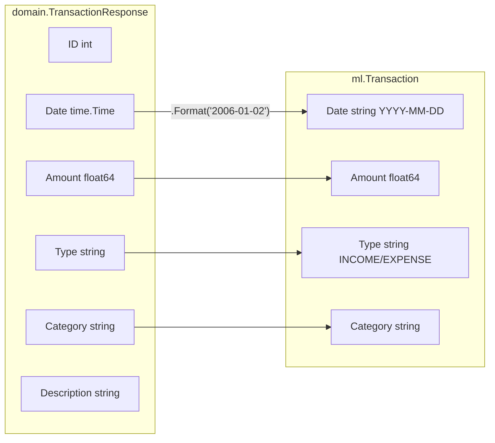
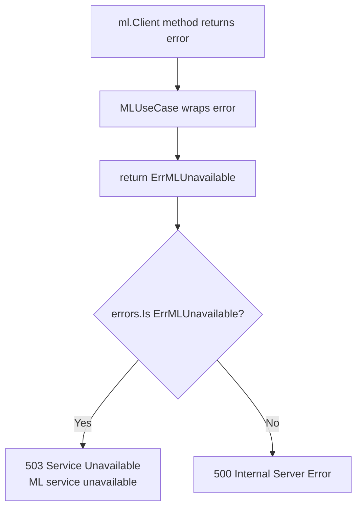

# Forecasting & ML Pipeline Flow

Derived from `internal/usecase/ml.go`, `internal/ml/client.go`, `internal/ml/types.go`.

---

## 1. Complete Forecast Pipeline



---

## 2. Spending Analysis Pipeline



---

## 3. Anomaly Detection Pipeline



> **ML Service note:** The Python FastAPI service at `:8000` performs the actual Prophet-based forecasting and statistical anomaly detection. The Go backend acts as a proxy — it fetches transaction data from PostgreSQL, transforms it to the ML schema, and forwards it. No ML computation happens in Go.

---

## 4. Data Transformation: Domain → ML Schema



---

## 5. ML Client Timeout Strategy

```mermaid
flowchart LR
    A[/analysis] -->|context timeout| B[5 seconds]
    C[/anomaly] -->|context timeout| D[10 seconds]
    E[/forecast] -->|context timeout| F[60 seconds]
    B --> G[Fast — simple aggregation]
    D --> H[Medium — statistical detection]
    F --> I[Slow — Prophet time-series model]
```

---

## 6. Error Handling — ML Unavailable


