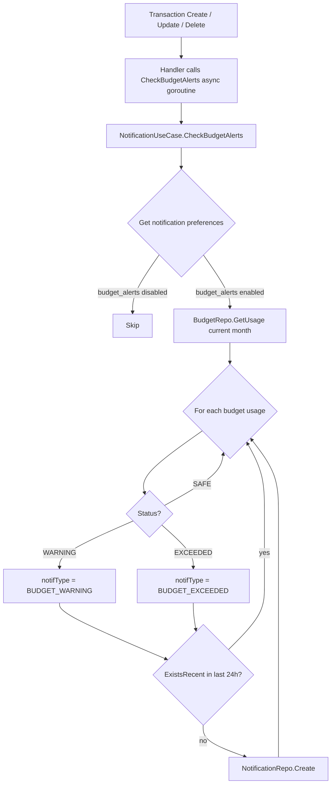
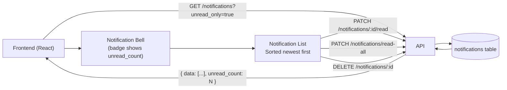
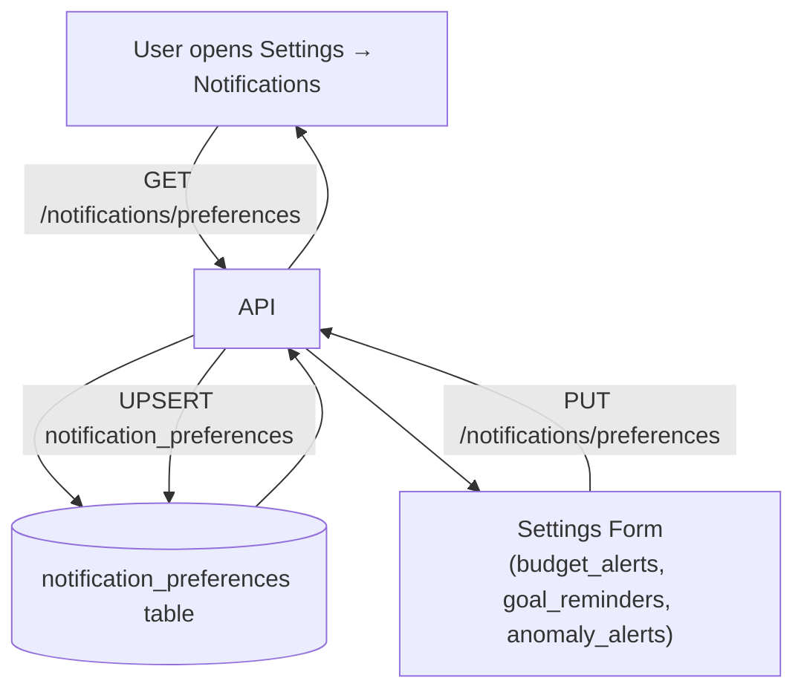

# Notification Flow

Added in v1.3 to support budget threshold alerts and in-app notification bell.

---

## Budget Alert Notification (triggered on transaction mutation)

---

## Frontend Notification Bell Flow

---

## Notification Preference Management

