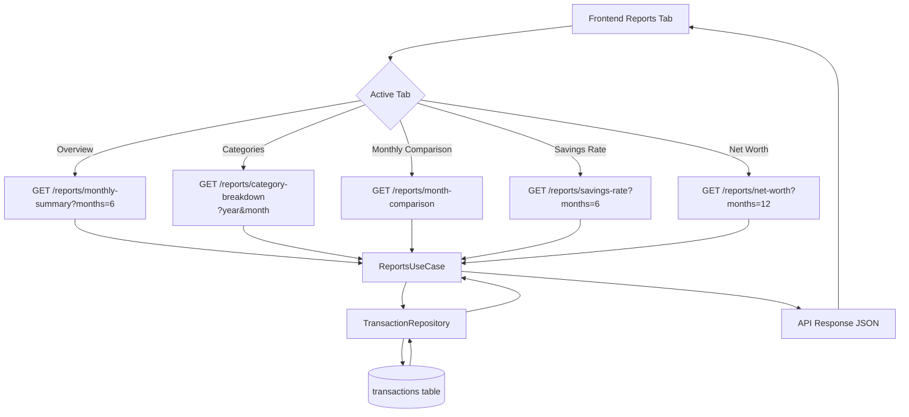
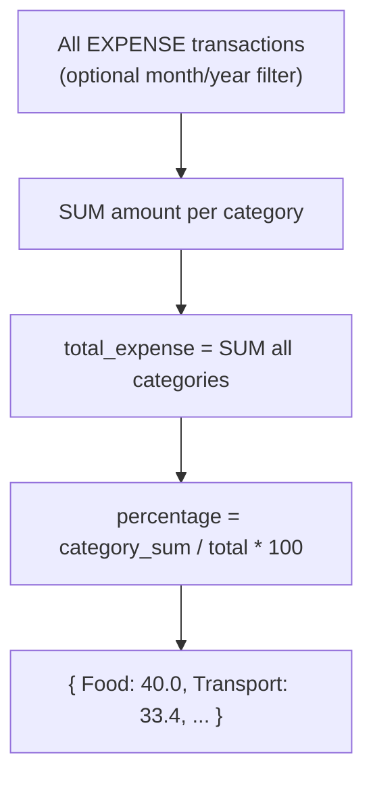
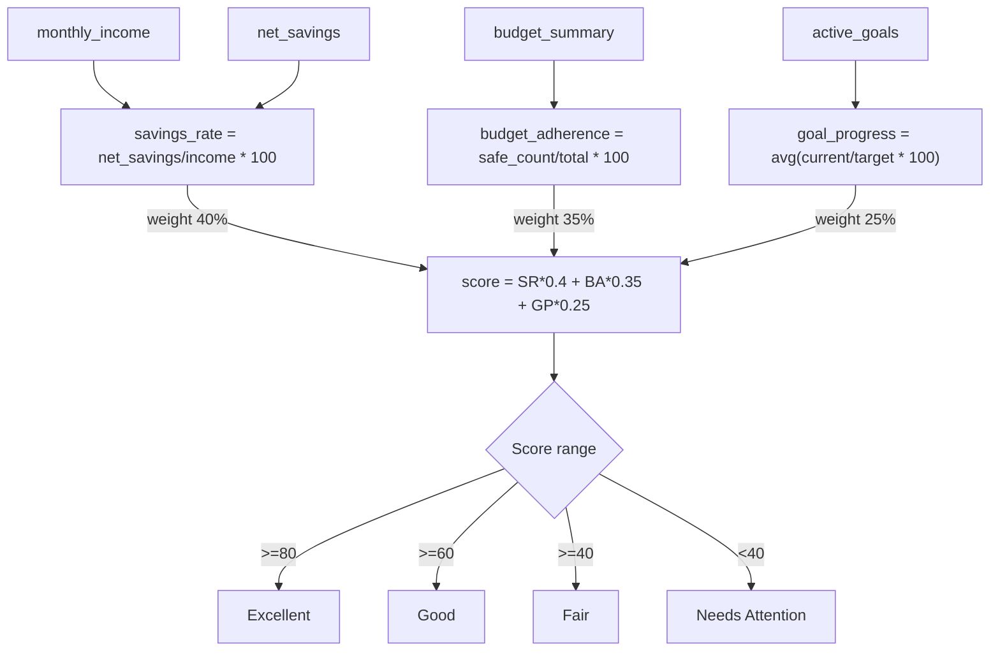

# Reports Flow

Added in v1.3 to support full Reports tab with Overview, Categories, Monthly Comparison, Savings Rate, Net Worth tabs.

---

## Reports Data Flow

---

## Category Breakdown Computation

---

## Financial Health Score Computation (Dashboard)

