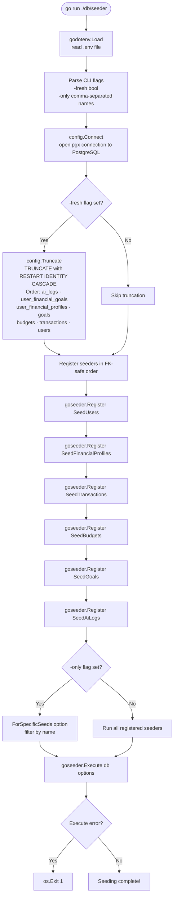
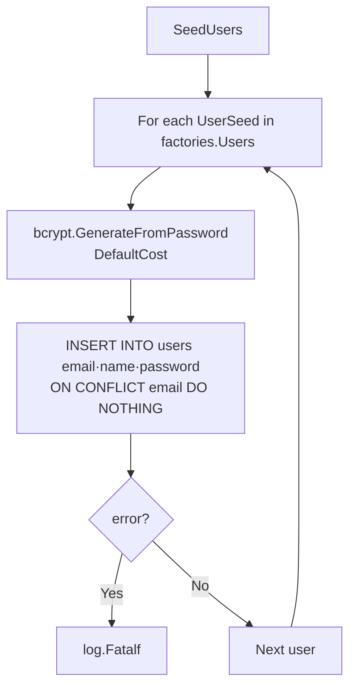
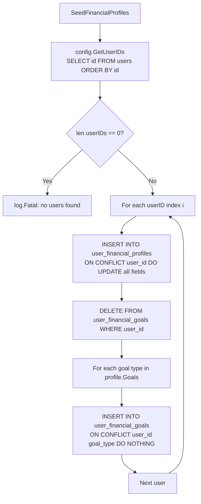
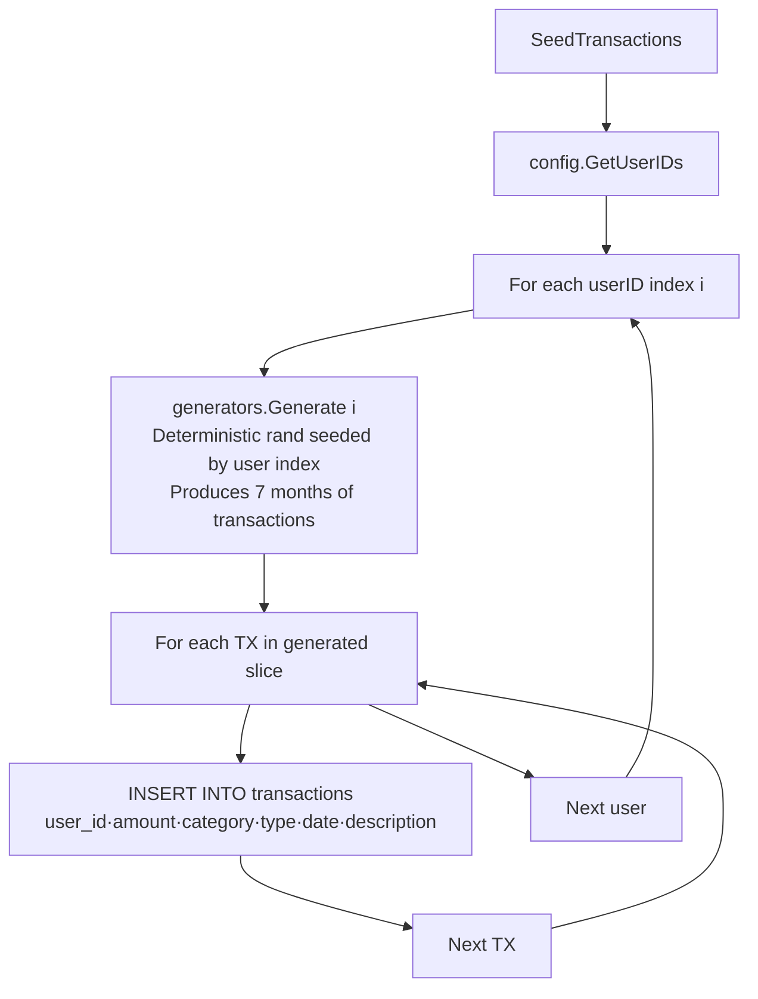
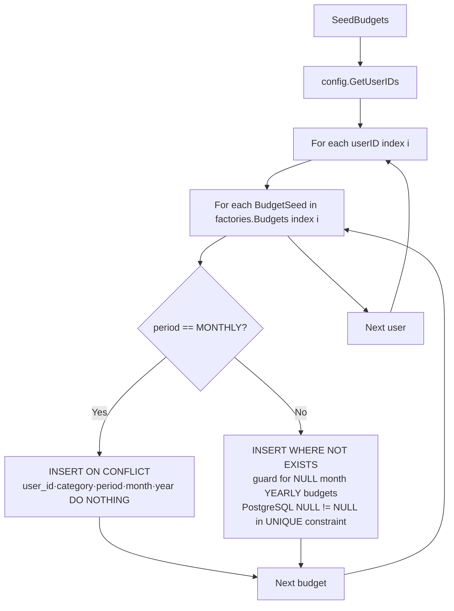
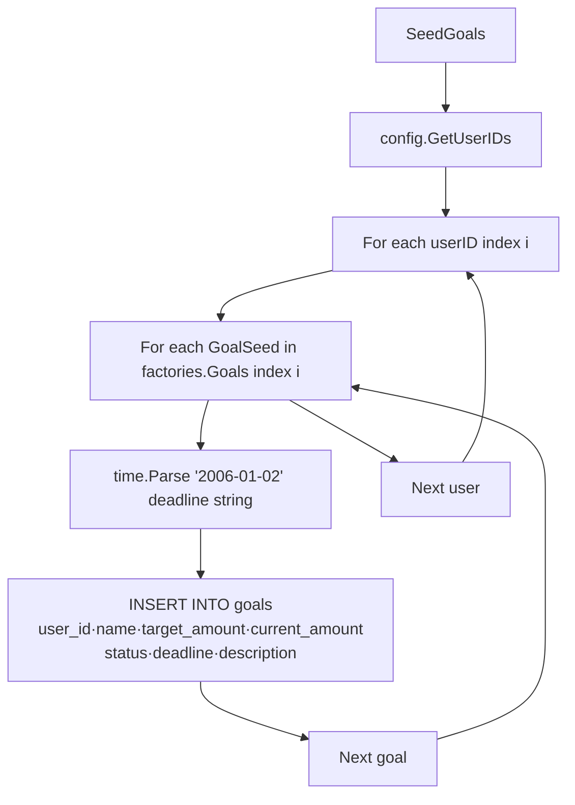
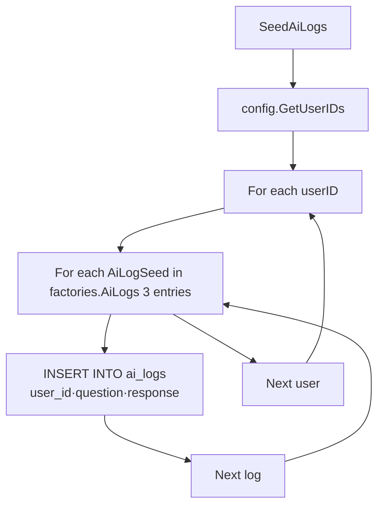
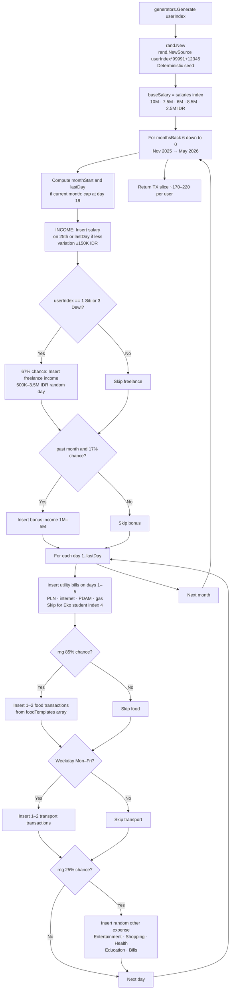

# Seeder Flow

Derived from `db/seeder/` — the standalone seeder binary using GoSeeder v1.0.5.

---

## 1. Seeder Entry Point

---

## 2. Individual Seeder Logic

### SeedUsers

### SeedFinancialProfiles

### SeedTransactions

### SeedBudgets

### SeedGoals

### SeedAiLogs

---

## 3. Transaction Generator Algorithm

---

## 4. Data Summary

| Entity | Records per User | Total (5 users) |
|---|---|---|
| users | 1 | 5 |
| financial profiles | 1 | 5 |
| user financial goal tags | 2–3 | ~12 |
| transactions | ~170–220 | ~1,000 |
| budgets | 3–6 | 21 |
| goals | 2–3 | 12 (1 COMPLETED) |
| ai_logs | 3 | 15 |
