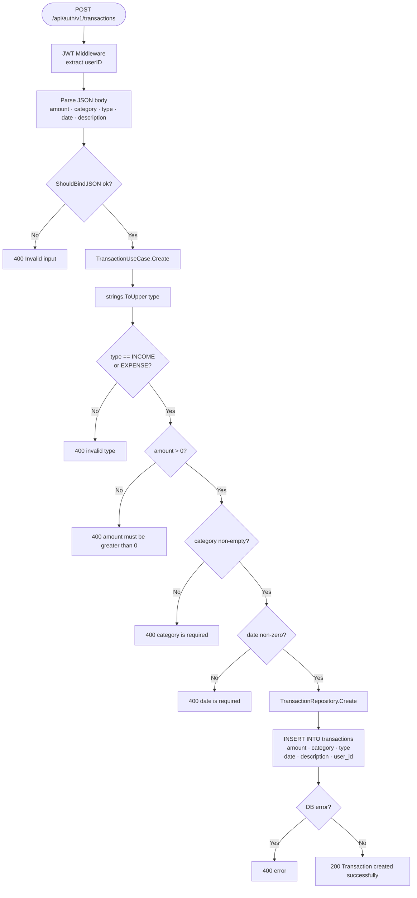
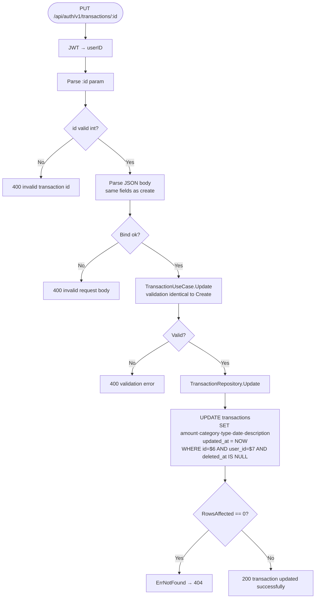
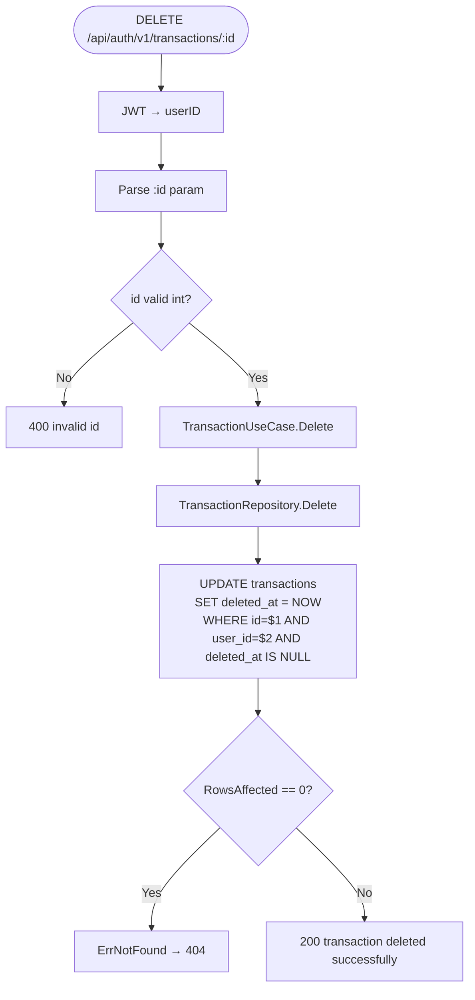
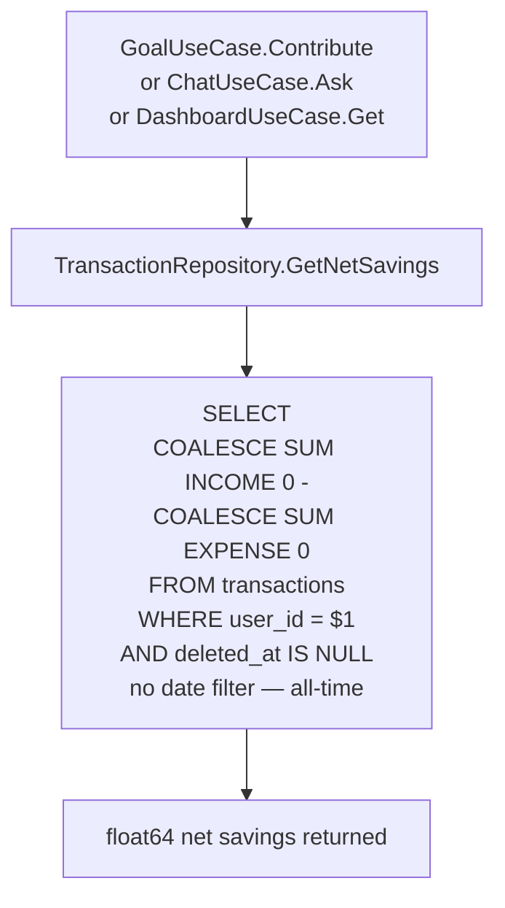

# Transaction Flow

Derived from `internal/usecase/transaction.go`, `internal/repository/postgres/transaction.go`, and `internal/delivery/http/handler/transaction.go`.

---

## 1. Create Transaction



---

## 2. List Transactions (Paginated + Filterable)

```mermaid
flowchart TD
    A([GET /api/auth/v1/transactions]) --> B[JWT → userID]
    B --> C[Parse query params\nlimit default 10 · offset default 0\nmonth · year optional]
    C --> D[TransactionUseCase.GetTransactions]
    D --> E[TransactionRepository.GetByUserID]

    E --> F{month AND year provided?}
    F -- Yes --> G[Add EXTRACT MONTH and YEAR filters\nto WHERE clause]
    F -- No --> H[No date filter]
    G --> I[Build query]
    H --> I

    I --> J[Execute count query\nSELECT COUNT * same filters]
    J --> K[Execute main query\nSELECT id·amount·category·type·date·description\nORDER BY date DESC\nLIMIT offset if limit > 0]
    K --> L[200 { data: transactions, total: count }]
```

---

## 3. Update Transaction



---

## 4. Soft-Delete Transaction



> **Soft delete:** The row is NOT removed. `deleted_at` is stamped with `NOW()`. All subsequent queries filter `WHERE deleted_at IS NULL`.

---

## 5. Monthly Aggregations

```mermaid
flowchart TD
    A1([GET /transactions/monthly]) --> B1[JWT → userID]
    A2([GET /transactions/monthly-income]) --> B2[JWT → userID]

    B1 --> C1[GetMonthlyExpenses\nSELECT COALESCE SUM amount 0\nWHERE type = EXPENSE\nAND EXTRACT MONTH = now.Month\nAND EXTRACT YEAR = now.Year\nAND deleted_at IS NULL]
    C1 --> D1[200 { total: float64 }]

    B2 --> C2[GetMonthlyIncome\nSELECT COALESCE SUM amount 0\nWHERE type = INCOME\nAND EXTRACT MONTH = now.Month\nAND EXTRACT YEAR = now.Year\nAND deleted_at IS NULL]
    C2 --> D2[200 { total: float64 }]
```

---

## 6. Net Savings (Cross-domain use)



> **All-time scope:** `GetNetSavings` has no month/year filter. It represents the user's total financial position since account creation.
