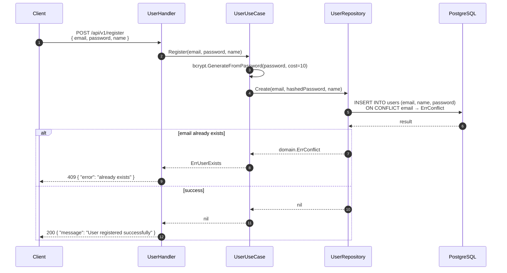
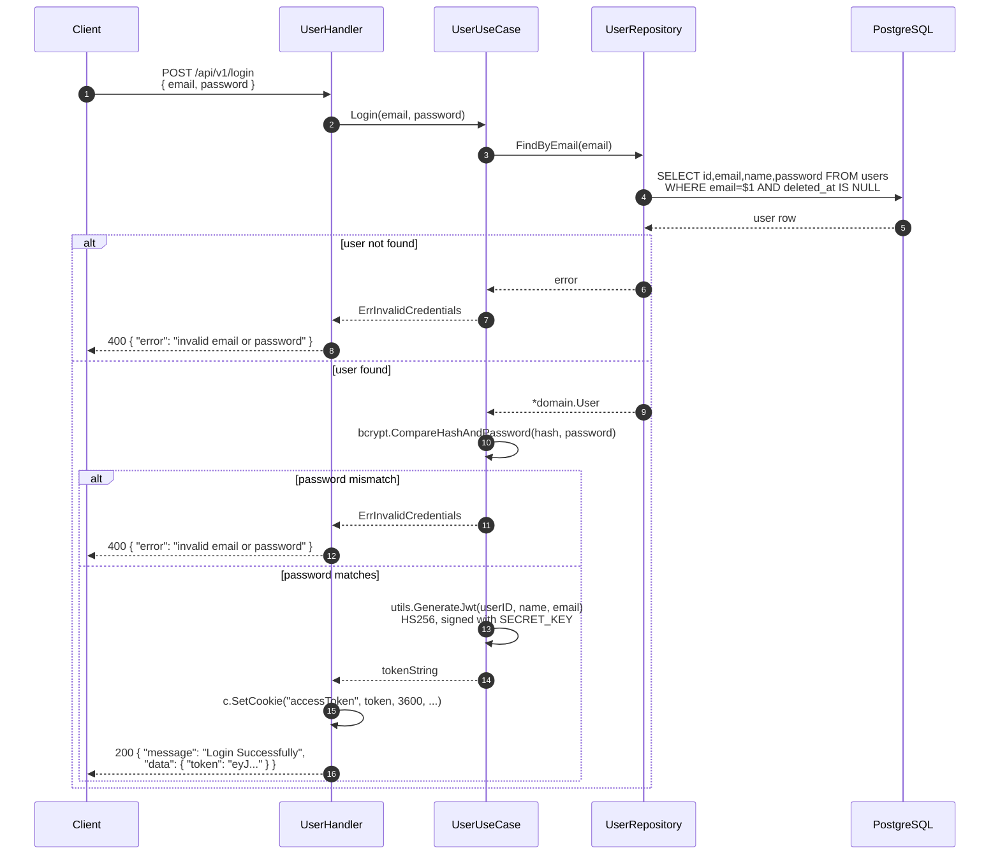
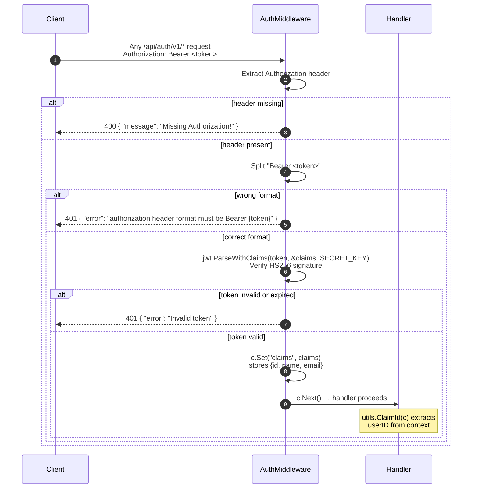
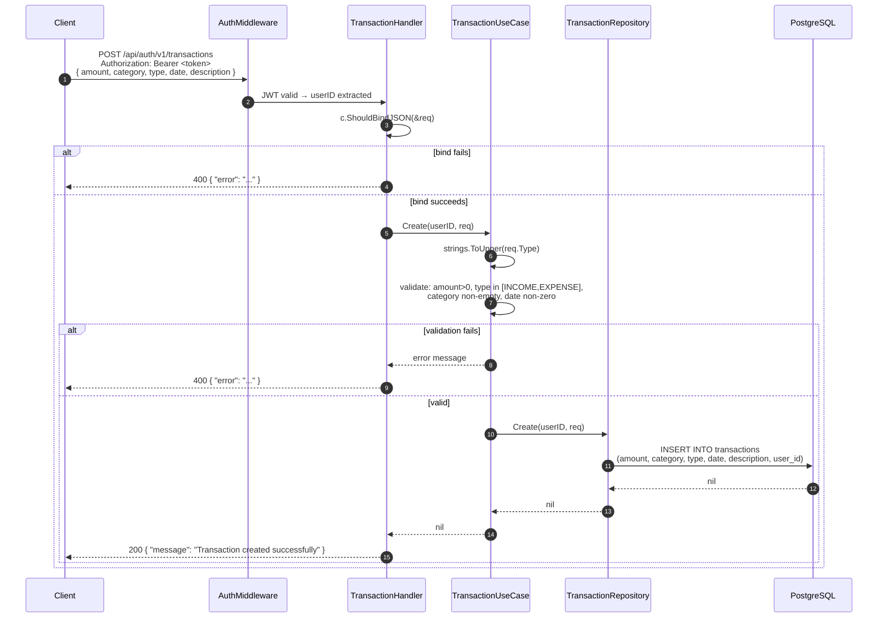
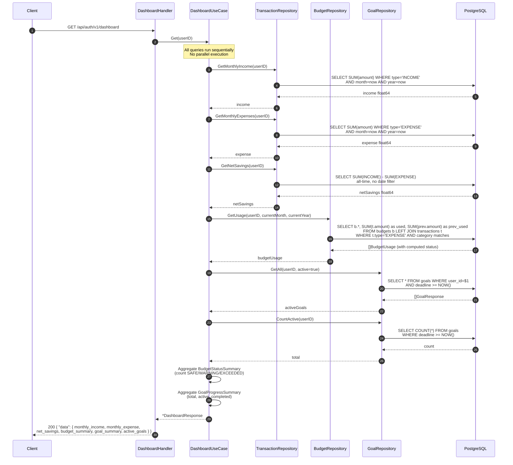
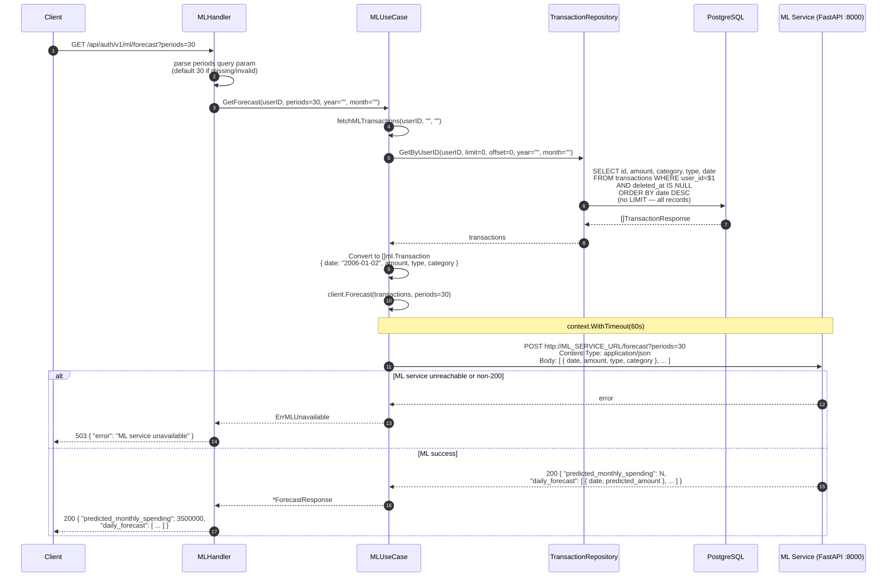
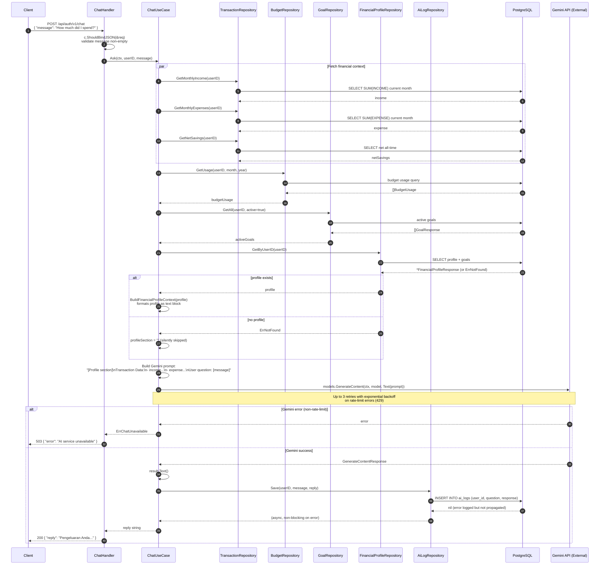
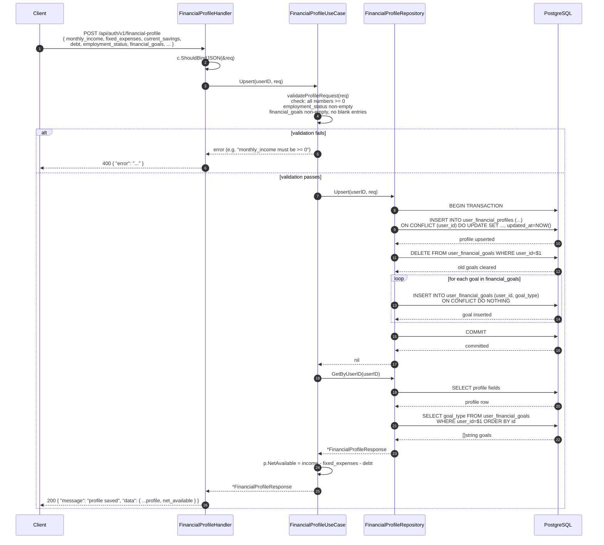
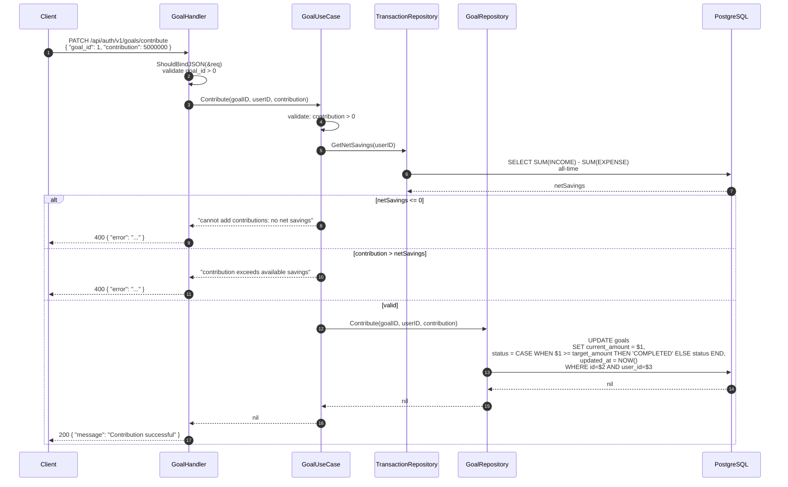

# Sequence Diagrams

All sequence diagrams are derived from the actual Go source code in `internal/`.

---

## 1. User Registration

---

## 2. User Login and JWT Issuance

---

## 3. Authentication Middleware (all protected routes)

---

## 4. Create Transaction

---

## 5. Dashboard Data Retrieval

---

## 6. ML Spending Forecast

---

## 7. AI Chat

---

## 8. Financial Profile Upsert

---

## 9. Goal Contribution

