# Sequence Diagrams

All sequence diagrams are derived from the actual Go source code in `internal/`.  
Last audited against codebase: 2026-05-19.

---

## 1. User Registration

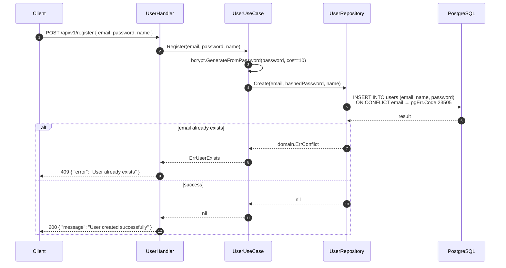

---

## 2. User Login and JWT Issuance

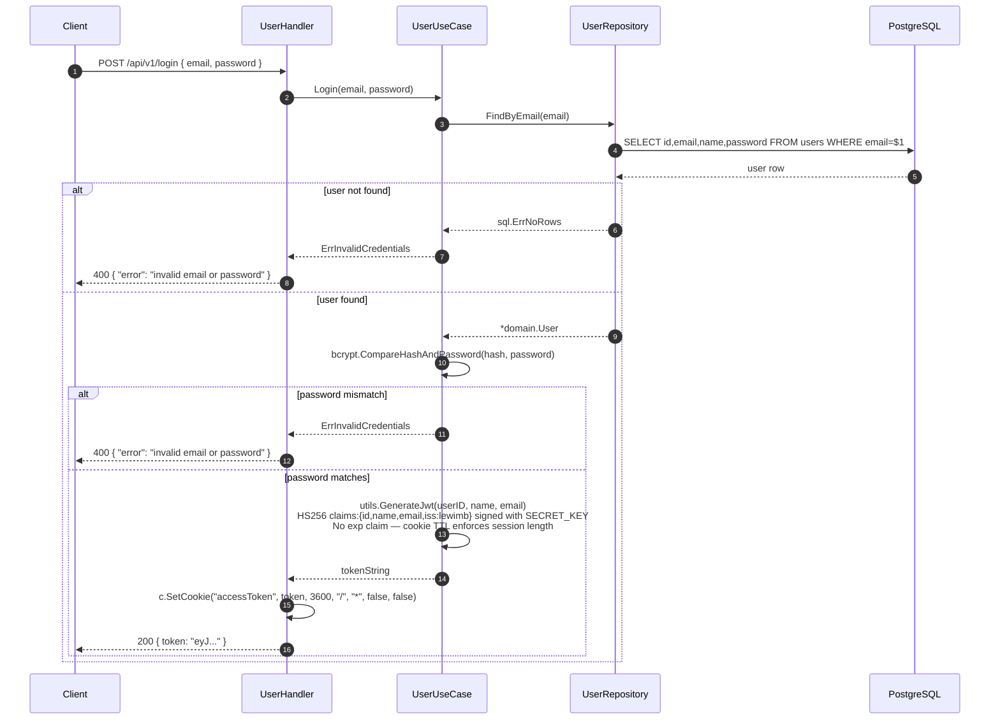

---

## 3. JWT Middleware (all protected routes)

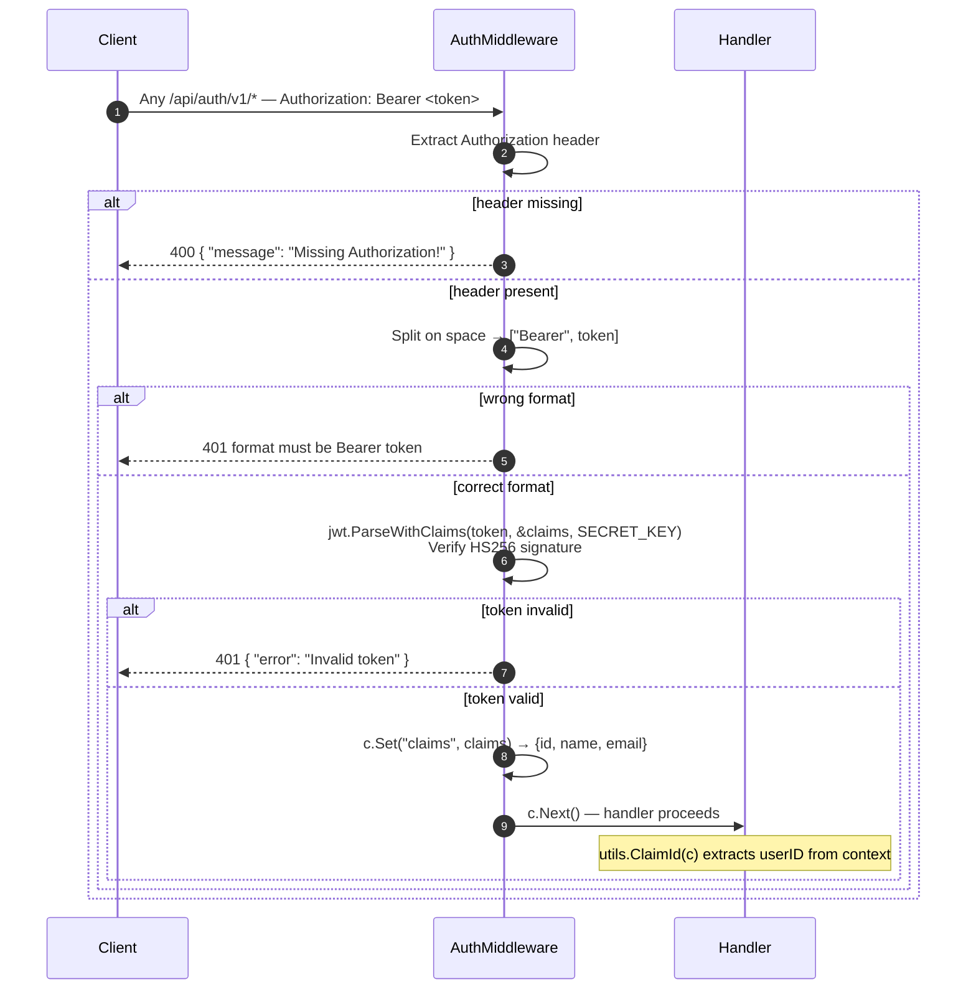

---

## 4. Create Transaction

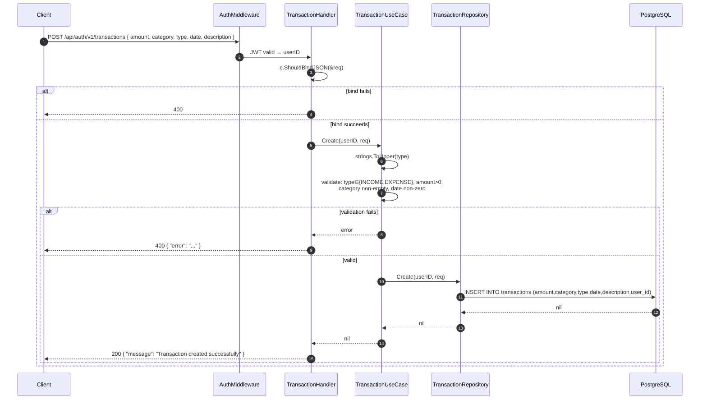

---

## 5. Goal Contribution

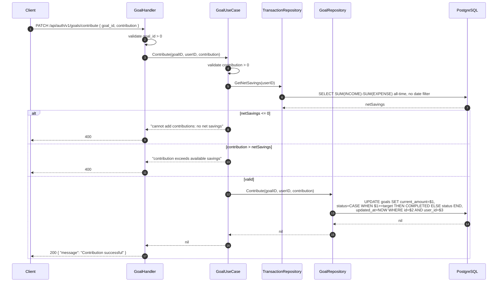

---

## 6. Dashboard Data Retrieval

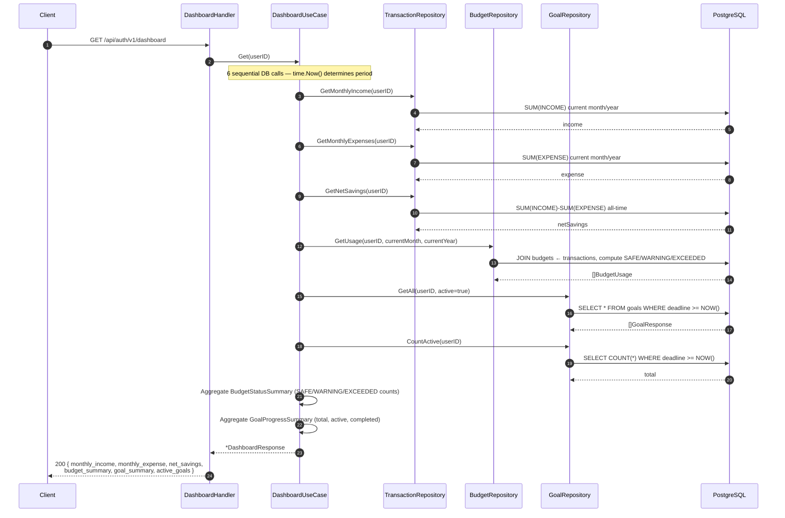

---

## 7. AI Chat (Gemini Integration)

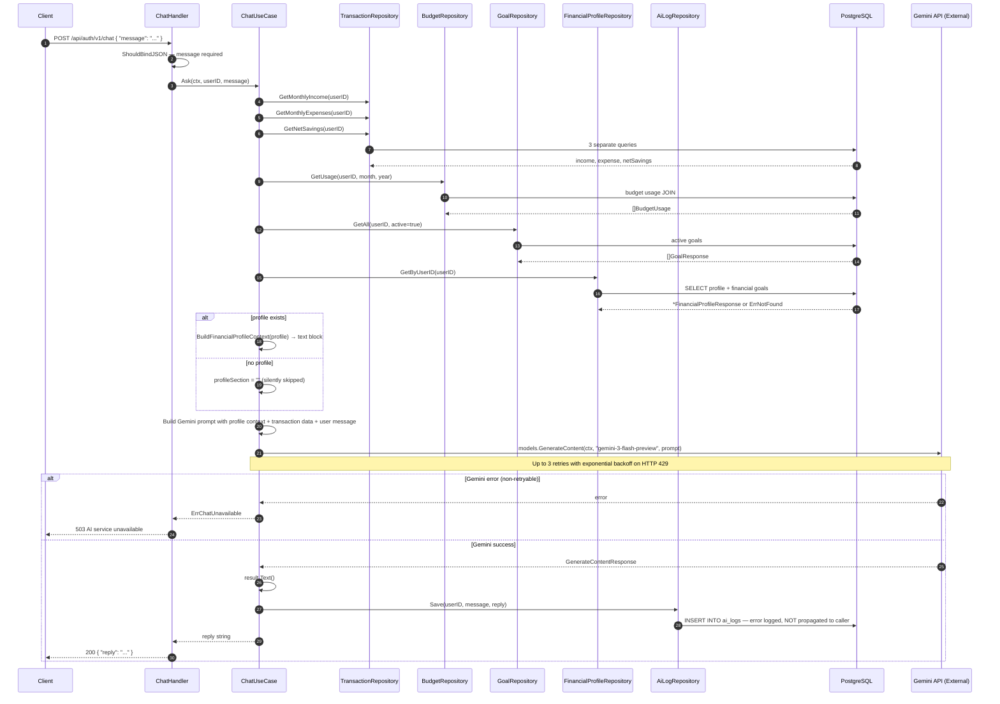

---

## 8. Financial Profile Upsert (Atomic DB Transaction)

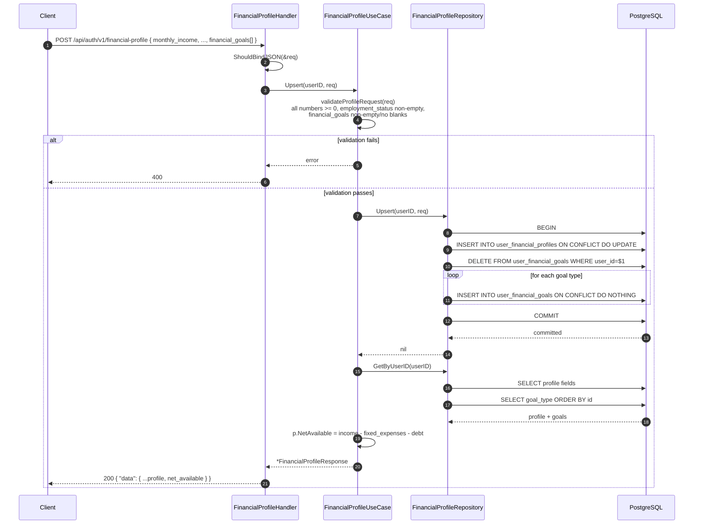

---

## 9. ML Forecast (Full Pipeline)

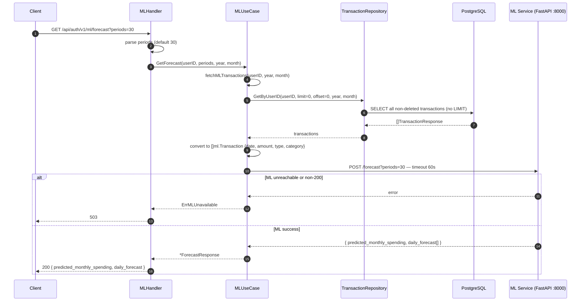

---

## 10. Budget Usage Retrieval

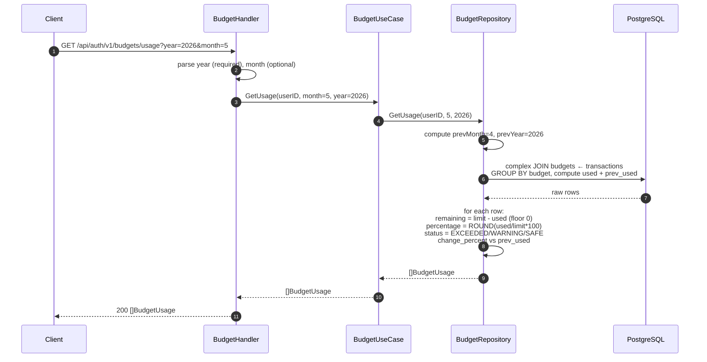

---

## 10. Transaction Create with Budget Alert Check (v1.3)

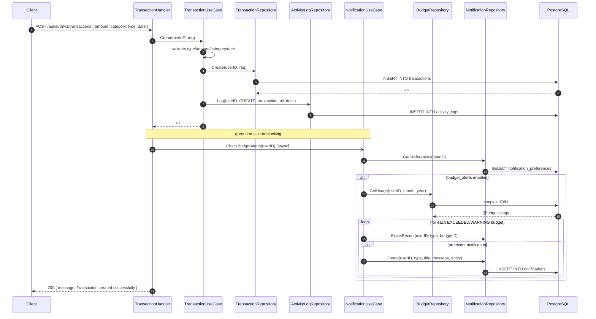

---

## 11. Get Monthly Summary (DashboardGraph data) (v1.3)

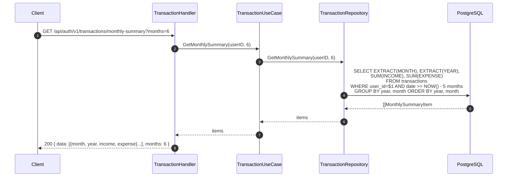

---

## 12. Dashboard with Financial Health Score (v1.3)

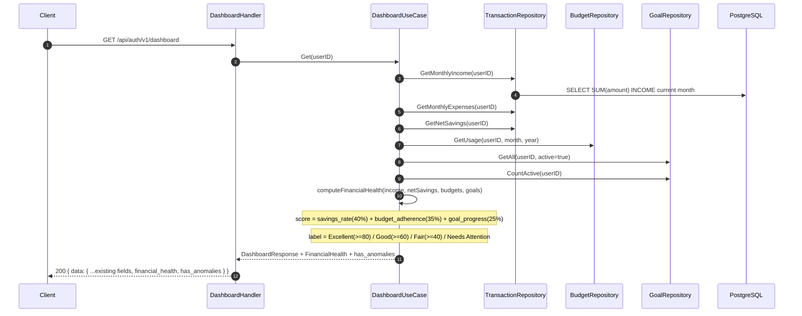

---

## 13. Transaction Bulk Import (v1.3)

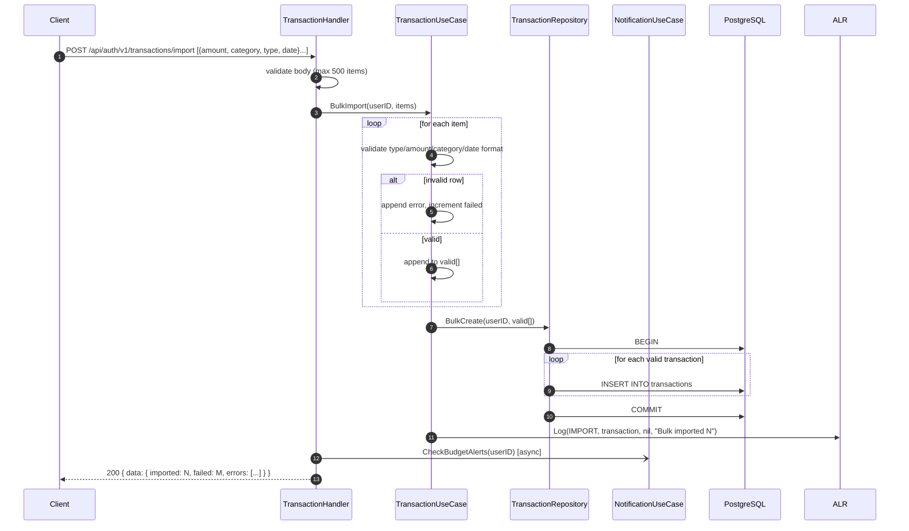
