# System Architecture Diagram

```mermaid
%%{init: {'theme': 'base', 'themeVariables': {
  'background': '#ffffff',
  'primaryColor': '#1e1e1e',
  'primaryTextColor': '#000000',
  'primaryBorderColor': '#000000',
  'lineColor': '#444444',
  'secondaryColor': '#f5f5f5',
  'tertiaryColor': '#e8e8e8',
  'clusterBkg': '#ffffff',
  'clusterBorder': '#000000',
  'nodeBorder': '#000000',
  'nodeTextColor': '#000000',
  'edgeLabelBackground': '#ffffff',
  'fontFamily': 'Courier New, monospace'
}}}%%

flowchart TB
    subgraph Client["CLIENT LAYER"]
        FE["React / Vite Frontend\nlocalhost:5173"]
    end

    subgraph API["API GATEWAY — Gin HTTP Server (:8080)"]
        direction TB
        ROUTER["Gin Router\n/api/v1/*  ·  /api/auth/v1/*"]
        CORS["CORS Middleware\nAccess-Control-Allow-Origin: localhost:5173"]
        AUTH["Auth Middleware\nJWT HS256 — Bearer Token\nClaims: {id, name, email}"]
    end

    subgraph HANDLERS["DELIVERY LAYER — HTTP Handlers"]
        direction TB
        H_USER["UserHandler\nRegister / Login / GetAll / GetMe"]
        H_TX["TransactionHandler\nCreate / GetAll / Update / Delete\nMonthly Income/Expense / Export / Import"]
        H_BUD["BudgetHandler\nCreate / GetAll / GetUsage\nGetByID / Update / Delete"]
        H_GOAL["GoalHandler\nCreate / GetAll / GetOverview\nGetMilestones / Contribute / Update / Delete"]
        H_DASH["DashboardHandler\nGet — Aggregated Snapshot"]
        H_CHAT["ChatHandler\nAsk / GetHistory / ClearHistory"]
        H_ML["MLHandler\nAnalysis / Anomaly / Forecast / Insights"]
        H_FP["FinancialProfileHandler\nUpsert / Get"]
        H_NOTIF["NotificationHandler\nGetAll / MarkRead / MarkAllRead\nDelete / GetPreferences / UpdatePreferences"]
        H_ACT["ActivityLogHandler\nGetActivity"]
        H_REP["ReportsHandler\nMonthlySummary / CategoryBreakdown\nSavingsRate / NetWorth / MonthComparison"]
    end

    subgraph USECASES["USE CASE LAYER — Business Logic"]
        direction TB
        UC_USER["UserUseCase\nbcrypt hash  ·  JWT generation"]
        UC_TX["TransactionUseCase\nValidation  ·  Bulk Import/Export"]
        UC_BUD["BudgetUseCase\nPeriod rules  ·  Threshold defaults"]
        UC_GOAL["GoalUseCase\nNet-savings validation  ·  Auto-complete"]
        UC_DASH["DashboardUseCase\n6-query aggregation  ·  Financial health"]
        UC_CHAT["ChatUseCase\nContext builder  ·  Prompt injection"]
        UC_ML["MLUseCase\nTx conversion  ·  API orchestration"]
        UC_FP["FinancialProfileUseCase\nValidation  ·  Net-available calc"]
        UC_NOTIF["NotificationUseCase\nBudget alert checker"]
        UC_ACT["ActivityLogUseCase\nRead-only paginated query"]
        UC_REP["ReportsUseCase\nMulti-dimension analytics"]
    end

    subgraph DOMAIN["DOMAIN LAYER — Entities · Ports · Errors"]
        direction TB
        ENTITIES["Entities\nUser · TransactionRequest/Response · Budget\nBudgetUsage · GoalResponse · DashboardResponse\nChatRequest/Response · AiLog · ActivityLog\nFinancialProfile · Notification"]
        INTERFACES["Repository Ports\nUserRepository · TransactionRepository\nBudgetRepository · GoalRepository\nAiLogRepository · FinancialProfileRepository\nNotificationRepository · ActivityLogRepository"]
        ERRORS["Sentinel Errors\nErrNotFound · ErrConflict · ErrUnauthorized\nErrInvalidInput · ErrChatUnavailable · ErrMLUnavailable"]
    end

    subgraph REPOS["REPOSITORY LAYER — PostgreSQL Implementations"]
        direction TB
        R_USER["userRepository\nFindByEmail · Create · GetAll · GetByID"]
        R_TX["transactionRepository\nGetByUserID · Create · Update · Delete\nGetMonthlyExpenses / Income\nGetNetSavings · GetMonthlySummary · BulkCreate"]
        R_BUD["budgetRepository\nGetAll · GetByID · GetUsage\nCreate · Update · Delete"]
        R_GOAL["goalRepository\nGetAll · GetByID · Create · Update\nDelete · Contribute · GetSavingsTotal\nCountActive · GetUpcomingMilestones"]
        R_AI["aiLogRepository\nSave · GetByUserID · DeleteByUserID"]
        R_FP["financialProfileRepository\nUpsert · GetByUserID"]
        R_NOTIF["notificationRepository\nGetByUserID · Create · MarkRead\nMarkAllRead · Delete · GetUnreadCount\nGetPreferences · UpsertPreferences"]
        R_ACT["activityLogRepository\nLog · GetByUserID"]
    end

    subgraph DATABASE["DATA LAYER — PostgreSQL :5432"]
        DB_USERS["users\nCentral identity · soft-delete"]
        DB_TX["transactions\nLedger · INCOME/EXPENSE\nsoft-delete · BIGINT amount"]
        DB_BUD["budgets\nMONTHLY/YEARLY periods\nsoft-delete"]
        DB_GOAL["goals\nSavings targets · hard-delete"]
        DB_AI["ai_logs\nChat history · soft-delete"]
        DB_FP["user_financial_profiles\n1:1 per user"]
        DB_FG["user_financial_goals\nGoal-type tags"]
        DB_NOTIF["notifications\nBudget alerts · activity"]
        DB_NP["notification_preferences\nPer-user toggle"]
        DB_ACT["activity_logs\nAudit trail"]
        DB_REP["reports\n(scaffolded)"]
        DB_SET["settings\n(scaffolded)"]
    end

    subgraph EXTERNAL["EXTERNAL SERVICES"]
        GEMINI["Google Gemini 2.0 Flash\nGenerateContent API\n3 retries · exponential backoff"]
        ML_SVC["ML Service (Python/FastAPI :8000)\nPOST /analysis · /anomaly · /forecast\nTimeouts: 5s / 10s / 60s"]
    end

    subgraph INFRA["BUILD & DEPLOYMENT"]
        ENV[".env configuration\nDB_USER · DB_PASSWORD · DB_NAME\nDB_HOST · DB_PORT · SECRET_KEY\nGEMINI_API_KEY · CORS_ORIGIN"]
        AIR["Air (hot-reload)\ngo run main.go\nair command"]
        MIGRATE["golang-migrate\ndb/migrations/\nNNNNN_desc.up/down.sql"]
        SEED["db/seeder\nStandalone CLI binary\n-fresh · -only flags"]
    end

    %% === DATA FLOW ===
    FE -->|"HTTP JSON\nAuthorization: Bearer"| ROUTER
    ROUTER --> CORS
    CORS --> AUTH
    AUTH --> HANDLERS

    H_USER --> UC_USER
    H_TX --> UC_TX
    H_BUD --> UC_BUD
    H_GOAL --> UC_GOAL
    H_DASH --> UC_DASH
    H_CHAT --> UC_CHAT
    H_ML --> UC_ML
    H_FP --> UC_FP
    H_NOTIF --> UC_NOTIF
    H_ACT --> UC_ACT
    H_REP --> UC_REP

    UC_USER --> INTERFACES
    UC_TX --> INTERFACES
    UC_BUD --> INTERFACES
    UC_GOAL --> INTERFACES
    UC_DASH --> INTERFACES
    UC_CHAT --> INTERFACES
    UC_ML --> INTERFACES
    UC_FP --> INTERFACES
    UC_NOTIF --> INTERFACES
    UC_ACT --> INTERFACES
    UC_REP --> INTERFACES

    INTERFACES -.->|"implemented by"| REPOS

    R_USER -->|"pgx/v5"| DB_USERS
    R_TX -->|"pgx/v5"| DB_TX
    R_BUD -->|"pgx/v5"| DB_BUD
    R_GOAL -->|"pgx/v5"| DB_GOAL
    R_AI -->|"pgx/v5"| DB_AI
    R_FP -->|"pgx/v5"| DB_FP
    R_FP -->|"pgx/v5"| DB_FG
    R_NOTIF -->|"pgx/v5"| DB_NOTIF
    R_NOTIF -->|"pgx/v5"| DB_NP
    R_ACT -->|"pgx/v5"| DB_ACT

    %% Cross-domain dependencies
    UC_GOAL -.->|"reads net_savings"| R_TX
    UC_DASH -.->|"aggregates 3 repos"| R_TX
    UC_DASH -.->|"aggregates"| R_BUD
    UC_DASH -.->|"aggregates"| R_GOAL
    UC_CHAT -.->|"builds context"| R_TX
    UC_CHAT -.->|"builds context"| R_BUD
    UC_CHAT -.->|"builds context"| R_GOAL
    UC_CHAT -.->|"reads profile"| R_FP
    UC_CHAT -.->|"persists Q&A"| R_AI
    UC_ML -.->|"fetches ML data"| R_TX

    %% External integrations
    UC_CHAT -->|"GenerateContent\n(model, prompt)"| GEMINI
    UC_ML -->|"POST JSON\n(transactions)"| ML_SVC

    %% Business logic annotations
    UC_GOAL x-->|"Contribute()\nvalidates ≤ net_savings"| ENTITIES
    UC_BUD x-->|"GetUsage()\n% calc → SAFE/WARNING/EXCEEDED"| ENTITIES
    UC_DASH x-->|"Financial health\nscore computation"| ENTITIES
    UC_NOTIF x-->|"CheckBudgetAlerts()\ngenerates notifications"| ENTITIES

    %% Infra
    ENV -.->|"loaded by\ngodotenv"| ROUTER
    AIR -.->|"triggers rebuild\non file change"| ROUTER
    MIGRATE -.->|"applies SQL\nmigrations"| DATABASE
    SEED -.->|"inserts test\ndata"| DATABASE
```

---

## Layer Descriptions

### Client Layer
Single-page application built with React/Vite. Communicates with the backend exclusively via HTTP JSON over the configured CORS origin (`localhost:5173`).

### API Gateway (Gin)
Routes all requests through CORS headers, then JWT authentication middleware for protected `/api/auth/v1/*` routes. Public routes (`/api/v1/register`, `/api/v1/login`, `/api/v1/users`) bypass the auth middleware.

### Delivery Layer (Handlers)
11 handler structs translating HTTP requests into use case calls. Each handler is responsible for:
- Extracting the authenticated user ID via `utils.ClaimId(c)`
- Binding and basic validation of request bodies via Gin's `ShouldBindJSON`
- Returning appropriate HTTP status codes (200, 400, 401, 404, 409, 500, 503)

### Use Case Layer
11 use case structs containing all business logic and validation. Key cross-domain flows:
- **GoalUseCase** reads `TransactionRepository` for net-savings validation before contributions
- **DashboardUseCase** aggregates across Transaction, Budget, and Goal repositories
- **ChatUseCase** aggregates all three + FinancialProfile for Gemini prompt context
- **MLUseCase** converts domain transactions to ML types and calls the external ML service

### Domain Layer
Pure Go structs (entities/DTOs), repository interface definitions (ports), and sentinel error variables. Has zero external dependencies — no Gin, no database imports.

### Repository Layer
8 repository structs implementing the domain interfaces with raw PostgreSQL queries via `database/sql` + pgx/v5 driver. All queries use parameterized `$N` placeholders. Soft-delete filtering (`WHERE deleted_at IS NULL`) is applied consistently for transactions, budgets, users, and ai_logs.

### Data Layer
**12 PostgreSQL tables** — 10 active with full repository implementations, 2 scaffolded (reports, settings) with schema only.

### External Services
- **Google Gemini 2.0 Flash** — AI chat via REST API with rate-limit retry (3 attempts, exponential backoff)
- **ML Service** — Python/FastAPI microservice for statistical analysis, anomaly detection (IsolationForest), and Prophet-based forecasting
