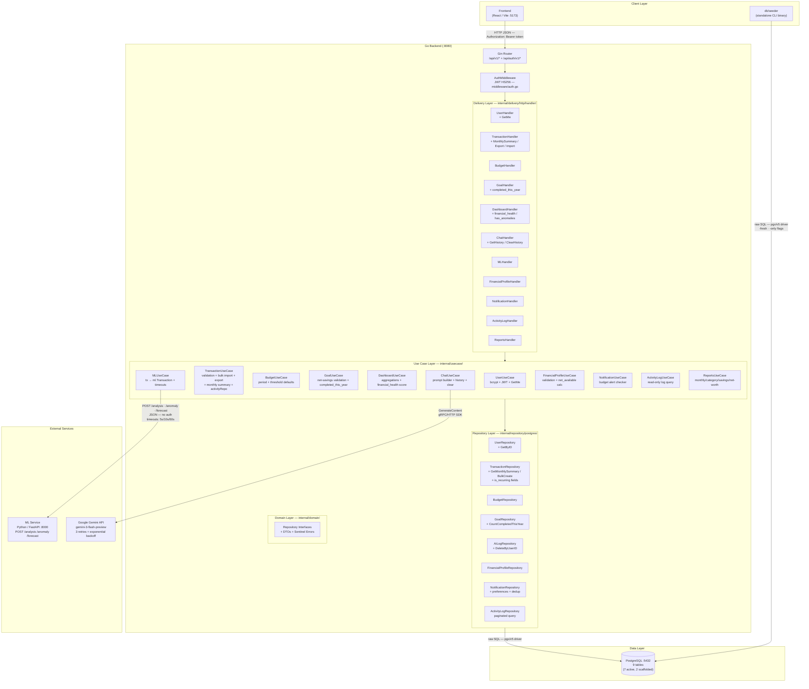
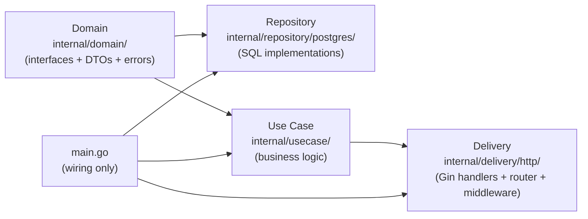
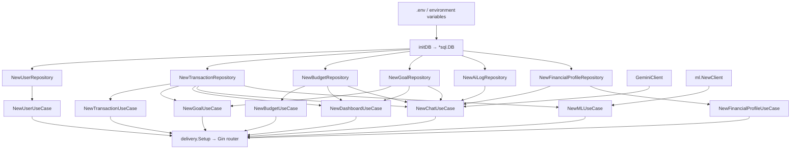
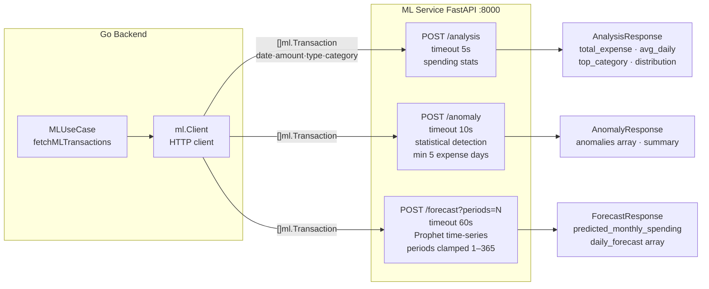

# System Architecture

Last audited against codebase: 2026-05-20. Updated for v1.3 — notifications, activity log, reports, chat history, recurring transactions, financial health score, monthly summary.

---

## 1. High-Level Overview

Three-tier application:

- **Go Backend** (Gin, port 8080) — authentication, business logic, data access, API routing
- **ML Service** (Python/FastAPI, port 8000) — stateless computation: spending analysis, anomaly detection, Prophet-based forecasting
- **PostgreSQL** (port 5432) — single relational database, raw SQL via pgx/v5 (no ORM)

External services:
- **Google Gemini API** — AI chat via `google.golang.org/genai` SDK (`gemini-3-flash-preview`)
- **Frontend** (React/Vite, port 5173) — not part of this repo; CORS origin hardcoded to `http://localhost:5173`



---

## 2. Clean Architecture Dependency Rule



**Dependency direction:** All arrows point inward toward Domain. The Domain layer has zero imports from other internal packages.

---

## 3. Component Wiring (main.go)



---

## 4. Authentication Architecture

```mermaid
flowchart TD
    subgraph JWT Token ["JWT Token (HS256)"]
        C1[id: int]
        C2[name: string]
        C3[email: string]
        C4[iss: lewimb]
        C5[NO exp claim]
    end
    subgraph Cookie
        K1[name: accessToken]
        K2[MaxAge: 3600 seconds]
        K3[path: /]
        K4[domain: *]
        K5[secure: false]
        K6[httpOnly: false]
    end
    L[Login success] --> JWT Token
    L --> Cookie
    Note1[Session length enforced by cookie TTL only]
```

---

## 5. ML Service Integration



---

## 6. Database Schema Summary (9 tables)

| Table | Status | Delete Strategy | Notes |
|---|---|---|---|
| `users` | Active | soft (deleted_at) | Central entity |
| `transactions` | Active | soft (deleted_at) | BIGINT amount, IDR |
| `budgets` | Active | soft (deleted_at) | MONTHLY/YEARLY periods |
| `goals` | Active | hard (DELETE) | deleted_at dropped in migration 012 |
| `ai_logs` | Active | soft (deleted_at) | Not queried in app — only written |
| `user_financial_profiles` | Active | CASCADE on user delete | 1:1 per user |
| `user_financial_goals` | Active | CASCADE + DELETE before re-insert | FK tags for profile |
| `reports` | Scaffolded | — | No app routes |
| `settings` | Scaffolded | — | No app routes |

---

## 7. Architecture Issues and Improvement Opportunities

### Identified Issues

| Issue | Location | Severity | Notes |
|---|---|---|---|
| Sequential DB calls in Dashboard | `DashboardUseCase.Get` | Medium | 6 queries run one-by-one; `errgroup` could parallelize |
| Logical JOIN between budget and transaction categories | `BudgetRepository.GetUsage` | Medium | No FK enforcement; case-insensitive string match; typos silently break budget tracking |
| GoalUseCase cross-domain dependency on TransactionRepository | `GoalUseCase.Contribute` | Low | Intentional but creates tight coupling; documented |
| JWT has no expiry claim | `utils/jwt.go` | Medium | Token is valid until cookie expires; if cookie is stolen, token remains valid indefinitely |
| CORS hardcoded to localhost:5173 | `main.go` | Low | Production deployment requires env-var-driven CORS config |
| Reports and Settings exist in DB but have no API routes | migrations 006/007 | Low | Dead schema increases cognitive load |
| `GetAll` for users returns passwords in response | `UserRepository.GetAll` | High | `UserResponse.Password` is included in JSON — credential leak |
| Dashboard `GoalProgressSummary.Active` miscounts | `DashboardUseCase.Get` | Medium | Counts completed goals from `GetAll(active=true)` which only returns goals with `deadline >= NOW` — COMPLETED goals with past deadlines are excluded from denominator |

### Scalability Notes

- No pagination on `GetAll` for goals or budgets — unbounded result sets
- No background jobs or scheduled tasks — all computation is request-scoped
- ML service has no auth — anyone who can reach port 8000 can call it directly
- Single PostgreSQL instance — no read replicas or connection pooling beyond pgx defaults
