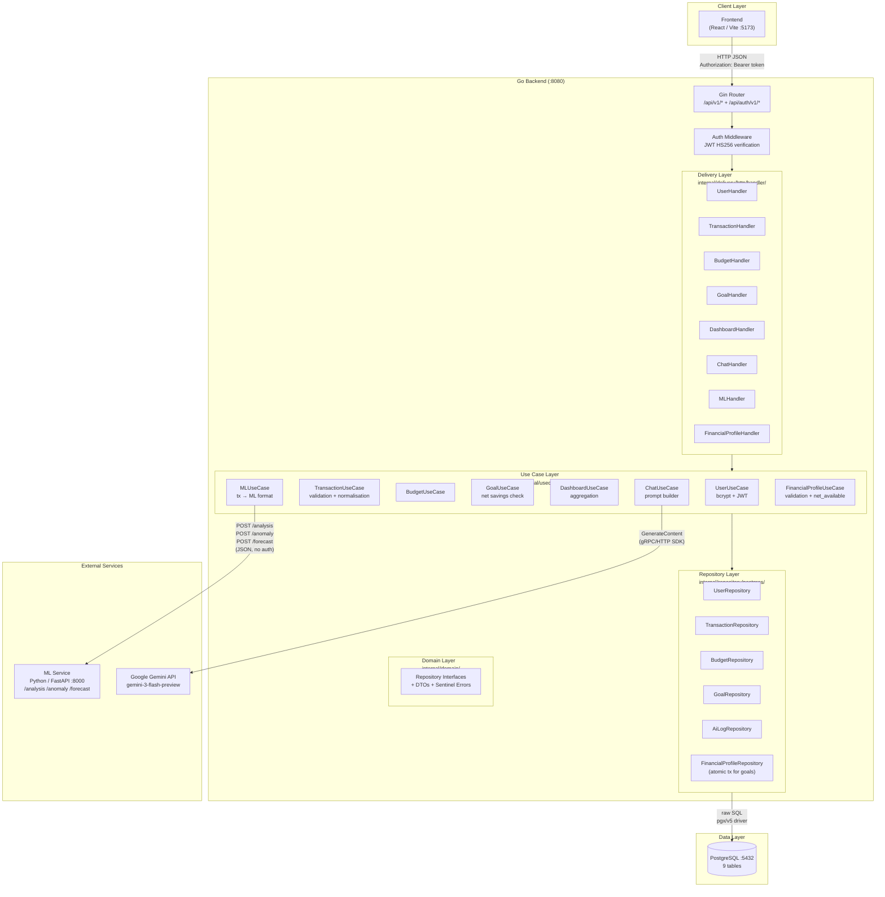
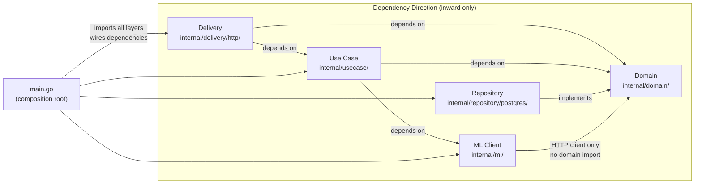
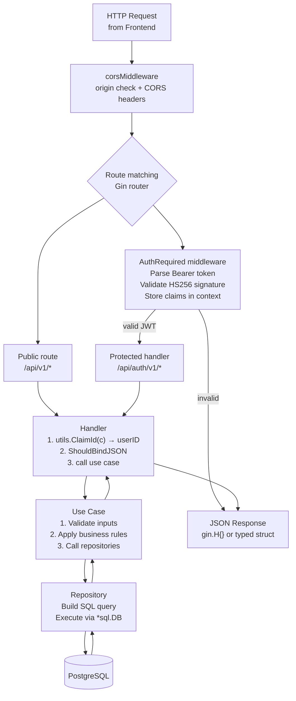
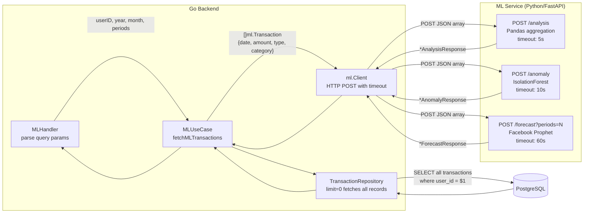
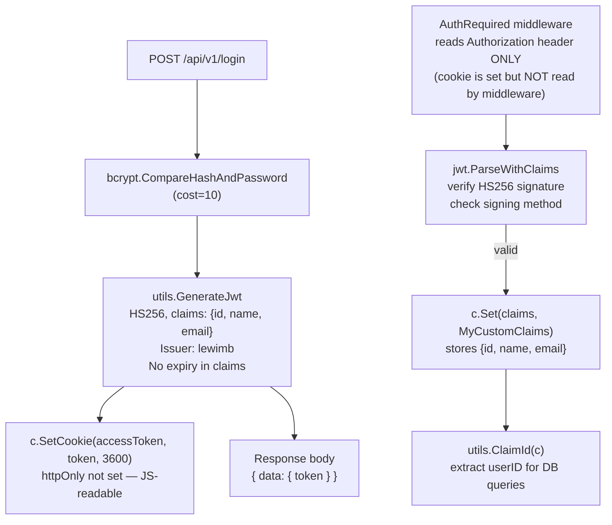

# System Architecture

## 1. High-Level Overview

The system is a three-tier application composed of:

- **Go Backend** (Gin, port 8080) — authentication, business logic, data access, API routing
- **ML Service** (Python/FastAPI, port 8000) — stateless computation: analysis, anomaly detection, forecasting
- **PostgreSQL** (port 5432) — single relational database, raw SQL (no ORM)

External services:
- **Google Gemini API** — AI chat responses via `google.golang.org/genai` SDK
- **Frontend** (React/Vite, port 5173) — not part of this repo; CORS configured for this origin

---

## 2. Clean Architecture — Dependency Rules

The codebase strictly follows Clean Architecture with `internal/` enforcing Go's package visibility rules.

**Key rule:** `domain/` imports nothing from this project. It defines interfaces, DTOs, and sentinel errors. All other layers depend inward on `domain/`, never outward.

`main.go` is the **composition root** — the only file that imports all layers and wires concrete types to interfaces via constructor injection.

---

## 3. Request Lifecycle

---

## 4. ML Integration Architecture

**Key properties of ML integration:**
- **Stateless:** ML service holds no state between calls. Full transaction array sent every time.
- **Timeout per endpoint:** analysis 5s, anomaly 10s, forecast 60s (context.WithTimeout).
- **INCOME silently ignored:** ML service filters only EXPENSE records internally. Go sends all types.
- **URL configuration:** `ML_SERVICE_URL` env var, falls back to `http://localhost:8000`.
- **Error wrapping:** Any ML error → `usecase.ErrMLUnavailable` → HTTP 503.

---

## 5. Authentication Architecture

---

## 6. Component Dependency Graph

```mermaid
graph TB
    subgraph "main.go (composition root)"
        MAIN["Wire all dependencies"]
    end

    MAIN -->|"creates"| UR["postgres.UserRepository"]
    MAIN -->|"creates"| TR["postgres.TransactionRepository"]
    MAIN -->|"creates"| BR["postgres.BudgetRepository"]
    MAIN -->|"creates"| GR["postgres.GoalRepository"]
    MAIN -->|"creates"| LR["postgres.AiLogRepository"]
    MAIN -->|"creates"| PR["postgres.FinancialProfileRepository"]
    MAIN -->|"creates"| MLC["ml.NewClient()"]
    MAIN -->|"creates"| GEM["usecase.NewGeminiClient(ctx)"]

    MAIN -->|"NewUserUseCase(UR)"| UUC["UserUseCase"]
    MAIN -->|"NewTransactionUseCase(TR)"| TUC["TransactionUseCase"]
    MAIN -->|"NewBudgetUseCase(BR)"| BUC["BudgetUseCase"]
    MAIN -->|"NewGoalUseCase(GR, TR)"| GUC["GoalUseCase"]
    MAIN -->|"NewDashboardUseCase(TR, BR, GR)"| DUC["DashboardUseCase"]
    MAIN -->|"NewChatUseCase(TR, BR, GR, LR, PR, GEM)"| CUC["ChatUseCase"]
    MAIN -->|"NewMLUseCase(TR, MLC)"| MUC["MLUseCase"]
    MAIN -->|"NewFinancialProfileUseCase(PR)"| FUC["FinancialProfileUseCase"]

    MAIN -->|"delivery.Setup(r, Deps{...})"| ROUTER["Gin Router\n+ all handlers"]
```

---

## 7. Environment Configuration

| Variable | Used by | Default | Required |
|---|---|---|---|
| `DB_USER` | main.go initDB | — | Yes |
| `DB_PASSWORD` | main.go initDB | — | Yes |
| `DB_NAME` | main.go initDB | — | Yes |
| `DB_HOST` | main.go initDB | — | Yes |
| `DB_PORT` | main.go initDB | — | Yes |
| `SECRET_KEY` | JWT sign + verify | — | Yes |
| `GEMINI_API_KEY` | genai.NewClient | — | Yes (503 if missing) |
| `ML_SERVICE_URL` | ml.NewClient | `http://localhost:8000` | No |

---

## 8. Architecture Assessment

### Missing Concerns

| Concern | Current State | Impact |
|---|---|---|
| **No interface for ml.Client** | `MLUseCase` takes `*ml.Client` (concrete), not an interface | Cannot mock ML client in tests; violates DIP |
| **No caching** | Dashboard hits 5 DB queries on every request; ML results recomputed every call | Latency and DB load at scale |
| **No connection pool config** | `sql.Open` with defaults (unlimited connections) | Connection exhaustion under load |
| **No rate limiting** | `/chat` endpoint calls Gemini without per-user throttle | Gemini quota exhaustion possible |
| **`reports` / `settings` scaffolded** | Tables exist, no Go implementation | Dead schema; maintenance confusion |
| **Duplicate `.env` load in main.go** | `godotenv.Load()` called twice | Minor bug; no functional impact |
| **JWT no expiry in claims** | Only cookie expiry enforced | Token valid indefinitely if extracted from cookie |
| **Middleware reads header only** | Cookie set on login but AuthRequired ignores it | Cookie-based auth silently fails |

### Tight Coupling

| Coupling | Location | Severity |
|---|---|---|
| `ChatUseCase` has 6 dependencies | `usecase/chat.go` NewChatUseCase | Medium — hard to test in isolation |
| `GoalUseCase` injects `TransactionRepository` for net savings | Cross-domain dependency | Low — intentional, documented |
| `DashboardUseCase` aggregates from 3 repos | `usecase/dashboard.go` | Low — acceptable for read aggregation |
| Budget↔Transaction join by string category | `repository/postgres/budget.go` GetUsage | High — typo silently breaks tracking |

### Scalability Concerns

| Concern | Detail |
|---|---|
| **ML forecast 60s timeout** | Blocks a goroutine per in-flight request; no queuing |
| **Full transaction list to ML** | `limit=0` fetches all records; grows unbounded with user history |
| **No async processing** | Dashboard, forecast, chat are all synchronous request-response |
| **Single DB instance** | No read replica or connection pooling config |

### Suggested Improvements

1. **Define `MLClientInterface`** in `internal/ml/` so `MLUseCase` depends on an interface → enables testing and swapping implementations.
2. **Add Redis cache** for dashboard (TTL 1–5 min) and ML results (TTL per forecast period).
3. **Set `sql.DB` pool params** (`SetMaxOpenConns`, `SetMaxIdleConns`, `SetConnMaxLifetime`) in `main.go`.
4. **Move forecast to async job** — accept request, return job ID, poll for result — to avoid 60s HTTP timeout.
5. **Add token expiry to JWT claims** (`ExpiresAt` in `RegisteredClaims`) and refresh flow.
6. **Implement `settings` and `reports` routes** or remove the tables to reduce schema confusion.
7. **Category normalisation** — enforce consistent casing on transaction insert rather than relying on `LOWER()` in JOIN.
