# Use Case Diagram

## Actors

| Actor | Description |
|---|---|
| **Guest** | Unauthenticated user — can only register or login |
| **Authenticated User** | Logged-in user with a valid JWT |
| **Gemini AI** | External Google Gemini API; called by the system on behalf of the user |
| **ML Service** | Internal Python/FastAPI service; called by the Go backend |

---

## Diagram

```mermaid
flowchart TB
    subgraph Actors
        Guest(["👤 Guest"])
        User(["👤 Authenticated User"])
        Gemini(["🤖 Gemini AI\n(External)"])
        ML(["⚙️ ML Service\n(Internal)"])
    end

    subgraph Auth ["Authentication"]
        UC1["Register Account"]
        UC2["Login / Obtain JWT"]
    end

    subgraph Profile ["Financial Profile"]
        UC3["Create Onboarding Profile"]
        UC4["Update Financial Profile"]
        UC5["View Financial Profile"]
    end

    subgraph Transactions ["Transaction Management"]
        UC6["Record Income"]
        UC7["Record Expense"]
        UC8["List Transactions"]
        UC9["Update Transaction"]
        UC10["Delete Transaction (soft)"]
        UC11["View Monthly Totals"]
    end

    subgraph Budgets ["Budget Management"]
        UC12["Create Budget"]
        UC13["List Budgets"]
        UC14["View Budget Usage (SAFE/WARNING/EXCEEDED)"]
        UC15["Update Budget"]
        UC16["Delete Budget"]
    end

    subgraph Goals ["Savings Goals"]
        UC17["Create Savings Goal"]
        UC18["List Goals"]
        UC19["View Goal Overview & Milestones"]
        UC20["Contribute to Goal"]
        UC21["Update Goal"]
        UC22["Delete Goal"]
    end

    subgraph Dashboard ["Dashboard"]
        UC23["View Aggregated Dashboard"]
    end

    subgraph MLFeatures ["ML Insights (via Go → ML Service)"]
        UC24["Get Spending Analysis"]
        UC25["Get Anomaly Detection"]
        UC26["Get Spending Forecast"]
        UC27["(POST /analysis)"]
        UC28["(POST /anomaly)"]
        UC29["(POST /forecast?periods=N)"]
    end

    subgraph AIChat ["AI Chat"]
        UC30["Ask Financial Question"]
        UC31["(GenerateContent via Gemini SDK)"]
    end

    %% Guest connections
    Guest --> UC1
    Guest --> UC2

    %% User connections
    User --> UC3
    User --> UC4
    User --> UC5
    User --> UC6
    User --> UC7
    User --> UC8
    User --> UC9
    User --> UC10
    User --> UC11
    User --> UC12
    User --> UC13
    User --> UC14
    User --> UC15
    User --> UC16
    User --> UC17
    User --> UC18
    User --> UC19
    User --> UC20
    User --> UC21
    User --> UC22
    User --> UC23
    User --> UC24
    User --> UC25
    User --> UC26
    User --> UC30

    %% ML pipeline
    UC24 -.->|"Go fetches transactions\nthen calls ML"| UC27
    UC25 -.->|"Go fetches transactions\nthen calls ML"| UC28
    UC26 -.->|"Go fetches transactions\nthen calls ML"| UC29
    UC27 --> ML
    UC28 --> ML
    UC29 --> ML

    %% AI pipeline
    UC30 -.->|"Builds prompt from\nfinancial context"| UC31
    UC31 --> Gemini
```

---

## Use Case Descriptions

### Authentication
| Use Case | Actor | Description |
|---|---|---|
| Register Account | Guest | Creates a new user with email, password (bcrypt cost 10), and name. Returns conflict if email exists. |
| Login / Obtain JWT | Guest | Validates email/password, returns HS256 JWT signed with `SECRET_KEY`. Token contains `id`, `name`, `email`. Cookie is also set (1h expiry). |

### Financial Profile
| Use Case | Actor | Description |
|---|---|---|
| Create Onboarding Profile | Authenticated User | Submits income, expenses, savings, debt, employment status, and goals. Stored atomically with goals in a DB transaction. |
| Update Financial Profile | Authenticated User | Same endpoint as create (`POST /financial-profile`) — upserts. Goals list is fully replaced. |
| View Financial Profile | Authenticated User | Returns profile + computed `net_available = income − fixed_expenses − debt`. Returns 404 if not yet created (triggers onboarding gate). |

### Transaction Management
| Use Case | Actor | Description |
|---|---|---|
| Record Income / Expense | Authenticated User | Inserts a transaction scoped to the user. Type normalised to uppercase. |
| List Transactions | Authenticated User | Paginated list with optional month/year filter. Returns total count for client-side pagination. |
| Update Transaction | Authenticated User | Full replacement of a transaction record. Requires ownership (`user_id` check). |
| Delete Transaction | Authenticated User | Soft delete via `deleted_at = NOW()`. All queries filter `WHERE deleted_at IS NULL`. |
| View Monthly Totals | Authenticated User | Aggregated sum of INCOME and EXPENSE for the current calendar month. |

### Budget Management
| Use Case | Actor | Description |
|---|---|---|
| Create Budget | Authenticated User | Creates budget per category + period + year (+ month for MONTHLY). Unique constraint prevents duplicates. |
| View Budget Usage | Authenticated User | Joins budgets with transactions. Computes `used`, `remaining`, `percentage`, `status`, and `change_percent` vs previous period. |
| Update Budget | Authenticated User | Partial update — zero values keep existing data (via `NULLIF`). Returns updated record. |

### Savings Goals
| Use Case | Actor | Description |
|---|---|---|
| Create Savings Goal | Authenticated User | Goal with name, target amount, description, and future deadline. Unique by name+user+active deadline. |
| Contribute to Goal | Authenticated User | Sets `current_amount` directly (not an increment). Validates against all-time net savings. Auto-completes when `current_amount >= target_amount`. |
| View Overview | Authenticated User | Returns active goal count, total savings across all goals, and next 4 milestones by deadline. |
| Delete Goal | Authenticated User | **Hard delete** (no soft delete — `deleted_at` was dropped in migration 012). |

### ML Insights
| Use Case | Actor | Description |
|---|---|---|
| Spending Analysis | Authenticated User | Go fetches user's transactions → sends full list to ML service → returns total expense, avg daily, top category, spending distribution. |
| Anomaly Detection | Authenticated User | IsolationForest detects statistically unusual spending days. Requires ≥ 5 unique expense days. |
| Spending Forecast | Authenticated User | Facebook Prophet predicts daily spend for N days (default 30, max 365). Timeout 60s. |

### AI Chat
| Use Case | Actor | Description |
|---|---|---|
| Ask Financial Question | Authenticated User | System builds context prompt from current month financials + financial profile, calls Gemini 2.0, persists Q&A to `ai_logs`. Responds in user's language. |
