# Use Case Diagram

```mermaid
graph TB
  subgraph Actors
    U[User]
    S[System / Gemini AI]
    ML[ML Service]
  end

  subgraph Authentication
    UC1[Register Account]
    UC2[Login]
    UC3[View My Profile]
    UC4[List All Users]
  end

  subgraph "Transaction Management"
    UC5[List Transactions]
    UC6[Create Transaction]
    UC7[Update Transaction]
    UC8[Delete Transaction]
    UC9[View Monthly Expenses]
    UC10[View Monthly Income]
    UC11[View Monthly Summary]
    UC12[Export Transactions]
    UC13[Bulk Import Transactions]
  end

  subgraph "Budget Management"
    UC14[List Budgets]
    UC15[Create Budget]
    UC16[Get Budget by ID]
    UC17[Update Budget]
    UC18[Delete Budget]
    UC19[View Budget Usage]
  end

  subgraph "Goal Management"
    UC20[List Goals]
    UC21[Create Goal]
    UC22[Get Goal by ID]
    UC23[Update Goal]
    UC24[Delete Goal]
    UC25[Contribute to Goal]
    UC26[View Goal Overview]
    UC27[View Milestones]
  end

  subgraph "Dashboard & Reports"
    UC28[View Dashboard]
    UC29[Monthly Summary Report]
    UC30[Category Breakdown Report]
    UC31[Savings Rate Report]
    UC32[Net Worth Report]
    UC33[Month Comparison Report]
  end

  subgraph "AI Chat"
    UC34[Ask AI Assistant]
    UC35[View Chat History]
    UC36[Clear Chat History]
  end

  subgraph "ML Analytics"
    UC37[Get Spending Analysis]
    UC38[Detect Anomalies]
    UC39[Get Forecast]
    UC40[Get Insights]
  end

  subgraph "Financial Profile"
    UC41[Upsert Financial Profile]
    UC42[View Financial Profile]
  end

  subgraph "Notifications"
    UC43[View Notifications]
    UC44[Mark Notification Read]
    UC45[Mark All Read]
    UC46[Delete Notification]
    UC47[Manage Preferences]
  end

  subgraph "Activity Log"
    UC48[View Activity History]
  end

  U --> UC1
  U --> UC2
  U --> UC3
  U --> UC4
  U --> UC5
  U --> UC6
  U --> UC7
  U --> UC8
  U --> UC9
  U --> UC10
  U --> UC11
  U --> UC12
  U --> UC13
  U --> UC14
  U --> UC15
  U --> UC16
  U --> UC17
  U --> UC18
  U --> UC19
  U --> UC20
  U --> UC21
  U --> UC22
  U --> UC23
  U --> UC24
  U --> UC25
  U --> UC26
  U --> UC27
  U --> UC28
  U --> UC29
  U --> UC30
  U --> UC31
  U --> UC32
  U --> UC33
  U --> UC34
  U --> UC35
  U --> UC36
  U --> UC37
  U --> UC38
  U --> UC39
  U --> UC40
  U --> UC41
  U --> UC42
  U --> UC43
  U --> UC44
  U --> UC45
  U --> UC46
  U --> UC47
  U --> UC48

  UC34 -.-> S
  UC37 -.-> ML
  UC38 -.-> ML
  UC39 -.-> ML
  UC40 -.-> ML

  UC41 --> UC42
  UC26 --> UC27

  note[<b>Cross-use-case:</b><br/>GoalContribute validates net savings<br/>via TransactionRepository.<br/>Transaction Create/Import triggers<br/>CheckBudgetAlerts as goroutine.<br/>ChatUseCase reuses<br/>BuildFinancialProfileContext.]
```

## Use Case Summary

| # | Use Case | Actor | Description |
|---|----------|-------|-------------|
| UC1 | Register Account | User | Create account with email, password, name |
| UC2 | Login | User | Authenticate, receive JWT |
| UC3 | View My Profile | User | Get own user details |
| UC4 | List All Users | User | View all registered users |
| UC5 | List Transactions | User | Paginated, filterable by month/year |
| UC6 | Create Transaction | User | Record income or expense |
| UC7 | Update Transaction | User | Modify transaction fields |
| UC8 | Delete Transaction | User | Soft-delete a transaction |
| UC9 | View Monthly Expenses | User | Total expenses for current month |
| UC10 | View Monthly Income | User | Total income for current month |
| UC11 | View Monthly Summary | User | Income/expense per month for last N months |
| UC12 | Export Transactions | User | CSV export of transactions |
| UC13 | Bulk Import Transactions | User | CSV import with validation |
| UC14 | List Budgets | User | Filterable by category/month/year |
| UC15 | Create Budget | User | Set category budget with period and threshold |
| UC16 | Get Budget by ID | User | Single budget details |
| UC17 | Update Budget | User | Modify limit, threshold, category |
| UC18 | Delete Budget | User | Soft-delete a budget |
| UC19 | View Budget Usage | User | SAFE/WARNING/EXCEEDED status per budget |
| UC20 | List Goals | User | With optional active-only filter |
| UC21 | Create Goal | User | Set target amount and deadline |
| UC22 | Get Goal by ID | User | Single goal details |
| UC23 | Update Goal | User | Modify target or name |
| UC24 | Delete Goal | User | Hard-delete a goal |
| UC25 | Contribute to Goal | User | Set current_amount (validated against net savings) |
| UC26 | View Goal Overview | User | Aggregated: totals, milestones, counts |
| UC27 | View Milestones | User | Next 4 upcoming goal deadlines |
| UC28 | View Dashboard | User | Aggregated income/expense/savings/budgets/goals |
| UC29 | Monthly Summary Report | User | Income/expense per month |
| UC30 | Category Breakdown Report | User | Expense % per category |
| UC31 | Savings Rate Report | User | Per-month savings rate + net savings |
| UC32 | Net Worth Report | User | Cumulative net worth over time |
| UC33 | Month Comparison Report | User | Current vs previous month % change |
| UC34 | Ask AI Assistant | User | Ask Gemini questions about finances |
| UC35 | View Chat History | User | Past Q&A with AI |
| UC36 | Clear Chat History | User | Delete all AI logs |
| UC37 | Get Spending Analysis | User | ML-powered spending pattern analysis |
| UC38 | Detect Anomalies | User | ML-powered anomaly detection |
| UC39 | Get Forecast | User | ML-powered spending forecast |
| UC40 | Get Insights | User | ML-powered financial insights |
| UC41 | Upsert Financial Profile | User | Create/update financial profile |
| UC42 | View Financial Profile | User | View profile with computed net available |
| UC43 | View Notifications | User | List with unread-only filter |
| UC44 | Mark Notification Read | User | Mark single as read |
| UC45 | Mark All Read | User | Mark all as read |
| UC46 | Delete Notification | User | Remove a notification |
| UC47 | Manage Preferences | User | Update notification preferences |
| UC48 | View Activity History | User | Paginated activity log |

## Cross-Use-Case Relationships

- **UC25 (Contribute to Goal)** → queries `TransactionRepository.GetNetSavings` to validate contribution ≤ net savings
- **UC6 / UC13 (Create/Import Transaction)** → triggers `NotificationUseCase.CheckBudgetAlerts` as a fire-and-forget goroutine
- **UC34 (Ask AI Assistant)** → reuses `BuildFinancialProfileContext` from `FinancialProfileUseCase` to build the Gemini prompt
- **UC26 (Goal Overview)** → `GetOverview` response includes the milestone data used by UC27
- **UC41 (Upsert Profile)** → returns the result of UC42 (Get Profile) after upsert

## Use Case Ownership

| Struct | Use Cases | File |
|--------|-----------|------|
| `UserUseCase` | UC1–UC4 | `internal/usecase/user.go` |
| `TransactionUseCase` | UC5–UC13 | `internal/usecase/transaction.go` |
| `BudgetUseCase` | UC14–UC19 | `internal/usecase/budget.go` |
| `GoalUseCase` | UC20–UC27 | `internal/usecase/goal.go` |
| `DashboardUseCase` | UC28 | `internal/usecase/dashboard.go` |
| `ReportsUseCase` | UC29–UC33 | `internal/usecase/reports.go` |
| `ChatUseCase` | UC34–UC36 | `internal/usecase/chat.go` |
| `MLUseCase` | UC37–UC40 | `internal/usecase/ml.go` |
| `FinancialProfileUseCase` | UC41–UC42 | `internal/usecase/financial_profile.go` |
| `NotificationUseCase` | UC43–UC47 | `internal/usecase/notification.go` |
| `ActivityLogUseCase` | UC48 | `internal/usecase/activity_log.go` |
